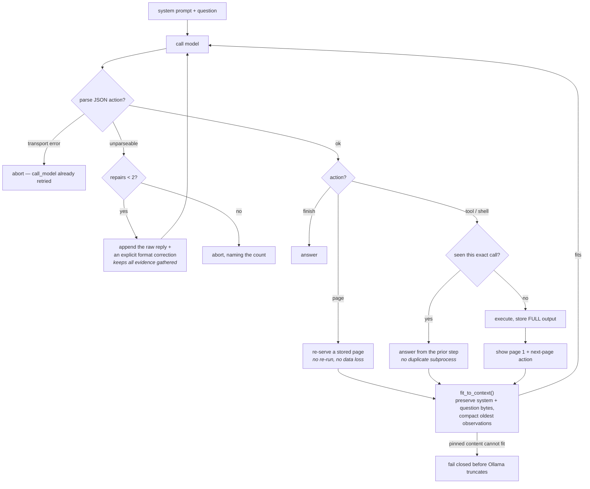

# Agents

FreeLlama includes specialized agent adapters for benchmarking and research, living entirely
under [`benchmark/local/`](benchmark/local/README.md) — the one canonical home for them, built on
the generic scoring infrastructure in [`benchmark/harness/`](benchmark/harness/README.md) (see
[`benchmark/harness/README.md`](benchmark/harness/README.md) for the workflow map).

## Repository operating index

Use this file for adapter behavior and measured caveats. Use the narrower owner for everything
else:

| Need | Source of truth |
|---|---|
| Install, run, architecture, and production workflow | [`README.md`](README.md) and [`docs/`](docs/) |
| MCP tool choice, request shapes, and agent workflow | [`packages/mcp/README.md`](packages/mcp/README.md) |
| Ollama/model operation procedure | [`skills/freellama/SKILL.md`](skills/freellama/SKILL.md) |
| Generic benchmark execution and scoring | [`benchmark/harness/README.md`](benchmark/harness/README.md) |
| Local adapter comparison and evidence | [`benchmark/local/README.md`](benchmark/local/README.md) |

Agent-facing invariants:

- Inspect current state; do not infer installed models, residency, CPU/GPU placement, or memory fit
  from a model name.
- Treat `run_task {preview:true}` as a decision-only request containing routing fields only. It
  rejects prompts, messages, embedding input, tool definitions, images, and runtime controls.
  Make a separate execution call with the payload after reviewing the decision.
- Model search and recommendation never authorize a pull. Require explicit approval for one exact
  tag and its reported size. Delete only when you explicitly name the exact installed tag.
- Treat configured CPU/GPU assignment as intent, not physical proof. Read the returned placement
  observation and require observed evidence when processor placement is consequential.
- `delegate_research` is a bounded read-only lookup helper. The caller retains decomposition,
  judgment, mutation authority, and final verification; discard an `escalate` result.

## Available agents

### Octocode CLI agent (v1)

**ID:** `octocode-cli-agent-v1`

**What it is:** An Ollama model with access to a purpose-built code-research tool (`octocode` CLI,
invoked via `npx octocode`) that provides five structured operations: local file viewing, finding
files by pattern, code search, semantic content retrieval, and LSP-based queries.

**Location:** `benchmark/local/scripts/octocode_agent.py`

**Tool set:**
- `localViewStructure` — View repository directory tree or file structure
- `localFindFiles` — Find files matching patterns (by name, extension, path)
- `localSearchCode` — Full-text code search with context. AST/structural mode is **not** driven by
  `keywords`: it requires `pattern` or `rule` and hard-errors otherwise. The adapter prompt used to
  advertise `mode: "structural"` next to `keywords`, so a model that followed it spent a turn on a
  request that the tool contract rejects; the prompt now says so explicitly.
- `localGetFileContent` — Read file with syntax and line numbers
- `lspGetSemantics` — Language server protocol queries (definitions, references, hover). **An empty
  result is ambiguous, and the tool does not disambiguate it.** It reports `serverAvailable: true`
  whether the language server is still indexing or genuinely cannot analyse the file.

  Measured on this repo, and the sequence matters: a *cold* probe of
  `packages/rust-core/src/proxy.rs` returned `totalSymbols: 0`; the identical call once
  rust-analyzer had indexed returned **35**. Python returned 139 (`requests/auth.py`) and 430
  (`jinja2/compiler.py`); TypeScript 45 (`source: "native"`, so no indexing wait).

  An earlier revision of this file recorded the cold zero as a Rust *coverage gap*. That was wrong
  — it was a warm-up artifact, and it is why the adapter prompt now says `totalSymbols: 0` means
  "ask again or search instead", never "unsupported". `localSearchCode` needs no index and cannot
  be cold, which is why it stays the default.

**Decoding/runtime config:** defaults are `temperature=0`, `seed=42`, `num_predict=512`,
`tool_timeout_seconds=45`, `max_turns=10` (`delegate_research` sets 8), and `num_ctx=8192`.
All operational values are validated environment settings; use the `delegate_research.agent`
object for per-call overrides. See **Adapter configuration schema** below. Safety confinement and
the JSON-only action contract are invariants, not configuration knobs.

**Use when:** You need an agent to answer code-research questions efficiently, with access to
structured code navigation and semantic understanding. The tool provides exact paths and evidence,
reducing hallucination and supporting deterministic grading.

**Performance notes:**
- Tool timeout: 45 seconds per call (longer than bash due to LSP overhead)
- Typically uses fewer tool calls than bash agents for the same questions on an accurate model —
  but not always faster or cheaper: measured evidence (30-question suite, qwen3.8:27b-mlx) showed
  *equal* pass rate to the bash agent while using ~2.8x more time and ~4.7x more input tokens. See
  `skills/freellama/references/task-delegation.md`.
- Results include exact file paths and line numbers

### Bash shell agent (v1)

**ID:** `bash-shell-agent-v1`

**What it is:** An Ollama model restricted to raw POSIX shell commands only (ls, find, grep, cat,
awk, etc). No specialized tools; must solve problems using only what the shell provides.

**Location:** `benchmark/local/scripts/bash_agent.py`

**Command restrictions:**
- ✅ Allowed: ls, find, grep, cat, head, tail, awk, sed, sort, uniq, wc, file, locate, etc.
- ❌ Blocked (regex denylist in the script): `sudo`, `rm -rf /`, `curl`, `wget`, `nc`, `ssh`, fork
  bombs, device-file redirects.

**Decoding/runtime config (same schema as above):** the Bash tool timeout defaults to 30 seconds;
every other default matches Octocode. Override `FREELLAMA_AGENT_TOOL_TIMEOUT_SECONDS` when the
tool surface needs a different deadline.

**Use when:** You want to measure how well a model can solve code-research problems using only
primitive shell tools, without specialized language-aware features. Useful as a baseline or to
evaluate whether better performance comes from the tool or the model.

**Performance notes:**
- Command timeout: 30 seconds per command
- On the one 30-question suite measured, needed *fewer* tool calls and tokens than the octocode
  agent for equal accuracy — don't assume more structure always wins; verify per task/model.

## Run agents

Agents are invoked through `benchmark/local/scripts/run_all.sh`, which runs both agents on the
same suite for a given model:

```bash
cd benchmark/local
./scripts/prepare_repo.sh                     # one-time: clone click/zustand/openui into .context/
./scripts/restart_ollama.sh                   # start Ollama + the retry-protected FreeLlama proxy
./scripts/run_all.sh --model qwen3.8:27b-mlx  # runs both agents on all 30 questions
open results/qwen3.8-27b-mlx/index.html
```

See `benchmark/local/README.md` for full documentation.

## Agent Lifecycle

When the benchmark harness (`benchmark/harness/scripts/run.py`) runs an agent:

1. **Setup** — Agent process starts with environment variables set:
   - `FREELLAMA_TARGET_MODEL` — Ollama model tag to use
   - `FREELLAMA_OLLAMA_ENDPOINT` — HTTP endpoint of Ollama (or the FreeLlama proxy)
   - `FREELLAMA_BENCH_WORKSPACE` / `FREELLAMA_BENCH_PROMPT` / `FREELLAMA_AGENT_RESULT` — paths for
     the disposable workspace copy, the question text, and where to write the result JSON
   - Runtime, retry, pagination, and context-policy settings are validated from `FREELLAMA_AGENT_*`;
     invalid combinations fail before an Ollama call and name the rejected setting

2. **Task loop** — For each question/task:
   - Agent receives the task prompt and a disposable copy of the fixture repos
   - Agent makes tool calls (octocode) or shell commands (bash)
   - Results are captured and clipped **head-and-tail** by `agent_context.clip` — the head is the
     half that identifies a directory listing, a grep hit list or a file read, and the adapters
     used to keep only the tail (`observation[-3000:]`), discarding it
   - An exact repeat of an earlier call is not re-executed: it is answered from the prior step and
     recorded with `status: "repeat"`, so a wasted turn does not also spend context twice
   - The conversation is refitted to `num_ctx` after every turn by `agent_context.fit_to_context`
     (see **Context management** below)
   - Loop continues until max turns reached or the model calls `finish`

3. **Grading** — After the agent completes:
   - **Deterministic checks** run (same for all agents): response contains required keywords,
     claimed file paths exist in the fixture, no workspace mutations
   - **LLM judge**: not run automatically as part of this benchmark. This repo's own incident
     (see `skills/freellama/references/disk-cleanup.md` and `task-delegation.md`) is why: a local
     judge model co-resident with the agent model under test crashed Ollama and corrupted a run.
     Quality judging here is a separate, deliberate, non-local, post-hoc step — see
     `benchmark/local/docs/05-grading-and-judge.md`.

4. **Cleanup** — Agent process stops; the disposable workspace copy is discarded (or, with
   `run_all.sh`'s default `--discard-workspaces`, never even fully persisted)

## The adapter loop

Both adapters drive their own chat loop against Ollama. Four behaviours in it are load-bearing, and
each exists because its absence caused a measured failure.



| Behaviour | Without it |
|---|---|
| **Pagination** | a repo-wide grep is 27,198 chars; a 3,000-char clip discarded **89%**, and the model concluded "not found" from a window that never held the answer |
| **JSON repair** | one unparseable reply aborted the whole run, discarding every tool result already gathered, and surfaced as model weakness |
| **Context fitting** | at `num_ctx=8192` a 10-turn run overflows; Ollama truncates from the *front*, dropping the system prompt, after which the agent stops emitting JSON |
| **Repeat suppression** | an exact repeat cost a turn out of ten *and* a second copy of an observation already in context |

`calls[].result` in `agent-result.json` is stored **in full** — it goes to disk and never into the
model's context, so shortening it only ever destroyed the audit trail. Only what the model sees is
paginated.

## Context management (`benchmark/local/scripts/agent_context.py`)

Both adapters run at `num_ctx=8192` and append an observation of up to 3000 characters every turn.
At `max_turns=10` the conversation reaches roughly 9-10k tokens — past the window. **Ollama does
not raise an error for this.** It silently truncates from the front of the prompt, and the front is
the system prompt, so the agent loses its own tool schema and output contract mid-run and then
returns prose instead of JSON. The run is recorded as `model did not return a JSON action`: a
parsing failure that reads like model weakness but is really a harness bug. Any benchmark number
gathered from a long run before this was fixed understates the model.

`fit_to_context` runs before the first call and after every turn. It:

- **byte-preserves** the system prompt and original question by default — the two messages Ollama
  deletes first during truncation; if they cannot fit, the adapter errors before calling Ollama;
- **compacts** older observations to a one-line breadcrumb, oldest first, so every step the agent
  took stays visible even when its full text is gone;
- **keeps the two most recent observations verbatim**, since the model uses them for its current
  reasoning;
- **clips the recent ones too**, looping until the estimate fits, if even they overflow.

The first call uses the configured 4-characters-per-token estimate. Ollama has no stable preflight
tokenizer endpoint; after each successful call, the budgeter calibrates upward from Ollama's own
`prompt_eval_count` and never becomes less conservative. The input budget reserves `num_predict`
plus a configurable 256-token margin. Emergency clipping retains 80% of the *current* largest
observation per pass, repeating until it fits; 80% is not the activation threshold. Setting
`FREELLAMA_AGENT_PINNED_OVERFLOW=clip` opts into the older last-resort pinned clipping behavior.

Each result reports `model_metadata.context_management`: resolved policy, counting mode
(`configured_estimate` or `model_calibrated_estimate`), calibration scale/sample count, estimated
input budget, and compaction count.

## Adapter configuration schema

| Area | Environment variables |
|---|---|
| Loop/model | `MAX_TURNS`, `NUM_CTX`, `NUM_PREDICT`, `TEMPERATURE`, `SEED`, `THINK`, `KEEP_ALIVE` |
| Deadlines/retry | `REQUEST_TIMEOUT_SECONDS`, `TOOL_TIMEOUT_SECONDS`, `RETRY_ATTEMPTS`, `RETRY_BACKOFF_SECONDS`, `MAX_PARSE_REPAIRS`, `PARSE_REPAIR_ECHO_CHARS` |
| Budget estimate | `CHARS_PER_TOKEN`, `SAFETY_MARGIN_TOKENS`, `IMAGE_TOKEN_ESTIMATE` |
| Compaction/paging | `KEEP_RECENT`, `COMPACT_PREVIEW_CHARS`, `COMPACT_RETAIN_RATIO`, `CLIP_HEAD_RATIO`, `OBSERVATION_PAGE_CHARS`, `PINNED_OVERFLOW` |

Prefix each table entry with `FREELLAMA_AGENT_`. The MCP `delegate_research.agent` object exposes
the same fields in camelCase. Defaults and validation live once in `AgentRuntimeConfig` and
`ContextPolicy`; both adapters consume those shared schemas.

Contracts: `benchmark/local/scripts/test_agent_context.py` (63 context/pagination contracts) and
`test_agent_actions.py` (strict Bash and Octocode action shapes).

## Add a new agent

1. **Create an adapter** — a Python script that:
   - Reads `FREELLAMA_TARGET_MODEL`, `FREELLAMA_OLLAMA_ENDPOINT`, `FREELLAMA_BENCH_WORKSPACE`,
     `FREELLAMA_BENCH_PROMPT`, `FREELLAMA_AGENT_RESULT` (see `octocode_agent.py`/`bash_agent.py`
     for the exact contract — copy one of them as a starting point)
   - Implements the tool-call loop (receives task, makes calls, gets results, loops)
   - Writes the result JSON to the path in `FREELLAMA_AGENT_RESULT`
2. **Add it to a matrix** — `benchmark/local/tasks/octocode-vs-bash-matrix.template.json` is
   filled in at runtime by `run_all.sh`; add a new model entry there (or a new template) pointing
   `agent_command` at your script.
3. **Test** — run it and verify results appear in the dashboard.

## References

- **Benchmark skill (workflow map)**: [`benchmark/harness/README.md`](benchmark/harness/README.md)
- **Generic harness**: [`benchmark/harness/README.md`](benchmark/harness/README.md)
- **This benchmark (the actual example)**: [`benchmark/local/README.md`](benchmark/local/README.md)
- **Ollama/model operations skill**: [`skills/freellama/SKILL.md`](skills/freellama/SKILL.md)
- **Agent implementation**:
  - Octocode adapter: `benchmark/local/scripts/octocode_agent.py`
  - Bash adapter: `benchmark/local/scripts/bash_agent.py`
