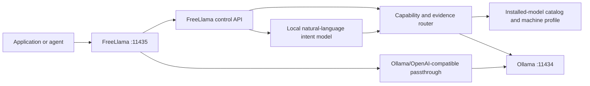

# FreeLlama

FreeLlama is a local model gateway, router, and Rust library for Ollama. It gives applications and agents one localhost endpoint for installed models, then adds model discovery, machine inspection, task-aware routing, natural-language intent routing, session affinity, and evidence-based request profiles.

Think of it as a local, private routing layer in front of Ollama. It is OpenRouter-like in purpose, but it routes only among models installed on your machine. Native Ollama and Ollama's OpenAI-compatible endpoints remain available through the same address.

## What works

| Capability | Status |
|---|---|
| Ollama and OpenAI-compatible API passthrough | Shipped |
| Local model inventory and capability discovery | Shipped |
| Machine profile and Ollama diagnostics | Shipped |
| Structured task and quality-aware routing | Shipped |
| Natural-language request-to-route conversion | Shipped |
| Session affinity for applications and agents | Shipped |
| Managed non-streaming chat and embedding tasks | Shipped |
| Embeddable Rust router and server modules | Shipped |
| Reviewed model recommendations and side-effect-free install plans | Shipped |
| Confirmed model installation and catalog discovery | Planned |
| Automatic machine-specific policy generation | Planned |
| MCP tool server (8 tools, routing + lifecycle + research delegation) | Shipped |
| A2A, durable agents, and autonomous tool execution | Planned |
| Authentication, TLS, quotas, and public multi-tenant serving | Not supported |

FreeLlama does not make model inference intrinsically faster. It improves how a local system discovers, selects, configures, and reuses models. Benchmark evidence and explicit policy prevent a fast but incorrect model from becoming the default for quality-sensitive work.

## How it works



FreeLlama exposes its own control plane under `/_freellama/v1`. Every other path passes through to Ollama, including `/api/chat`, `/api/embed`, `/v1/chat/completions`, and `/v1/models`.

The OpenAI-compatible paths are passthrough routes. They require an explicit installed model and do not automatically invoke FreeLlama routing. Use `/_freellama/v1/routes`, `/_freellama/v1/natural-routes`, or `/_freellama/v1/tasks` for managed selection.

## Two ways to run it

FreeLlama's Ollama-facing HTTP surface has two entry points sharing the same default port
(`127.0.0.1:11435`) — pick one, not both:

| Command | What it exposes | Use when |
|---|---|---|
| `freellama proxy` | Only passthrough to Ollama (with retry/backoff/timeout on transient failures — see `packages/rust-core/src/proxy.rs`). No `/_freellama/v1/*` control routes. | You just want a more reliable Ollama endpoint — e.g. a benchmark or app driving `/api/chat` directly. This is what `benchmark/local/scripts/restart_ollama.sh` runs. |
| `freellama serve` | The full platform: `/_freellama/v1/{machine,models,routes,natural-routes,sessions,tasks}` **plus** the same retry-protected passthrough as `proxy` (it composes `proxy::app()` as its fallback route). | You want model discovery, task-aware routing, or session affinity — not just a passthrough. |

Verified live on this machine: `freellama proxy` returns 404 for `/_freellama/v1/models` (by
design — it doesn't mount those routes); `freellama serve` answers `/_freellama/v1/machine`,
`/_freellama/v1/models`, and passthrough (`/api/version`) all correctly on the same port.

**Scope note:** the retry/backoff/timeout fix lives in `packages/rust-core/src/proxy.rs` and is used by both
passthrough paths above. The managed-task routing path (`forward_managed_task` in
`packages/rust-core/src/platform.rs`, behind `/_freellama/v1/tasks`) builds its own separate `reqwest::Client` and
does **not** currently get that same retry protection — a known gap if you rely on managed tasks
under a flaky Ollama, tracked the same way `docs/OLLAMA_SYSTEM_OPTIMIZATION.md` tracks other
deferred work.

## What's installed locally right now

`ollama list` on this machine (informational — re-run it yourself, this changes over time;
the MCP `models` tool reports the same thing with capabilities and VRAM residency):

```
qwen3.8:27b-mlx           18.2 GB
nomic-embed-text:latest    0.3 GB
```

`freellama models` (against a running `serve` instance) returns the live, structured version of
this — including which model is currently resident in VRAM and its advertised context window —
which is what `packages/rust-core/src/platform.rs`'s routing actually reads to make selection decisions.

## Start in five minutes

**Prerequisites:** Rust 1.85+, Node 20+, a running Ollama at `http://127.0.0.1:11434`, and at least
one installed model of ~12B or larger (smaller models are measurably unreliable for research —
see [`skills/freellama/`](skills/freellama/SKILL.md)).

```bash
git clone <this repo> && cd FreeLlama
cargo build --release                  # builds freellama-core + the freellama CLI
npm install && npm run build           # builds the native addon into packages/mcp/native
npm --prefix packages/mcp install
npm --prefix packages/mcp run build    # builds the MCP server
```

Check the machine before anything else — this works with nothing else running:

```bash
./target/release/freellama doctor
```

It reports Ollama reachability, CLI/server version drift, your chip/RAM/disk, and the nine
`OLLAMA_*` settings **with their effective defaults** (unset means "Ollama picks", not "off" — two
of those defaults are commonly wrong for a large-model setup).

## Using the CLI

Start the control plane, then drive it from another terminal:

```bash
./target/release/freellama serve --recommendation-catalog recommendations.example.toml
```

```bash
freellama tools                                  # every MCP tool and its CLI equivalent
freellama models                                 # installed models, capabilities, residency
freellama route --task coding --objective fastest
freellama task --task completion --objective fastest "Reply with exactly OK."
freellama doctor                                 # works without serve
```

`doctor` is the only subcommand that runs without `serve`. Every other control-plane command now
tells you exactly how to start it if it is not running, rather than surfacing a transport error.

**Objectives.** `fastest` needs no configuration. `balanced` and `quality` require a policy file —
see "Trustworthy routing" below.

### Making routing trustworthy

By default every route grades `confidence: "low"`, because nothing has vouched for any model. To
get `medium` — and to make `minConfidence: "medium"` useful rather than a switch that refuses
everything — the router needs **two** inputs:

| Input | Supplies |
|---|---|
| a policy file | a *quality* contract: which models are vouched for on this task |
| a benchmark report | local *functional* measurement, from `freellama bench-all` |

Generate the policy from quality data — never from `bench-all`, which measures throughput:

```bash
freellama policy-from-eval \
  --aggregate benchmark/local/results/<model>/aggregate.json \
  --task coding --min-pass 0.8 --out platform.toml

freellama bench-all --output benchmark-report.json
freellama serve --recommendation-catalog recommendations.example.toml
```

`serve` picks up `platform.toml` and `benchmark-report.json` from the working directory
automatically; explicit `--policy-file` / `--benchmark-report` always win. When either is missing it
says so at startup rather than silently grading everything `low`.

`policy-from-eval` refuses to manufacture evidence: fewer than three trials is a smoke result
(`--allow-smoke` marks the output accordingly), aggregates past their review date are rejected, and
models that are not installed are skipped.

## Which local models to use

Measured on this machine, not inferred from model cards or download counts. Re-derive for your own
hardware with `freellama models` and `search_models` — the method transfers, the numbers may not.

### Text, code, and vision — one model covers all of it

**`qwen3.8:27b-mlx`** (18 GB). It handles coding, grounded research, image description, OCR, and
summarisation, and it was both the most accurate *and* the fastest of the large models tested here.
Vision works properly: it described a UI mockup accurately and transcribed a terminal screenshot
including an identifier a dedicated OCR model got wrong.

`muse-glimmer:30b-mlx` is a credible alternative — it won the largest-sample benchmark in this repo
(96.7% over 90 trials) — but it is slower and does not add a capability qwen lacks. Running one
large model rather than two also removed memory contention: qwen's vision latency dropped from ~37s
to ~14s afterwards.

**Do not go small for research.** Accuracy collapses below roughly 12B: measured here at 7B 2/8,
3B 3/8, 0.5B 0/8 on grounded lookups. A fast wrong answer costs more than the tokens it saved,
which is why `delegate_research` refuses a model measured unusable instead of running it.

### Embeddings — the cheapest thing you can run locally

**`nomic-embed-text`** (274 MB). Benchmarked against the alternatives on real retrieval over this
repo — 152 chunks, 6 questions with known-correct files:

| Model | recall@3 | Index time | Dims | Size |
|---|---|---|---|---|
| **`nomic-embed-text`** | **5/6** | **4.2s** | 768 | **274 MB** |
| `embeddinggemma:300m` | 5/6 | 4.9s | 768 | 622 MB |
| `qwen3-embedding:0.6b` | 4/6 | 14.8s | 1024 | 639 MB |

Note that **`qwen3-embedding` ranks first on ollama.com and came last here**, at 3.5x the indexing
cost. Site rank is not retrieval quality — `search_models` returns a `pulls` field precisely so you
can judge rather than trust position. `embeddinggemma` is a fine substitute; `nomic-embed-text` is
smaller, faster, and already the most-downloaded embedding model by a wide margin.

Embeddings are the strongest local play by a distance: indexing this repo's source cost **zero**
tokens returned to the orchestrator and under ten seconds. There is no sampling, so nothing to
hallucinate. Index once, query many times.

**But use them for the right thing.** For finding code by keyword, `grep` beat embedding search
here on accuracy, latency and cost simultaneously. Reach for embeddings when there is no keyword to
search for — grouping, deduplication, classification, semantic similarity.

## Using the MCP server

[`.mcp.json`](.mcp.json) registers it already, so an MCP-capable agent in this repo picks it up with
no setup. For another client:

```json
{
  "mcpServers": {
    "freellama": {
      "command": "node",
      "args": ["/absolute/path/to/FreeLlama/packages/mcp/dist/index.js"]
    }
  }
}
```

Eight tools: `doctor`, `models`, `route`, `search_models`, `run_task`, `ollama_manage`,
`ollama_delete`, `delegate_research`. Full contract in
[`packages/mcp/README.md`](packages/mcp/README.md); the orchestration playbook — what to offload,
to which tier, and what never to delegate — is [`skills/freellama/`](skills/freellama/SKILL.md).

Four of the eight need `serve` running (`models` installed-view, `route`, `run_task`, and `doctor`'s
machine profile). The rest talk to Ollama directly or to ollama.com.

## Running everything

```bash
cargo test                              # 55 Rust tests across core + CLI contracts
cargo clippy --all-targets              # zero warnings expected
npm --prefix packages/mcp test          # protocol suite (69 assertions)

# behaviour suite — exercises every tool against the live system; needs serve + Ollama
node packages/mcp/test/validate-all.mjs
```

`validate-all.mjs` is the one that matters: it asserts what each tool *does*, not that its schema
parses — that `minConfidence` refuses **before** generating, that embedding vectors are withheld by
default, that a 143GB model is excluded on a 52GB machine, and that an unusable model is refused
without being run.

## MCP tools: offloading tokens to a local model

`packages/mcp/` exposes FreeLlama's control plane, Ollama's lifecycle, and a research-delegation
tool as 8 MCP tools, so an orchestrating LLM can hand off work instead of spending its own
context on it. Full tool table, input schemas, and configuration: [`packages/mcp/README.md`](packages/mcp/README.md).

**The two tools that offload tokens** (`route`/`recommend`/`doctor`/`models` only
ever make a decision — they never run anything, and cost no local generation):

- **`run_task`** routes and executes a chat, completion, embedding, or vision call in one call.
  Every output token Ollama generates is spent on the local model; the orchestrator only pays for
  the JSON response wrapper, typically a few hundred tokens regardless of how much the local model
  generated.
- **`delegate_research`** hands a grounded code-research question to a local model equipped with
  the [octocode](https://github.com/bgauryy/octocode) CLI and returns a cited answer. Measured on
  this machine, real calls: a question answerable from one file spent 4,584 input / 296 output
  tokens on the local model and returned about 220 tokens to the orchestrator — roughly 95% of the
  work never entered the orchestrator's context. A question spanning three files spent 26,298
  input / 849 output tokens locally and returned about 480 — roughly 98% offloaded. The saving
  scales with how many files the question requires reading.

**Trust boundary, also measured, not assumed**: on 100+ real questions, the same local model
reached 98.9% accuracy on grounded lookups ("where is X defined," "find every call site of Y")
because it must cite file:line evidence you can spot-check — but only about 67% on judgment calls
such as code review or bug-finding, with the same confident tone either way. Delegate lookups
freely; verify judgment calls yourself before acting on them.

## Benchmarking Local Models and Agents

FreeLlama includes a flexible benchmarking skill that measures model performance, cost, latency, and token efficiency across frozen task suites. The framework is parameterized to support any agent type.

**Documentation:**
- **Benchmark skill (workflow map)**: [`benchmark/harness/README.md`](benchmark/harness/README.md) — points into `benchmark/`, where all benchmark material actually lives
- **Generic harness**: [`benchmark/harness/`](benchmark/harness/README.md) — scripts, schemas, and reference docs the skill above routes to
- **Example benchmark**: [`benchmark/local/`](benchmark/local/README.md) — octocode CLI vs raw bash on 30 code-research questions across click/zustand/openui, the canonical (only) home for this comparison, built on the harness
- **Agent types**: [`AGENTS.md`](AGENTS.md) — Available agents (octocode CLI, bash shell)

## Documentation

- [Architecture](docs/ARCHITECTURE.md) — control-plane, passthrough, and Ollama boundaries.
- [Ollama sidecar rationale](docs/OLLAMA_SIDECAR.md) — why the proxy is a sidecar, not a plugin.
- [System optimization](docs/OLLAMA_SYSTEM_OPTIMIZATION.md) — what FreeLlama tunes today, what it deliberately doesn't yet.
- [Agents](AGENTS.md) — Available agent types for benchmarking and research.
- [**FreeLlama skill**](skills/freellama/SKILL.md) — the orchestration playbook for any agent
  driving this: which tier to push work to, what never to delegate, and how to check the machine
  before a large call. Loaded on demand; the MCP instructions point at it.
- [`packages/rust-core`](packages/rust-core/README.md) — all the logic, embeddable as a Rust library.
- [`packages/cli`](packages/cli/README.md) — the `freellama` binary.
- [`packages/mcp`](packages/mcp/README.md) — the MCP server. One Cargo workspace, shared versions.
- [MCP server](packages/mcp/README.md) — 8 tools (routing, model discovery, Ollama lifecycle, research delegation) built on native NAPI bindings (`packages/rust-core/src/napi.rs`) and the official TypeScript SDK; see "MCP tools: offloading tokens to a local model" above for measured token savings.

## Verify the repository

Last verified on **2026-08-27**: all 39 contract tests (including proxy retry/backoff), formatting, strict Clippy, and live Ollama routing passed. The live checks covered health, 12-model discovery, machine inspection, sessions, structured routing, natural-language routing, Qwen code-repair selection, managed chat inference, native Ollama passthrough, OpenAI-compatible model listing, and a side-effect-free recommendation plan.

```bash
cargo fmt --all -- --check
cargo test --all-targets
cargo clippy --all-targets -- -D warnings
```

The platform binds to loopback and has no authentication layer. Keep it local. Do not expose port `11435` through a public listener or reverse proxy without adding authentication, authorization, TLS, rate limits, and tenant isolation.

The Cargo package declares the `Apache-2.0 OR MIT` license expression.
