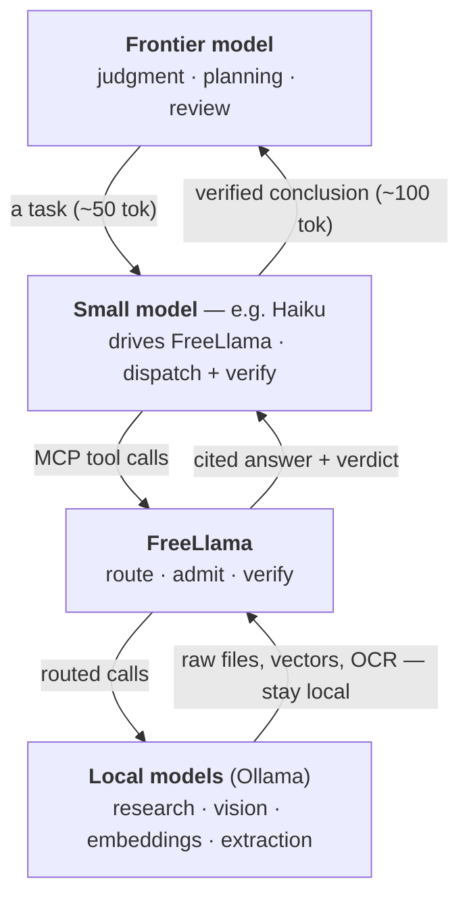
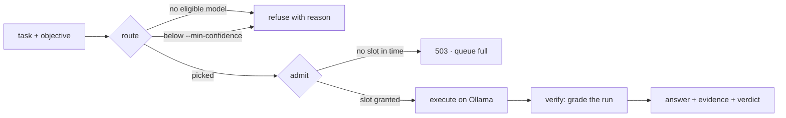
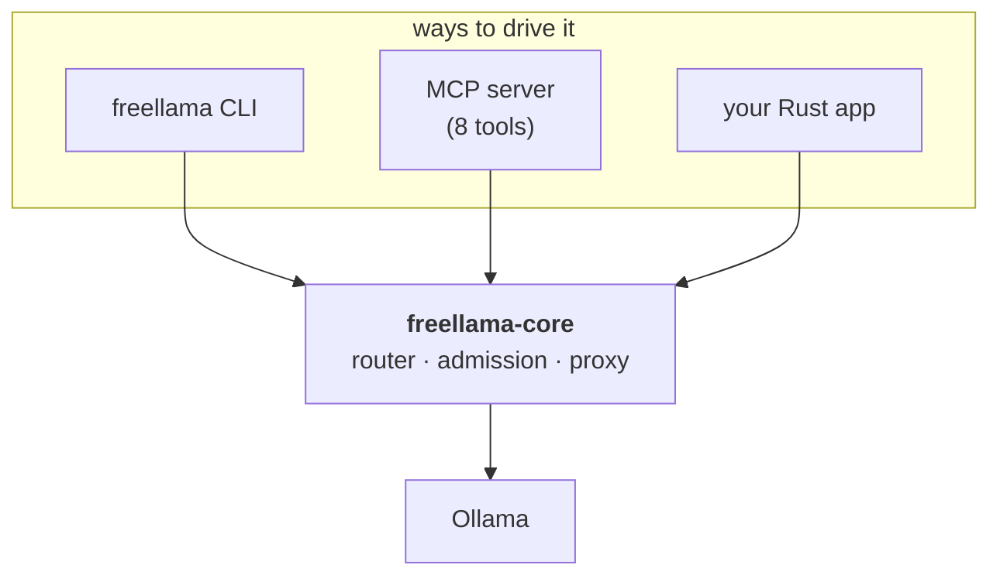
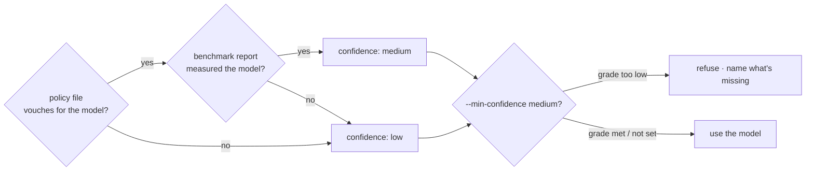

# FreeLlama

**An evidence-aware local-model gateway for Ollama.**

FreeLlama lets applications and AI agents push work down to local models running on your own
machine — *without blindly trusting them*. It discovers what your hardware can run, routes
each task to an installed model, admits local execution only when there's evidence behind the
choice, and returns a verdict you can check.

**Offload work down. Keep judgment up.**



Each hop strips tokens, and the cost of being wrong falls as work moves down. The tier that decides
what matters stays at the top; the raw data never climbs back up to it.

**Drive the FreeLlama MCP with a small model (for example, Haiku), not the frontier model.** Choosing a tool,
filling in a path, and reading a verdict is mechanical dispatch, not judgment — exactly what small
models do well and cheaply, and it keeps the ~3k tokens of tool schema off the frontier model's
per-turn bill. The frontier model is reserved for when the small model's verdict says to escalate.
See [`docs/ARCHITECTURE.md`](docs/ARCHITECTURE.md) for why this wiring beats attaching the tools to
the frontier model directly.

## Why use it

Large files, embedding vectors, images, and tool schemas can stay on your machine while the
expensive orchestrating model receives only the conclusion and the evidence behind it.

The point isn't only that this saves tokens — it's that it controls **what deserves to enter the
expensive model's context**. The orchestrator never has to ingest whole files, raw OCR, intermediate
research, or repetitive schemas to benefit from them. Cost savings follow, but so does context
quality.

Because a local model is roughly **99% accurate on grounded lookups but ~67% on judgment calls — in
an identical confident tone** — FreeLlama trusts nothing on tone. Every delegated answer carries a
verdict computed from what the run *did* (which files it read, which model ran), never from
what the model says about itself.

## How it works

FreeLlama sits between your orchestrating model and Ollama, and does three things:

1. **Route** — pick an installed model for a task (`coding`, `vision`, `embedding`, …) and an
   objective (`fastest`, `balanced`, `quality`), returning a bounded Ollama request profile.
2. **Admit** — bound how many tasks hit Ollama at once, with a real queue and honest backpressure
   instead of silent pile-ups and timeouts.
3. **Verify** — grade each routing decision on separate evidence dimensions, and grade each
   delegated research answer on what the run did.

One task's journey through the gateway:



You can use it through any of four surfaces, all built on one core so routing logic lives in exactly
one place:

| Surface | What it is | Use it when |
|---|---|---|
| **`freellama-core`** | The Rust library (`packages/rust-core`): router, admission, proxy, benchmark harness | You're embedding the gateway in a Rust application |
| **`freellama` CLI** | A binary wrapping the core (`packages/cli`) | You're scripting, testing routes, or running `serve` |
| **MCP server** | 8 tools over stdio (`packages/mcp`) | An MCP-capable agent should offload work to local models |
| **`freellama` skill** | An orchestration playbook (`skills/freellama`) | An agent needs guidance on *when* and *how* to delegate |



## Install and run

Requirements: **Rust 1.85+**, **Node 20+**, a running **Ollama**, and at least one installed model
of **~12B or larger** — below that, accuracy on research collapses (see [Real
numbers](#real-numbers)).

```bash
cargo build --release                                   # freellama-core + the freellama CLI
npm install && npm run build                            # native addon (napi)
npm --prefix packages/mcp install                       # MCP server deps
npm --prefix packages/mcp run build                     # MCP server

./target/release/freellama doctor                       # health check — works with nothing else running
./target/release/freellama serve                        # the gateway, on 127.0.0.1:11435
```

`doctor` reports Ollama's health and the memory-governing settings that decide what fits.
`serve` starts the control plane; `.mcp.json` already registers the MCP server, so an MCP-capable
agent in this repository picks it up with no extra setup.

## Use the CLI

Start the control plane, then drive it from another terminal:

```bash
freellama serve --recommendation-catalog recommendations.example.toml

freellama models                                        # installed models, capabilities, residency
freellama route --task coding --objective fastest       # the model this task picks, and why
freellama task --task completion --objective fastest "Reply with exactly OK."
freellama tools                                         # every MCP tool and its CLI equivalent
freellama doctor                                        # the one command that needs no serve
```

`fastest` needs no configuration. `balanced` and `quality` require a policy file plus a benchmark
report — see [`docs/CLI.md`](docs/CLI.md) for `policy-from-eval`, `bench-all`, and objectives.

## Use the MCP server

The server exposes eight tools. The two you reach for most:

- **`run_task`** — routes *and* executes a chat/generate/embed call; output tokens land on the local
  model, and embedding vectors are withheld from the response by default.
- **`delegate_research`** — answers a grounded question by letting a local model read files under an
  allowlisted path, and returns the answer, a citation trail, and an `accept` / `verify` /
  `escalate` verdict.

The rest cover diagnostics and lifecycle: `doctor`, `models`, `route`, `search_models`,
`ollama_manage`, `ollama_delete`. See [`packages/mcp/README.md`](packages/mcp/README.md) for the
full tool table, configuration, and the security boundary on `delegate_research`.

For agents driving the server, the [`freellama` skill](skills/freellama/SKILL.md) is the playbook:
when to delegate, how to check the queue first, and how to read the verdict.

## Inspectable routing

`confidence: "medium"` on its own reads like a calibrated probability. It isn't one — so FreeLlama
reports the dimensions it's derived from separately:

```
$ freellama route --task code-repair --objective fastest
  selected        : qwen3.8:27b-mlx
  qualityEvidence : none          # no policy vouches for this model on this task
  taskEvidence    : none          # no functional benchmark measured it
  hardwareFit     : strong        # fits the requested context
  confidence      : low           # derived from the above, not asserted
  rejected        : []            # every losing candidate, with its reason
```

Confidence is *derived*, never asserted — it's a function of the two evidence inputs you supply:



Pass `--min-confidence medium` and an unjustified route is **refused** — naming the grade, the
evidence behind it, the model it declined, and the two commands that raise the grade. The
gate lives in the router itself, so the CLI, the HTTP API, and anyone embedding `freellama-core`
inherit it. To reach `medium`, give the router a policy file and a benchmark report
([`docs/CLI.md`](docs/CLI.md)).

## Real numbers

Measured with real calls on one machine (Apple M4 Pro, 52 GB unified memory). Your figures differ;
the full accounting is in [`docs/ECONOMICS.md`](docs/ECONOMICS.md).

**Context isolation** — how much of the work never reaches the orchestrator:

| Work | Without FreeLlama | Returned | Kept local |
|---|---:|---:|---:|
| 6 grounded code questions | 59,208 tok | 1,742 tok | **97.1%** |
| 4 text embeddings | 17,600 tok | ~200 tok | **98.9%** |
| 1 image, OCR, byte-exact | 1,970 tok | 37 tok | **98.1%** |
| Tool schemas, per turn | 2,987 tok | 0 tok | **100%** |

**Model size matters** — grounded single-file research, accuracy by model size:

| Size | Solved (of 8) |
|---|---:|
| 0.5B | 0 |
| 3B | 3 |
| 7B | 2 |
| 12B | 6 |
| 27B | **8** |

Research falls off a cliff below ~12B, and accuracy isn't monotonic at the small end — a fast wrong
answer costs more than the tokens it saved. Pick a model measured strong for the work.

**The cost side.** A grounded question takes **7–62 s** (versus ~1 s for a frontier model that
already holds the file), and latency is turn-dominated: `seconds ≈ 9.8 × tool_calls`. Past ~1k
tokens of source, the token math wins; below that, read the file yourself.

## What it is not

FreeLlama is **not** a remote-provider marketplace, billing layer, model registry, installation
executor, agent runtime, or A2A coordinator.

**It also does not make inference faster.** An audit traced a measured 43.9% speedup entirely to
Ollama's MLX artifact, not to FreeLlama; holding the artifact constant, the proxy added 0.330 ms and
no speedup. Use Ollama directly if raw speed for one exact model is the only goal.

Ollama runs the models. FreeLlama decides *when* local inference deserves to be used, *which* model
gets the work, and *what evidence* is allowed back into the orchestrator.

## Documentation

| Doc | What's in it |
|---|---|
| [Architecture](docs/ARCHITECTURE.md) | the three tiers, admission and throttling, request paths, product boundary |
| [Economics](docs/ECONOMICS.md) | the token accounting in full |
| [CLI](docs/CLI.md) | every subcommand, policy generation, objectives |
| [Model selection](docs/MODEL_SELECTION.md) | which local models, and how to re-derive it for your machine |
| [Testing](docs/TESTING.md) | the suites and what each one asserts |
| [Ollama sidecar](docs/OLLAMA_SIDECAR.md) | why the proxy is a sidecar, not a plugin |
| [System optimization](docs/OLLAMA_SYSTEM_OPTIMIZATION.md) | what FreeLlama tunes, and what it deliberately doesn't |
| [MCP server](packages/mcp/README.md) | the 8 tools, build, configuration, security |
| [FreeLlama skill](skills/freellama/SKILL.md) | the orchestration playbook for an agent driving this |
| [Agents](AGENTS.md) | the adapter loop, context management, benchmark adapters |
| [Benchmarks](benchmark/harness/README.md) | the benchmark surfaces and when to use which |

## Security

The platform binds to loopback and has no authentication layer. Keep it local. Do not expose port
`11435` through a public listener or reverse proxy without adding authentication, authorization,
TLS, rate limits, and tenant isolation.

Licensed `Apache-2.0 OR MIT`.
