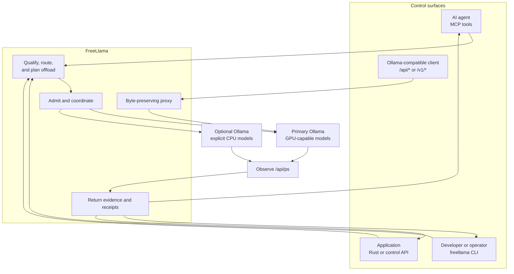
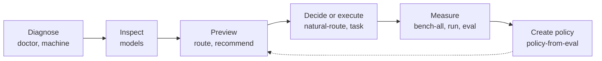
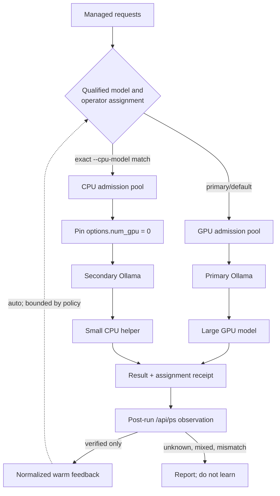
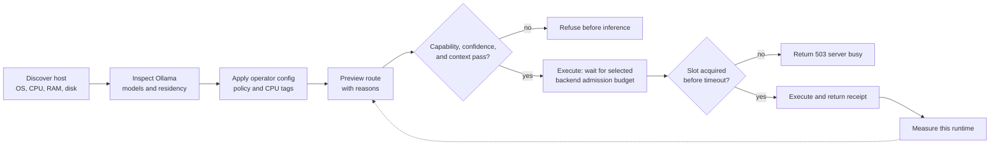

# FreeLlama

**The local agentic traffic controller for Ollama.**

FreeLlama is a local-only model delegation control plane for developers. It sits beside Ollama and
helps an agent decide whether to offload work now, wait, or refuse; which eligible local model and
backend to use; how much caller-declared independent work fits the current capacity snapshot; and
what evidence came back from managed execution.

> Ollama runs local models. FreeLlama helps agents offload work deliberately.

FreeLlama preserves Ollama's native API. It does not replace Ollama's runners, scheduler, model
storage, accelerator support, or token generation.

## See the control plane

MCP gives an AI agent bounded tools. The CLI gives an operator explicit controls. Both converge on
the same Rust routing and execution core.



Managed work follows a decision contract. Raw Ollama traffic follows a compatibility contract:

- **Managed tasks** enter routing, refusal, queuing, eligible-backend assignment, and measurement.
- **Route previews** return a snapshot-only `agent_plan`; previews never reserve capacity or infer
  dependencies. For actual independent work, `run_task_batch` supplies bounded fair dispatch.
- **Raw `/api/*` and `/v1/*` requests** pass through unchanged to the primary Ollama server.
- **Grounded research** runs in a confined adapter whose model turns re-enter managed `coding`
  tasks, so file confinement does not bypass routing, admission, or placement evidence.

Read [Product positioning](docs/PRODUCT_POSITIONING.md) for the audience and category decision, or
[Architecture](docs/ARCHITECTURE.md) for the complete ownership and request flows.

## Understand why it exists

Calling Ollama directly is the right choice when the caller already knows the exact model and
request. Agent delegation adds decisions that a raw inference API does not own:

- Does an installed model satisfy the task, capability, context, policy, and confidence constraints?
- Can the workload fit the detected host and coexist with resident models?
- Can a small helper run on CPU while a large model remains on GPU?
- Did repository research read the relevant files, or did the model answer from recall?
- Which backend ran the request, how long did it wait, and what did Ollama report?
- Can large vectors, files, images, and intermediate tool output remain outside the orchestrator's
  context?

FreeLlama turns those questions into inspectable contracts. It can refuse before inference instead
of allowing an unqualified model to produce a confident answer.

### What it adds over direct Ollama—and what it costs

Direct Ollama is often the better choice. Ollama already provides local inference, model lifecycle,
tool calling, structured outputs, vision, request options, and `keep_alive`. Use it directly when
the application already knows the exact model and request, or needs streaming with the smallest
possible hop.

| Need | Direct Ollama | FreeLlama managed task | Critical caveat |
|---|---|---|---|
| Exact known model and prompt | One request to the runtime | Adds routing, admission, and a receipt | FreeLlama is extra latency and complexity; do not insert it by default. |
| Agent must choose safely | Application must implement its own rules | Typed capability, context, policy, confidence, and placement-evidence checks can preview or refuse | The rules are only as good as the configured policy and benchmark evidence. |
| Avoid local overload | Ollama owns its runtime queue | Weighted-fair per-backend admission with bounded waiting; independent batches get a bounded dispatcher | Raw compatibility traffic bypasses managed routing; the optional raw cap is generic, not device-aware. |
| Keep related tasks on one model | Caller names the model each time | In-memory affinity handle binds only after successful execution | A session is not chat memory or Ollama KV, expires when idle, and disappears on restart. |
| CPU/GPU separation | Ollama selects runner placement | Exact operator-assigned models can use a second CPU Ollama process | This is manual process topology, not automatic GPU scheduling or live VRAM management. |
| Ground repository answers | Caller supplies tools, prompts, and verification | Confined research adapters return citations and a verification verdict | The adapter is deliberately narrow and is not a general autonomous coding system. |

FreeLlama's managed API is non-streaming. Its machine profile exposes portable host RAM,
CPU, and disk, while physical placement is observed from Ollama after execution. It does not expose
vendor GPU telemetry, thermal state, power limits, live free VRAM before load, multi-tenant RBAC,
durable conversation state, or cluster scheduling. Those are product gaps, not hidden features.

Route preview returns an advisory `execution.agent_plan`: `runnable_now` or `queue_likely`, the
number of same-backend tasks admissible in the current snapshot (including the proposed task),
the number of additional same-cost siblings after it, warm-runner reuse, and keep-alive guidance.
It never reserves capacity, estimates device memory, or promises parallel completion; managed
execution admission remains authoritative. Execution receipts also include a model-metadata
K/V lower-bound preflight. It refuses only a known impossible CPU/unified-memory floor; Ollama remains
the authority for live free memory, cache format, runner graph allocation, and final loading.

## Understand what is agentic and what is deterministic

FreeLlama is a bounded agentic system around a deterministic control core. The agent proposes work;
the core decides whether that proposal is eligible and executable. This split prevents a model from
turning a natural-language preference into hardware authority or a destructive side effect.

| Layer | Behavior | Why it belongs there |
|---|---|---|
| Calling agent | Chooses whether to inspect, preview, execute, or delegate research | The caller owns the requested outcome and task decomposition |
| Operator | Configures endpoints, exact CPU-model assignments, runtime settings, and lifecycle approval | Hardware and disk authority must remain explicit human-owned configuration |
| Intent interpreter | Converts natural language into typed task signals | A model can interpret wording, but it cannot select the final model or backend |
| Research adapter | Iteratively searches or reads allowlisted files and returns evidence | Repository investigation benefits from an agent loop with bounded tools and turns |
| Router | Applies capability, policy, context, confidence, explicit-model, and session rules | Eligibility must be repeatable and testable rather than prompt-dependent |
| Placement and admission | Applies exact operator assignments, backend capacity, and weighted permits | Models must not invent topology, bypass queues, or move themselves between devices |
| Runtime feedback | Suggests a backend after comparable warm samples show a meaningful advantage | Measurement can adapt routing, but only inside operator-owned eligible choices |
| Lifecycle tools | Separates inspection, installation, unloading, and permanent deletion | Side effects stay explicit and destructive actions remain distinguishable |
| Ollama | Loads model runners, manages its internal queue and parallel decoding, and performs inference | FreeLlama preserves Ollama rather than replacing its runtime or scheduler |
| OS and accelerator runtime | Schedule physical CPU/GPU kernels and memory | A routing receipt is not direct control over device execution |

The system therefore is not an autonomous scheduler. It is agentic where interpretation and
investigation help, deterministic where trust, safety, hardware ownership, and compatibility
matter.

In short: the agent owns **what can be offloaded and what can run concurrently**; the operator owns
**which Ollama processes and exact model tags may use CPU**; FreeLlama owns **qualification,
admission, and the managed routing decision**; Ollama and the operating system own **the actual
model runner and physical CPU/GPU execution**.

### Audit the fixed boundaries

Some contracts are intentionally strict:

- The service defaults to loopback. A nonloopback listener requires explicit remote opt-in and a
  bearer token loaded from a permission-restricted file; authentication covers managed and raw
  passthrough routes.
- CPU assignment requires an exact operator-configured tag and pins `num_gpu: 0`; physical CPU
  proof still requires post-run `size_vram:0` because some MLX runners ignore the request.
- An explicit model or an existing session affinity wins over adaptive placement.
- The schema represents managed task types and objectives as enums rather than free-form prompts.
- The MCP surface has seven focused tools; permanent deletion remains a separate destructive tool.
- Quality-sensitive routes fail closed when policy or benchmark evidence is missing.

Workload policy remains configurable: endpoints, CPU model assignments, policies, benchmark
reports, admission totals, queue timeout, context window, decoding options, keep-alive, research
turn limits, tool timeouts, retry behavior, pagination, clipping, compaction, and pinned-overflow
handling all have operator or per-call controls.

The remaining compiled policy is deliberately small but is not dynamic tuning: the core assigns
embedding cost as `ceil(input_items / 4)`, chat cost 2, and vision cost 4; backend feedback needs
three warm samples and more than a 10% advantage; the CLI persists bounded aggregate feedback by
default; and each backend admits work against its configured weighted capacity. Callers can create
concurrency between independent tasks, including work assigned to different backends. Change these
constants only with a new workload benchmark and regression guard, not as unmeasured host detection.

## Compare adjacent projects

FreeLlama does not replace the local AI stack. It governs one decision that the surrounding stack
does not own: whether to send an agent task to a local Ollama model, which eligible model and
backend receives it, and what evidence must come back.

The following table compares that contract with adjacent projects based on their official
documentation:

| Project | What the project owns | Why FreeLlama is different |
|---|---|---|
| [Ollama](https://docs.ollama.com/faq) | Model storage, inference, model loading, parallel requests, runtime queues, and scheduling | Ollama is the required runtime, not an acceleration target. FreeLlama preserves its API and adds pre-inference qualification, bounded admission, explicit CPU/GPU assignment, and execution receipts. It does not claim to make Ollama decode faster. |
| [LiteLLM](https://docs.litellm.ai/) | A unified gateway across many model providers, with retries, fallbacks, rate limits, budgets, and spend tracking | LiteLLM governs provider access and cost. FreeLlama determines whether machine-local Ollama work qualifies, fits the host, and has enough task evidence to run. |
| [RouteLLM](https://github.com/lm-sys/RouteLLM) | Learned routing between stronger and weaker model endpoints, with evaluation tools for quality and cost tradeoffs | RouteLLM learns which endpoint should answer a prompt. FreeLlama adds deterministic local eligibility, operator-owned CPU assignments, bounded admission, physical placement evidence, and grounded-research receipts around Ollama. |
| [Open WebUI](https://docs.openwebui.com/) | A self-hosted interface with conversations, retrieval-augmented generation (RAG), plugins, tools, knowledge, and agent workflows | Open WebUI is the application layer people interact with. FreeLlama has no chat UI or general plugin runtime; it gives an existing agent or application a narrow, inspectable delegation contract. |
| [LocalAI](https://localai.io/docs/index.html) | A replacement local inference platform with many backends, multimodal APIs, built-in agents, RAG, MCP tool hosting, and multi-node operation | LocalAI replaces and integrates the inference and agent stack. FreeLlama keeps Ollama in place and adds a smaller loopback governance sidecar centered on deterministic qualification, admission, placement, and evidence. |
| [llama.cpp server](https://github.com/ggml-org/llama.cpp/blob/master/tools/server/README.md) | A lower-level inference server with CPU/GPU execution, continuous batching, parallel slots, multimodal support, and compatible APIs | llama.cpp server owns inference mechanics. FreeLlama implements no kernels, batching, or decoding; it governs an Ollama deployment above that engine layer. |

### FreeLlama self-rating

These are fit scores for FreeLlama 0.2's intended niche, not a latency benchmark or a claim that it
is broadly "better" than the projects above. Scores reflect implemented, tested capability; a low
score often indicates deliberately excluded scope.

| Dimension | Score | Reason |
|---|---:|---|
| Governed agent delegation to Ollama | **8/10** | Capability, policy, context, confidence, placement-evidence, fair admission, independent batch scheduling, session affinity, and advisory offload checks are deterministic. Policy evidence remains operator-supplied and sessions are in-memory only. |
| Agent-facing contract quality | **7/10** | Eight bounded MCP tools now declare output boundaries, return compact text cues with canonical structured content, expose typed batch items, and validate action shapes. Most output fields remain permissive because Ollama owns forward-compatible payloads. |
| Local workload efficiency | **7/10** | Fair 3:2:1 admission, batch-aware embedding charging, bounded independent dispatch, CPU isolation, retry policy, residency evidence, and compaction reduce avoidable work; FreeLlama adds a hop and does not improve token decode speed. |
| Machine-aware placement | **5/10** | It discovers portable host capacity, computes a metadata-backed K/V lower bound, and verifies placement after execution, but has no vendor GPU telemetry, thermals, power, or live free-VRAM signal. |
| Ollama configuration guidance | **8/10** | Doctor covers queueing, Flash Attention, context, K/V-cache tradeoffs, residency, and parallelism; on macOS loopback endpoints it also allow-lists settings observed in one same-user `ollama serve` process. It still cannot prove that PID is the queried endpoint or inspect remote services. |
| Chat UI, RAG, and multi-user product features | **2/10** | Intentionally out of scope; use Open WebUI or LocalAI when those are the product. |
| Multi-provider, tenant, and spend governance | **1/10** | Intentionally out of scope; use LiteLLM for provider routing, budgets, and tenant controls. |
| Distributed or multi-node inference | **1/10** | Intentionally out of scope; FreeLlama coordinates one primary and optional CPU Ollama process rather than a cluster. |

**Overall: 7/10 for a developer operating an agent beside local Ollama; 2/10 as a general local-AI
platform.** The remaining gap is proof and control of live fairness, parallel decode throughput,
batch-size admission, and live K/V/free-memory fit. Choose it for inspectable local delegation,
not for a UI, a replacement inference runtime, a fleet scheduler, or a multi-provider gateway.

**RouteLLM is the closest routing-specific comparison; LocalAI is the closest broad platform-level
alternative.** RouteLLM focuses on learned strong-versus-weak model selection. LocalAI combines a
replacement local inference runtime with many backends, built-in agents, RAG, MCP tool hosting,
and multi-node operation. FreeLlama is narrower than either: an Ollama-specific governance sidecar
focused on deterministic qualification, bounded admission, physical placement, grounded research,
and inspectable execution receipts.

FreeLlama is different because it makes delegation defensible before and after inference:

- **Before inference,** it can preview or refuse a route when capability, policy, context,
  confidence, hardware fit, or capacity does not qualify.
- **During execution,** it keeps model and hardware authority in deterministic operator-owned
  policy instead of allowing an agent prompt to invent topology or bypass admission.
- **After execution,** it returns a receipt with the selected model, selected backend, queue
  measurements, timing measurements, and decision reasons. Delegated research also returns
  citations plus an independently computed verification verdict.
- **For compatibility,** it leaves raw Ollama `/api/*` and `/v1/*` traffic unchanged and adds no
  inference-acceleration claim.

Use Ollama or llama.cpp server when the caller already knows the exact model and request. Use
LiteLLM for provider failover, tenant budgets, or spend governance. Use RouteLLM when learned
strong-versus-weak endpoint selection is the main problem. Use Open WebUI for conversations, RAG,
plugins, and autonomous workflows. Use LocalAI when you want one broad runtime and agent platform.
Use FreeLlama when an existing agent needs a small, testable contract for deciding whether and
where local Ollama work runs—and evidence that the decision held.

This architectural comparison has **high confidence**: it derives from the linked official project
documentation and FreeLlama's implementation and architecture documents. It does not compare
reliability, latency, installation friction, or resource overhead because no controlled
side-by-side benchmark has measured those outcomes.

## Meet the prerequisites

FreeLlama requires Ollama for model storage and inference. It does not bundle, install, start, or
replace Ollama. Install Ollama from the [official download page](https://ollama.com/download), then
start the Ollama app or `ollama serve`. The default endpoint is `127.0.0.1:11434`.

If Ollama is missing or unreachable:

- the source build and non-live tests can still run;
- `doctor` returns a connection error because it queries Ollama directly, although it does not need
  `freellama serve`;
- installed-model discovery, pulls, routing, proxying, and generation cannot run;
- online-library search can describe model families, but it is not proof that a model runs or fits
  this machine.

Verify the prerequisite before selecting a model:

```bash
ollama list
```

An empty list is valid: diagnostics and model discovery can start before you pull the first model.
Every pull remains an explicit operator action after you review the exact tag, download size, task
fit, and machine fit.

Building FreeLlama from source also requires Rust 1.85 or later and Node.js 20 or later.

## Install from npm on a supported platform

After the matching release is published, run the CLI directly:

```bash
npx @octocodeai/freellama doctor
```

Add the MCP server to your AI client:

```json
{
  "mcpServers": {
    "freellama": {
      "command": "npx",
      "args": ["@octocodeai/freellama-mcp-server"]
    }
  }
}
```

The portable JavaScript package installs exactly one matching `@octocodeai/freellama-native-*` optional
dependency containing the Rust CLI and N-API addon. Do not install with `--omit=optional`.

Prebuilt targets are macOS arm64/x64, Linux arm64/x64 for glibc and musl, and Windows arm64/x64.
The release gate publishes no Cargo crates: `freellama-core` and `freellama-cli` are internal Rust
implementation crates, while the public npm packages bundle their compiled artifacts.

## Build and run from source

Build the Rust CLI, native Node addon, MCP bundle, and workspace packages:

```bash
yarn install
yarn build
```

Start with diagnostics, then run the control plane:

```bash
./target/release/freellama init       # read-only prerequisite, inventory, and next-step receipt
./target/release/freellama doctor
./target/release/freellama serve
```

In another terminal, inspect the models. Then preview and execute one route:

```bash
./target/release/freellama models
./target/release/freellama route --task coding --objective fastest
./target/release/freellama task --task completion --objective fastest \
  "Reply with exactly OK."
```

The control plane listens on `127.0.0.1:11435` by default. Point your MCP client at
`npx @octocodeai/freellama-mcp-server` or, from a source checkout, `node packages/mcp/dist/index.js`.
Before publishing, run the local release checks in the [production runbook](docs/PRODUCTION.md),
assemble checksummed artifacts for every claimed target, and publish the CLI and MCP packages
explicitly. See the [MCP build and client guidance](packages/mcp/README.md).

## Control FreeLlama through MCP

The MCP server exposes eight tools to compatible AI-agent hosts:

| MCP tool | Control | Important behavior |
|---|---|---|
| `doctor` | Diagnose Ollama, host, versions, and memory settings | `summary` is compact by default; use `scheduler`, `config`, or `full` only for diagnosis |
| `models` | Inspect installed, resident, detailed, raw, or online-library models | Raw inventory and library tags are paged; reports managed CPU/GPU placement where available |
| `run_task` | Preview or execute chat, vision, and embedding work | Applies routing, confidence, admission, and response trimming |
| `run_task_batch` | Execute caller-declared independent work | Requires stable IDs and `independent:true`; bounds dispatch and returns each sibling result/error |
| `session` | Create or release bounded model affinity for related tasks | Stores neither prompt history nor Ollama KV; expires when idle |
| `ollama_manage` | Pull or unload an exact model | Keeps lifecycle work explicit |
| `ollama_delete` | Permanently delete an exact model | Isolated as a destructive tool |
| `delegate_research` | Answer a narrow question from allowlisted files | Runs managed coding-agent turns and returns citations, placement receipts, and an independent verdict |

An agent can preview a consequential route without generating:

```json
{
  "task": "embedding",
  "objective": "fastest",
  "executionPreference": "prefer_cpu",
  "minPlacementEvidence": "observed",
  "preview": true
}
```

`minPlacementEvidence:"observed"` intentionally refuses a cold model. Warm once with
`"configured"`, inspect `execution.observation`, then require observed proof. The preview reports
whether FreeLlama satisfied the preference, the selected backend/upstream, admission, and reason. A preference does not grant an agent
authority to assign arbitrary models: exact CPU tags remain operator-owned, and explicit model,
session, capability, policy, context, and confidence constraints win.
Route previews honor existing session affinity but never create or change it. Only a successfully
admitted task execution binds an eligible session to the selected model.
Preview input contains routing constraints only. Supply prompts, embedding input, images, and tool
payloads when executing the accepted route.

Start with `models {view:"installed"}`, then `models {view:"resident"}`. Call `doctor` only when
you need to diagnose the runtime or configuration; its default `summary` is deliberately small,
while `scheduler` adds configuration/snapshot evidence, `config` returns categorized settings, and
`full` returns the remaining non-duplicated diagnostic. Every tool returns canonical
`structuredContent` under a declared MCP output schema; ordinary text is a compact cue.

`run_task` withholds embedding vectors by default so they do not consume agent context. Set
`returnEmbeddings: true` only when the caller needs to store the values. Use `delegate_research`
instead of `run_task` when the model must read workspace files.

### Keep an agent's context small

FreeLlama saves **orchestrator context**, not model-compute tokens. It prevents a client from
needlessly carrying full diagnostics, raw embedding vectors, and every intermediate research-tool
result in its own conversation. The local delegate still consumes local Ollama tokens to do the
work; its value is that the calling agent receives an answer, citations, verification verdict, and
compact receipt instead of a long tool transcript.

Use this decision order:

1. Call `models {view:"installed"}`. Call `models {view:"resident"}` only if residency affects
   the next decision.
2. For consequential generation, call `run_task {preview:true, ...}` with routing constraints.
   It performs no generation and cannot reserve capacity.
3. Execute only the selected task. Set `contextTokens` deliberately for long work, and set
   `options.num_predict` to bound the generated output.
4. Use `delegate_research` only for a narrow question that requires reading an allowed workspace.
   Give it a self-contained question and a bounded `agent.maxTurns`, `agent.contextTokens`, and
   `agent.outputTokens`.
5. Read `structuredContent` for the canonical receipt. Keep the ordinary text cue in the active
   conversation; request pages or detailed evidence only when the decision requires it.

For delegated research, the usable input estimate is `contextTokens − outputTokens − safety margin`
(256 tokens by default). The adapter pins its system contract and original question, preserves the
two newest observations, compacts older observations to breadcrumbs, and fails closed rather than
letting Ollama silently remove the front of the prompt. `pinnedOverflow:"clip"` is an explicit
quality-risk escape hatch, not a normal optimization. The first estimate is conservative and is
calibrated from later Ollama prompt counts.

The control receipt is evidence about routing and execution, not a quality grade. A successful
short completion proves that exact response only. Treat `confidence:"low"`, missing policy
evidence, or missing benchmark evidence as a reason to verify the result or retain the task in the
calling agent.

### Use FreeLlama for images and OCR

Use `run_task` for supplied images; it has no workspace-file access. First preview a vision route
with `task:"vision"` and `requiredCapabilities:["vision"]`. Then make a separate execution call
with the selected installed model, a clear prompt, and `images` containing base64 image bytes
without a data-URI prefix. Inspect the execution receipt for admission and physical placement; use
`keepAlive:"0"` for a one-off image task when the next task does not use that model.

Do not treat a model name, advertised vision capability, GPU use, or a successful single image as
OCR-quality proof. Image quality depends on the exact **installed model build**, prompt and decoding
settings, requested context/output budget, and the host's available memory and accelerator
performance. Run representative held-out images on the target machine, then create policy and
benchmark evidence before accepting quality-sensitive OCR or visual judgment automatically. See
[model selection](docs/MODEL_SELECTION.md) and [production validation](docs/PRODUCTION.md).

Use `run_task_batch` only when no result is needed to construct another task. Each item has the typed
shape `{id, independent:true, task}`; the nested task uses the same routing and payload controls as
`run_task`. Set
`maxParallelism` to the smallest useful dispatch cap (1–64); omission never grants an unbounded
fan-out. Its `interactive`,
`normal` (default), and `background` priorities use a 3:2:1 weighted-fair policy at both local
dispatch and managed admission. Priority changes neither model eligibility nor capacity; a task can
still queue or receive 503. For one embedding request, pass an input array to `run_task`; its
admission cost scales in transparent groups of four inputs rather than pretending every batch costs one.

The MCP package, schemas, environment variables, allowed-root rules, and client setup live in the
[MCP server reference](packages/mcp/README.md).

## Control FreeLlama through the CLI

The CLI is the operator and automation surface. It starts the service, diagnoses the host, previews
and executes work, measures models, and generates routing evidence.



| CLI control | Purpose |
|---|---|
| `init`, `doctor`, `machine`, `models` | Guide first-run prerequisites, then inspect runtime, host, catalog, residency, and drift |
| `route`, `recommend` | Make a side-effect-free model decision or installation recommendation |
| `task`, `session` | Execute managed work or create a session; successful admitted tasks preserve eligible affinity |
| `natural-route` | Infer typed intent and return a route decision without executing the selected task or changing session affinity |
| `serve` | Run managed control routes and the Ollama-compatible proxy |
| `proxy` | Run only passthrough, retry, and telemetry behavior |
| `bench-all`, `run`, `eval` | Measure installed models or compare frozen suites |
| `policy-from-eval` | Convert correctness evidence into task policy |
| `tools` | Print the maintained CLI-to-MCP parity map |

Run `npx @octocodeai/freellama <command> --help` for the authoritative flags and enum values. Read the
[CLI reference](docs/CLI.md) for the full command map and policy workflow.

## Use CPU and GPU in parallel

FreeLlama can keep large models on a primary GPU-capable Ollama process while explicitly assigned
helper models run on a second CPU Ollama process. The two backends have independent admission pools
and transition locks, so eligible requests can overlap across models.



This is **parallelism across separate model backends**, not a promise that one model decodes several
requests concurrently. Parallel requests within one Ollama process remain controlled by
`OLLAMA_NUM_PARALLEL`, which also multiplies K/V-cache memory. FreeLlama admission cannot remove
that Ollama limit.

The useful pattern is usually a large GPU generation model plus small CPU helpers such as embedders
or intent models. A second enormous CPU generation model can contend for RAM and memory bandwidth
and make the combined workload slower.

Choose the backend from workload evidence, not from parameter count alone:

| Workload | Default backend | Reason |
|---|---|---|
| Embeddings with `nomic-embed-text:latest` | CPU | Small, batchable helper work can overlap large GPU generation; vectors stay local and are withheld by default |
| Intent classification or short extraction | CPU after measurement | Useful only when latency and shared-memory contention beat the GPU alternative on the target host |
| OCR or vision with `glm-ocr:latest` | GPU | The tested 1.1B vision model uses accelerator execution; text recognition passed 3/3 held-out images and 6/6 configured repeat trials |
| Coding and grounded research with `qwen3.8:27b-mlx` | GPU | The measured 27B model is useful for bounded file-backed retrieval; measured host behavior makes CPU generation substantially slower |
| Long-context or quality-sensitive generation | GPU | Context and decode workloads benefit from accelerator residency; do not make them compete with an unmeasured large CPU model |

Run CPU and GPU work concurrently only when the requests are independent. For example, an agent can
start an embedding batch while a separate coding or OCR task runs. If one task consumes the other
task's output, keep them sequential. FreeLlama permits cross-backend overlap, but the MCP host or
application must issue the independent calls concurrently; FreeLlama does not infer a dependency
graph from two unrelated requests.

### Start the two backends

Start the primary Ollama server with a conservative local-only baseline:

```bash
OLLAMA_HOST=127.0.0.1:11434 OLLAMA_NO_CLOUD=1 \
  OLLAMA_MAX_LOADED_MODELS=1 OLLAMA_NUM_PARALLEL=1 ollama serve
```

For every operating system, run `freellama doctor` after startup. Its
`local_conservative_config_posture` is a portable, non-mutating starter profile: it distinguishes
an observed process setting from a FreeLlama/launchd hint, recommends a finite internal queue, and
never turns a recommendation into a restart or configuration write. It intentionally leaves
global context at Ollama's 4096-token default and K/V cache at `f16` until the target workload is
measured. `host_runtime_signals` reports the source and permission boundary of available host
signals; unsupported telemetry is an explicit result, never an invented reading.

Start a separate CPU-oriented Ollama process on loopback:

```bash
OLLAMA_HOST=127.0.0.1:11436 OLLAMA_NO_CLOUD=1 \
  OLLAMA_MAX_LOADED_MODELS=1 OLLAMA_NUM_PARALLEL=1 \
  OLLAMA_LLM_LIBRARY=cpu ollama serve
```

`OLLAMA_LLM_LIBRARY=cpu` is process-level guidance and is not sufficient on every backend. For
managed tasks assigned to the CPU process, FreeLlama also pins Ollama's per-request
`options.num_gpu` value to `0`.

Start FreeLlama with exact CPU-eligible model tags:

```bash
./target/release/freellama serve \
  --upstream http://127.0.0.1:11434 \
  --cpu-upstream http://127.0.0.1:11436 \
  --cpu-model nomic-embed-text:latest
```

All other managed models and every raw Ollama-compatible request remain on the primary upstream.
Repeat `--cpu-model` to assign more exact tags. FreeLlama rejects missing, ambiguous, same-socket,
and nonloopback backend configurations.

### Let the agent express intent without owning topology

MCP `run_task` and the CLI accept `auto`, `prefer_cpu`, or `prefer_gpu`. FreeLlama applies the
preference only after installation, capability, policy, context, confidence, explicit-model, and
session-affinity checks.

For eligible `auto` work, normalized warm feedback can refine `fastest` and `balanced` routing only
after three successful samples for the same task on each backend and a measured advantage greater
than 10%. Feedback never steers the `quality` objective or overrides an explicit constraint. The
CLI persists its bounded, versioned snapshot atomically by default; `--ephemeral-feedback` is an
explicit disposable-test mode.

### Verify physical placement

FreeLlama receipts separate `execution.backend` (configured process), compatibility field
`execution.placement` (requested processor), and `execution.observation` (post-run `/api/ps`
evidence). A fully CPU-loaded model reports `size_vram:0`; a GPU-loaded model reports positive
resident VRAM. Only `observation.status:"verified"` enters adaptive feedback. For `keep_alive:0`,
FreeLlama keeps the runner briefly, observes placement, explicitly unloads it, and verifies the
post-unload `not_resident` state before returning.

Read [CPU and GPU routing](docs/CPU_GPU_ROUTING.md) for platform-specific device controls, complete
setup, health-contract checks, placement verification, feedback rules, and troubleshooting.

## Adapt to each machine

The development measurements are not routing defaults. FreeLlama discovers the host operating
system, architecture, logical CPU count, total physical memory, and available disk on macOS, Linux,
and Windows. It distinguishes known unified memory from general host memory and uses Ollama's
resident-runner report as accelerator-placement evidence.



Route preview reports a point-in-time capacity signal; it does not reserve capacity. Weighted
capacity is enforced when a managed task is admitted, where the request may wait up to the
configured queue deadline before returning `503 Service Unavailable`.

Admission defaults are conservative workload units rather than values inferred from a hardware
name. FreeLlama's admission wait happens before Ollama's independent internal queue. Tune
`--max-concurrent-tasks`, `--cpu-max-concurrent-tasks`, `--max-queue-wait-seconds`,
`OLLAMA_MAX_QUEUE`, Ollama parallelism, context size, and K/V-cache type from observations on the
target machine. Start with one loaded model and one parallel stream per Ollama process.

### Choose a model from the task

Do not start with a leaderboard or model name. First establish the workload: text generation,
grounded code research, tools, vision, audio, embeddings, or long context. Also establish the
quality target, latency tolerance, context requirement, privacy boundary, and acceptable download
and resident-memory budget.

Then use this order:

1. Inspect installed and resident models before considering a download.
2. Run `doctor` only for runtime diagnosis. Its default summary keeps the routing context small;
   request `scheduler` or `full` only when configuration detail is needed. On macOS for a loopback
   endpoint, distinguish its allow-listed same-user process snapshot from inherited configuration
   hints; neither establishes a remote service's settings.
3. Filter by additive capabilities. FreeLlama reports generative, multimodal, and embedding-only
   inventory types, but routing continues to use the complete capability set.
4. If no installed model fits, search the online library for families and inspect one family again
   for exact tags, sizes, context windows, and the host-memory preflight.
5. Preview quality-sensitive work and benchmark unmeasured tags. A capability label or memory fit
   is not correctness evidence; vision requires a real image trial.
6. Present the evidence and ask for approval of one exact tag before pulling it.

Model discovery and recommendation are side-effect-free. FreeLlama never interprets a search,
ranking, or recommendation as permission to download a model.

## Review measured evidence

The following results demonstrate behavior on one Apple M4 Pro with 48 GB unified memory. They do
not predict another host:

### Delegated code and documentation research

The evidence validates FreeLlama for selective, bounded delegation. It does not validate FreeLlama
as a general frontier-model replacement.

| Model and adapter | Deterministic result | Interpretation |
|---|---:|---|
| Qwen 27B grounded lookup | 8/8 | Passed the focused single-file research evaluation |
| Qwen 27B with Bash | 26/30 (86.7%) | Useful, but below a 90% broad-research target |
| Muse 30B with Bash | 29/30 (96.7%) | Best broad result measured |
| Gemma 12B with Bash | 2/30 (6.7%) | Fast responses did not make it a viable research worker |
| Qwen 27B fresh code/docs smoke | 9/9 valid trials | Passed three trials on each of three bounded tasks |
| GLM-OCR 1.1B vision | 3/3 held-out images; 6/6 configured repeats; production gate 1/1 | Exact OCR passed; the production gate correctly rejected plain-text repetition, then passed with a one-line newline stop and verified GPU placement |

On both measured large-model families, the confined Bash adapter matched or exceeded the Octocode
adapter while using 2.1–2.9 times less context and 2.6–3.2 times less time. Bash is therefore the
default; select Octocode only when the task specifically needs its structured operations and a new
measurement justifies the overhead.

The fresh valid smoke used 22,184 local input tokens and returned 100 answer tokens, a 99.55%
answer-token isolation proxy. This ratio excludes the MCP evidence envelope and is not a billing or
universal savings claim. There is no direct frontier-only versus frontier-plus-FreeLlama A/B yet.

The coding adapters also protect their operating contract under context pressure. All 65 context
tests pass for model-calibrated budgeting, configurable pagination/compaction, byte-preserved
system prompts and questions, fail-closed pinned overflow, typed tool history, repeat suppression,
compaction breadcrumbs, recent-observation preservation, and byte-identical page reassembly.
Ollama exposes the exact prompt count only after a call, so a genuinely new model/template starts
from a configurable conservative estimate. Managed coding agents persist model-specific
calibration, allowing later processes to start from prior `prompt_eval_count` evidence without
sharing estimates across model templates.

These results support 27–30B local workers for narrow, grounded retrieval with citations, and a
verdict. They do not support routing broad research to the measured models at or below 12B, or
delegating architecture judgment and autonomous review without independent verification. See the
[benchmark entry points](benchmark/README.md), [agent context contract](AGENTS.md), and
[token-economics limits](docs/ECONOMICS.md).

### CPU and GPU execution

- Three warmed GPU-completion plus CPU-embedding trials reduced median combined wall time from
  37.997 seconds sequentially to 28.233 seconds concurrently: 1.346 times faster, or 25.70% lower.
- One of those three parallel trials was slower than sequential because CPU and Metal shared memory
  bandwidth.
- Ollama reported 19,175,677,668 GPU-resident bytes for `qwen3.8:27b-mlx` and `size_vram: 0` for
  `nomic-embed-text:latest` on the CPU process.
- A fresh post-deployment smoke trial completed the same classes of work in 9.151 seconds
  sequentially and 6.289 seconds concurrently, a 1.455-times speedup with zero FreeLlama queue wait.
  Treat this single trial as a regression check, not a replacement for the three-trial result.

The durable claims are that suitable CPU and GPU work can overlap, physical placement is
observable, and bounded local research can keep intermediate context out of the orchestrator. Read
[CPU/GPU measurements](docs/CPU_GPU_ROUTING.md#interpret-the-measured-mac-result) and
[Token economics](docs/ECONOMICS.md) for the receipts and limitations.

## Know the boundaries

- FreeLlama is a single-operator or trusted-team control plane rather than a hosted, multi-tenant
  inference service.
- It does not make one model decode faster.
- CPU/GPU overlap can improve or worsen wall time. Performance depends on the machine and workload.
- It does not let an agent invent hardware topology or move arbitrary models to CPU.
- It does not treat throughput benchmarks as correctness evidence.
- It supports bearer authentication on all routes and refuses unauthenticated nonloopback
  listeners. Use an external ingress for TLS, tenant authorization, and tenant-specific limits.
- “Free” refers to reducing reliance on metered frontier inference, not zero-cost computing.
- “Llama” is the product name; qualifying models are not limited to the Meta Llama family.

## Explore the documentation

| Document | Purpose |
|---|---|
| [Product positioning](docs/PRODUCT_POSITIONING.md) | Definition, audiences, messaging, and claim guardrails |
| [Architecture](docs/ARCHITECTURE.md) | Ownership, request classification, routing, admission, research, and backend flows |
| [Production runbook](docs/PRODUCTION.md) | Auth, persisted feedback, explicit Ollama settings, releases, hardware gates, and promotion |
| [MCP server](packages/mcp/README.md) | Seven tools, schemas, configuration, allowed roots, build, and security |
| [CLI reference](docs/CLI.md) | Commands, flags, objectives, managed execution, and policy workflow |
| [CLI package](packages/cli/README.md) | npm launcher, binary selection, packaging, and CLI/MCP differences |
| [Rust core](packages/rust-core/README.md) | Embeddable routing, admission, recommendation, evaluation, and NAPI boundary |
| [CPU and GPU routing](docs/CPU_GPU_ROUTING.md) | Portable two-process setup, placement proof, concurrency, and feedback |
| [Resource-routing decision](docs/ADR_RESOURCE_AWARE_BACKEND_ROUTING.md) | Design alternatives and bounded agent authority |
| [Model selection](docs/MODEL_SELECTION.md) | Evidence, qualification, recommendations, and CPU-helper selection |
| [Ollama sidecar](docs/OLLAMA_SIDECAR.md) | Compatibility and responsibility boundary with Ollama |
| [System optimization](docs/OLLAMA_SYSTEM_OPTIMIZATION.md) | Ollama settings, K/V cache, parallelism, and measured tradeoffs |
| [Token economics](docs/ECONOMICS.md) | Context isolation, measurements, and cost limits |
| [Testing](docs/TESTING.md) | Rust, unit, integration, end-to-end, and live-runtime verification |
| [Benchmarks](benchmark/README.md) | Benchmark entry points and evidence ownership |
| [Agent adapters](AGENTS.md) | Local research-agent lifecycle and context management |
| [Agent skill](skills/freellama/README.md) | Delegation playbook for agents using the MCP server or CLI |

FreeLlama uses the Apache-2.0 OR MIT license.
