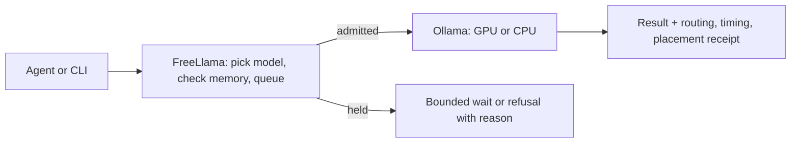

# FreeLlama


FreeLlama lets AI agents offload bounded tasks to **local Ollama models**. You or your agent submit a
task. FreeLlama picks an installed model, checks memory, queues or refuses work, and routes it to a GPU or
CPU Ollama backend. It returns the result plus evidence of where and how the task ran.

Good fits are embeddings, OCR/vision, bulk text transforms, and read-only repository lookups.
Your agent still decides what to delegate and verifies the answer.


```mermaid
flowchart LR
    Agent["Agent or CLI"] --> FL["FreeLlama: pick model, check memory, queue"]
    FL -->|admitted| Ollama["Ollama: GPU or CPU"]
    FL -->|held| Wait["Bounded wait or refusal with reason"]
    Ollama --> Receipt["Result + routing, timing, placement receipt"]
```

## Requirements

- [Ollama](https://ollama.com/download) installed and running (`ollama list` works).
- Node.js 20.19+ or 22.12+ for the npm packages.
- At least one installed model. FreeLlama never downloads a model without your explicit approval.

Prebuilt native binaries cover macOS, Linux (glibc/musl), and Windows on arm64 and x64.
Keep npm optional dependencies enabled; they carry the native binary.

## Use with your agent (MCP)

Add the MCP server to your agent host. Claude Code:

```bash
claude mcp add freellama -- npx -y @octocodeai/freellama-mcp-server
```

Claude Desktop, Cursor, and other hosts use the same command in their JSON config:

```json
{
  "mcpServers": {
    "freellama": {
      "command": "npx",
      "args": ["-y", "@octocodeai/freellama-mcp-server"],
      "env": { "FREELLAMA_MCP_ALLOWED_ROOTS": "/absolute/path/to/your-project" }
    }
  }
}
```

The server starts its own FreeLlama service when none is running. It does not install or start
Ollama. `FREELLAMA_MCP_ALLOWED_ROOTS` is needed only for `delegate_research`, which also requires
`python3`.

### MCP tools

| Tool | Use it to |
|---|---|
| `models` | List installed or loaded models, or search the Ollama library |
| `doctor` | Diagnose Ollama and FreeLlama, read live status and usage |
| `run_task` | Preview a route (`preview:true`) or run one task: chat, coding, tools, vision, embeddings |
| `run_task_batch` | Run independent tasks concurrently, with one result or error per task |
| `task_jobs` | Follow deferred tasks (`defer:true`): list, get, cancel, remove |
| `scope` / `session` | Keep bounded conversation history / keep related tasks on the same model |
| `warm_model` | Preload an installed model through the same memory checks |
| `delegate_research` | Read-only repository lookup that returns an answer with citations and a verdict |
| `ollama_manage` / `ollama_delete` | Pull or unload, or delete, one exact approved tag |

Typical flow: `models` → `run_task {preview:true}` → `run_task` with the prompt → check the receipt.
A preview runs nothing and reserves nothing. Full schemas and the agent workflow are in the
[MCP reference](packages/mcp/README.md).

## Use from the terminal (CLI)

```bash
npx @octocodeai/freellama init        # check prerequisites, print a first-run plan
npx @octocodeai/freellama doctor      # verify Ollama
npx @octocodeai/freellama serve       # start the service on http://127.0.0.1:11435
```

Keep `serve` running. In another terminal:

```bash
npx @octocodeai/freellama models
npx @octocodeai/freellama route --task completion --model MODEL_TAG     # preview only
npx @octocodeai/freellama task  --task completion --model MODEL_TAG "Reply with exactly OK."
npx @octocodeai/freellama status      # queues, memory holds, loaded models
```

Replace `MODEL_TAG` with an exact tag from `models`. Other commands: `jobs`, `usage`, `config`,
`warm`, `scope`, `session`, `recommend`, `bench-all`, `proxy`, and `tools` (maps each MCP tool to
its CLI command). Run `npx @octocodeai/freellama <command> --help`, or see the [CLI guide](docs/CLI.md).

While `serve` runs, a status page is available at `http://127.0.0.1:11435/_freellama/ui`.

## Features

- **Model selection:** filters installed models by capability, context window, policy, and confidence.
- **Resource admission:** weighted per-backend slots, finite queues, priorities, wait budgets, and
  host memory checks. Refusals include a reason and `retry_after_seconds`.
  See [monitoring and tuning](docs/MONITORING.md).
- **CPU + GPU backends:** optionally run a second, CPU-only Ollama for exact helper models, such as
  embeddings, next to GPU work. Each result reports the backend and the placement observed after
  execution. See [CPU/GPU routing](docs/CPU_GPU_ROUTING.md).
- **Deferred tasks and batches:** submit now and collect later, or fan out independent tasks.
- **Context and warming:** scopes, sessions, and warm models.
  See [Scopes and warming](docs/SCOPES_AND_WARMING.md).
- **Grounded research:** bounded read-only repository lookup with citations.
- **Small agent context:** compact views, paged details, and embedding vectors omitted unless requested.
- **Monitoring:** live status, usage, metrics, circuit breakers, and runtime config reload.
- **Evaluation:** benchmark installed models and build a routing policy from the results.
  See [model selection](docs/MODEL_SELECTION.md).
- **Ollama compatible:** `/api/*` and `/v1/*` pass through to Ollama unchanged.
  See [Ollama compatibility](docs/OLLAMA_SIDECAR.md).

## Good to know

- Model searches and recommendations never download anything. Approve one exact tag and size before a pull.
- Managed tasks are non-streaming. Raw Ollama passthrough keeps streaming.
- CPU assignment is configured by the operator. Trust the returned placement evidence, not the configuration.
- Memory checks keep a reserve of free RAM, so a model can be refused while the OS still shows free memory.
  See [CLI admission controls](docs/CLI.md#bound-admission).
- Scopes, sessions, and deferred jobs live in memory and are lost when the service restarts.
- The service binds to loopback by default. For remote access, see [Production](docs/PRODUCTION.md).

## Build from source

Requires Rust 1.85+ and Yarn.

```bash
yarn install && yarn build
./target/release/freellama serve
node packages/mcp/dist/index.js        # MCP server from this checkout
```

npm releases can lag this checkout. Checks are described in [Testing](docs/TESTING.md); the release
gate is `yarn verify:production`.

## Documentation

| Topic | Guide |
|---|---|
| All guides | [Documentation index](docs/README.md) |
| MCP tools, schemas, agent workflow | [MCP reference](packages/mcp/README.md), [agent skill](skills/freellama/README.md) |
| CLI commands and flags | [CLI](docs/CLI.md) |
| How it works and who owns what | [Architecture](docs/ARCHITECTURE.md) |
| CPU/GPU setup and placement | [CPU/GPU routing](docs/CPU_GPU_ROUTING.md) |
| Queues, memory, live tuning | [Monitoring](docs/MONITORING.md) |
| Choosing models | [Model selection](docs/MODEL_SELECTION.md), [model metadata](docs/MODEL_METADATA.md) |
| Deployment and releases | [Production](docs/PRODUCTION.md), [Release](RELEASE.md) |
| Benchmarks and economics | [Benchmarks](benchmark/README.md), [token economics](docs/ECONOMICS.md) |
| Embedding the Rust core | [Rust core](packages/rust-core/README.md) |

Licensed under [Apache-2.0](LICENSE-APACHE) or [MIT](LICENSE-MIT).
