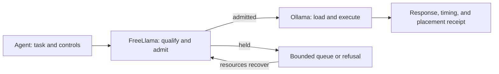

# FreeLlama


FreeLlama helps AI agents choose local Ollama models, control task execution within resource limits, and retain scoped task history.
It queues or refuses work when constraints fail and returns evidence about routing, timing, and observed model placement.

**Main strength:** one managed task contract connects model eligibility, resource admission, task history, and execution evidence.
Your agent owns the prompt and task dependencies. FreeLlama checks whether the work can run. Ollama runs the model.


```mermaid
flowchart LR
    Agent["Agent: task and controls"] --> Check["FreeLlama: qualify and admit"]
    Check -->|"admitted"| Ollama["Ollama: load and execute"]
    Check -->|"held"| Wait["Bounded queue or refusal"]
    Wait -->|"resources recover"| Check
    Ollama --> Receipt["Response, timing, and placement receipt"]
```

[Quick start](#quick-start) · [Features](#features) · [MCP setup](#connect-your-agent) · [Comparison](#how-it-differs) · [Guides](#documentation)

## Quick start

Install and start [Ollama](https://ollama.com/download) first. FreeLlama uses its installed models and inference runtime.
For this checkout, use Node.js 20.19+ or 22.12+, Rust 1.85+, and Yarn.
Run these commands from the repository root:

```bash
ollama list
yarn install
yarn build
./target/release/freellama doctor
./target/release/freellama serve
```

The control plane listens on `http://127.0.0.1:11435`; Ollama defaults to `http://127.0.0.1:11434`.
Keep `serve` running. In another terminal, inspect the inventory and choose an installed completion model:

```bash
./target/release/freellama models
./target/release/freellama route --task completion --model INSTALLED_MODEL --context-tokens 2048
./target/release/freellama task --task completion --model INSTALLED_MODEL --context-tokens 2048 \
  "Reply with exactly OK."
```

Replace `INSTALLED_MODEL` with an exact installed tag supporting completion and a context window of at least 2,048 tokens.
`route` previews the choice without inference. `task` checks resources again, then executes or returns a reason it cannot proceed.
A preview does not reserve capacity. Read the task's response and execution receipt before accepting the result.
If work waits or refuses, run `./target/release/freellama status` for queues, resource holds, and breaker state.

An empty model inventory is valid. Inspect [model selection](docs/MODEL_SELECTION.md) before installing a model.
Search and recommendations never download models. Approve one exact tag and its reported size before a pull.

For published versions, the CLI and MCP server also run through npm:

```bash
npx @octocodeai/freellama doctor
npx @octocodeai/freellama-mcp-server
```

npm runs the latest published release, which can differ from this checkout.
The MCP server uses stdio; configure it in your agent host rather than running it interactively.
Keep npm optional dependencies enabled: they provide the matching native CLI and addon.
Prebuilt targets cover macOS arm64/x64, Linux arm64/x64 with glibc or musl, and Windows arm64/x64.
See the [CLI package](packages/cli/README.md) and [release procedure](RELEASE.md) for installation details.

## Features

| Feature | What you control or receive | Entry point |
|---|---|---|
| Model discovery | Installed and resident models, capabilities, exact library tags, download sizes, and host diagnostics | `models`, `doctor` |
| Task qualification | Model, capability, context, policy, confidence, and placement requirements; preview or refusal before inference | `run_task`, CLI `route` |
| Natural-language routing | A local model converts wording into typed intent; the core still owns model selection | CLI `natural-route` |
| Managed inference | Chat, coding, tools, vision/OCR, embeddings, and long-context requests with caller-owned prompts and runtime options | `run_task`, CLI `task` |
| Resource queues | Weighted fair admission, host pressure holds, finite queues, priorities, wait budgets, deadlines, and cancellation | [Admission controls](docs/CLI.md#bound-admission) |
| Independent batches | Bounded concurrent dispatch, stable task IDs, fair priorities, and separate results or errors for each task | `run_task_batch` |
| Deferred tasks | Submit now; inspect status, retrieve a result, cancel, or remove the retained record | `task_jobs`, CLI `jobs` |
| Task context | Bounded message history, routing defaults, revision checks, and independent history forks | `scope` |
| Affinity and warming | Prefer the same model for related work; warm installed models through managed resource checks | `session`, `warm_model` |
| CPU/GPU routing | Assign exact models to a second CPU Ollama process and inspect observed residency after execution | [CPU/GPU setup](docs/CPU_GPU_ROUTING.md) |
| Adaptive feedback | Prefer an eligible backend only when comparable observed samples justify the choice; explicit controls retain authority | [Feedback rules](docs/CPU_GPU_ROUTING.md#understand-automatic-feedback) |
| Grounded research | Bounded read-only repository lookup with citations, paged observations, context fitting, and a verification verdict | `delegate_research` |
| Monitoring and tuning | Queue state, usage, metrics, memory, model residency, circuit breakers, adaptive limits, eviction evidence, and runtime config reload | CLI `status`, `usage`, `config`; [monitoring](docs/MONITORING.md) |
| Cost visibility | Observed local token counts and an optional equivalent API-cost estimate using operator-configured rates | [MCP telemetry](packages/mcp/README.md#measure-avoided-external-cost) |
| Model evaluation | Frozen suites, correctness checks, benchmark reports, and policy generated from evaluation results | CLI `bench-all`, `run`, `eval`, `policy-from-eval` |
| Explicit lifecycle | Pull or unload exact models; keep permanent deletion separate from ordinary task execution | `ollama_manage`, `ollama_delete` |
| Ollama compatibility | Pass native `/api/*` and `/v1/*` traffic to the primary Ollama backend | CLI `serve` or `proxy` |

MCP, the CLI, and embedded Rust applications share the routing core.
Raw compatibility requests use a separate passthrough path; managed qualification and CPU assignments apply to managed tasks.

### Keep context and residency separate

- **Scope:** message history and routing defaults. A revision protects each append; forks create independent histories.
- **Session:** model affinity for related tasks. It stores no messages or engine cache.
- **Warm model:** a loaded Ollama runner retained through residency controls. It can still be evicted.

Scopes and deferred jobs are process-local and disappear on service restart.
Reusing history does not transfer KV tensors or reserve a runner. Ollama owns engine cache reuse.
Use [Scopes and warming](docs/SCOPES_AND_WARMING.md) for limits, failures, and examples.

### Keep the calling agent's context small

Model inventory and diagnostics offer compact views and paged details.
Embedding vectors stay out of MCP responses by default; request them explicitly when storing values.
Delegated research returns an answer, citations, and a verdict instead of the full intermediate tool transcript.
The local worker still consumes model tokens. This reduces the caller's context burden, not the computation needed for the task.

### Inspect the runtime

The built-in status page is available at `http://127.0.0.1:11435/_freellama/ui` while `serve` runs.
For the separate React dashboard, run the following command from this checkout:

```bash
yarn dev:view
```

Open `http://127.0.0.1:5173` for queues, models, usage, configuration, and diagnostics.
The dashboard is read-only and requires Node.js 20.19+ or 22.12+.
See the [runtime view](packages/view/README.md) for setup and telemetry meanings.

## Connect your agent

After building this checkout, add the MCP server to your host's configuration:

```json
{
  "mcpServers": {
    "freellama": {
      "command": "node",
      "args": ["/ABSOLUTE/PATH/FreeLlama/packages/mcp/dist/index.js"],
      "env": {
        "FREELLAMA_MCP_ALLOWED_ROOTS": "/ABSOLUTE/PATH/your-project"
      }
    }
  }
}
```

Replace both paths with your checkout and the project the research adapter can read.
For a published release, use `"command":"npx"` and `"args":["@octocodeai/freellama-mcp-server"]` instead.
The MCP server can start an owned control-plane child when the default local service is unavailable.
It does not install or start Ollama.
Research delegation additionally requires Python 3 available as `python3`.
See [MCP setup](packages/mcp/README.md) for endpoint overrides, authentication, schemas, and allowed roots.

### Preview, then execute

Start with `models {view:"installed"}`. For a consequential task, call `run_task` with routing fields only:

```json
{
  "task": "completion",
  "model": "INSTALLED_MODEL",
  "contextTokens": 2048,
  "preview": true
}
```

Review the decision. Submit the payload in a separate `run_task` call:

```json
{
  "task": "completion",
  "model": "INSTALLED_MODEL",
  "contextTokens": 2048,
  "prompt": "Reply with exactly OK.",
  "options": { "num_predict": 32 }
}
```

Use the exact installed tag from the quick start.
Preview requests reject prompts, messages, images, embedding inputs, tools, and runtime options.
Execution rechecks eligibility and admission. An explicit model choice does not establish answer quality.
Read `structuredContent` for the canonical result, errors, and execution evidence.

For longer work, add `defer:true`, then use the returned job ID with `task_jobs`.
For parallel work, use `run_task_batch` only when tasks do not consume each other's results.
For file-backed questions, use `delegate_research` with a self-contained question and an allowed `workspacePath`.
Your agent retains decomposition, judgment, and final verification; discard an `escalate` result.

## How it differs

FreeLlama's distinction is the combination of agent-facing task controls around a local Ollama runtime.
The individual mechanisms have counterparts elsewhere: warming, queues, routing, and cache reuse are established features.
FreeLlama connects qualification, fair admission, scoped history, bounded research, and inspectable receipts in one managed workflow.

| Project | Main emphasis | FreeLlama's difference |
|---|---|---|
| [Ollama](https://docs.ollama.com/faq) | Model loading, residency, request queues, and inference | Adds task eligibility, host admission policy, scoped history, and managed execution receipts around Ollama. |
| [llama.cpp](https://github.com/ggml-org/llama.cpp/blob/master/tools/server/README.md) | Engine controls, continuous batching, parallel slots, and prompt-cache save/restore | Manages application history and task policy through Ollama; scopes are distinct from engine-cache snapshots. |
| [vLLM](https://github.com/vllm-project/vllm) | PagedAttention, continuous batching, prefix caching, and distributed inference | Focuses on local agent delegation; engine scheduling remains with Ollama and its runners. |
| [SGLang](https://github.com/sgl-project/sglang) | Multimodal inference; ecosystem includes KV caching and deployment gateways | Targets local Ollama task control rather than implementing those inference and deployment mechanisms. |
| [LiteLLM](https://docs.litellm.ai/docs/routing) | Multiple deployment-routing strategies, affinity, retries, fallbacks, and usage limits | Focuses on installed-model eligibility, host resources, task scopes, and observed CPU/GPU placement. |
| [RouteLLM](https://github.com/lm-sys/RouteLLM) | Trained prompt routing between stronger and weaker models | Uses explicit qualification and bounded backend feedback; it does not learn prompt-specific answer quality. |

Choose FreeLlama when your agent needs controlled local delegation with reasons, task history, and execution evidence.
Use Ollama directly when your application already owns these decisions and needs its native inference API.
Direct integrations with llama.cpp, vLLM, and SGLang are outside FreeLlama's current backend contract.
Read the [feature and logic comparison](docs/dev/FINDINGS_AND_POSITIONING.md#feature-and-logic-assessment) for the detailed assessment.

## Boundaries

Managed tasks are non-streaming. Raw Ollama passthrough retains upstream streaming behavior.
CPU assignment is operator-owned; verify returned placement rather than assuming `num_gpu:0` controls every runner.
A scope ID is a history handle, not a tenant credential. Model capability labels and successful execution do not establish answer correctness.

The service defaults to loopback. Remote access requires explicit opt-in and bearer authentication; use an external ingress for TLS and tenant isolation.
FreeLlama is designed for one operator or a trusted team. Local inference uses your hardware, memory, power, and time.
The name refers to reducing reliance on metered inference; supported models are not limited to the Meta Llama family.
See [Production](docs/PRODUCTION.md) for authentication, persistence, deployment, and recovery.

## Development and verification

The production gate builds packages and checks Rust, TypeScript, adapters, benchmark contracts, integration, and release artifacts:

```bash
yarn verify:production
```

This gate needs the prerequisites and native artifacts described in [Testing](docs/TESTING.md) and [Release](RELEASE.md).
Physical throughput, CPU/GPU activity, and thermal behavior require separate [local measurements](docs/dev/LOCAL_PERFORMANCE_TESTING.md).
Historical results and their limits live in the [findings report](docs/dev/FINDINGS_AND_POSITIONING.md) and [benchmarks](benchmark/README.md).

## Documentation

| Goal | Guide |
|---|---|
| Choose a model and set evidence requirements | [Model selection](docs/MODEL_SELECTION.md), [model metadata](docs/MODEL_METADATA.md) |
| Understand ownership and request flows | [Architecture](docs/ARCHITECTURE.md), [Ollama compatibility](docs/OLLAMA_SIDECAR.md) |
| Configure commands and per-task controls | [CLI](docs/CLI.md), [MCP](packages/mcp/README.md), [agent skill](skills/freellama/README.md) |
| Retain context or warm related work | [Scopes and warming](docs/SCOPES_AND_WARMING.md) |
| Configure CPU/GPU backends and feedback | [CPU/GPU routing](docs/CPU_GPU_ROUTING.md), [system optimization](docs/dev/OLLAMA_SYSTEM_OPTIMIZATION.md) |
| Monitor queues, usage, and live configuration | [Monitoring](docs/MONITORING.md), [runtime dashboard](packages/view/README.md) |
| Deploy or publish a release | [Production](docs/PRODUCTION.md), [Release](RELEASE.md) |
| Embed the routing core | [Rust core](packages/rust-core/README.md) |
| Evaluate models and investigate adapters | [Benchmarks](benchmark/README.md), [adapter contracts](AGENTS.md), [token economics](docs/ECONOMICS.md) |
| Review positioning and design decisions | [Product positioning](docs/PRODUCT_POSITIONING.md), [findings](docs/dev/FINDINGS_AND_POSITIONING.md), [resource-routing decision](docs/dev/ADR_RESOURCE_AWARE_BACKEND_ROUTING.md) |

Licensed under [Apache-2.0](LICENSE-APACHE) or [MIT](LICENSE-MIT).
