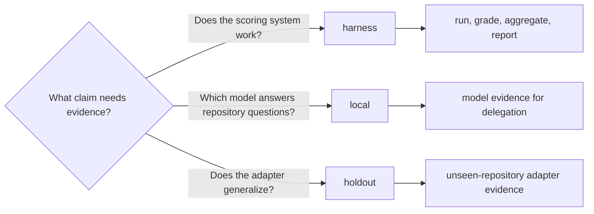

# Benchmarks

Three surfaces, three questions. Start at the directory that matches what you are measuring.

| Directory | Measures | Corpus |
|---|---|---|
| [`harness/`](harness/README.md) | generic scoring (run → grade → aggregate → report) | synthetic `atlas` fixture |
| [`local/`](local/README.md) | **which model** answers code-research questions | pinned `click` / `zustand` / `openui` |
| [`holdout/`](holdout/README.md) | **the adapter loop**, on repos it was never tuned against | fresh clones in `.clones/` (gitignored) |

[`evidence/model-evidence.json`](evidence/model-evidence.json) is the on-disk grade table `delegate_research` loads. [`suites/`](suites/ollama-mlx-regressions.json) is the Ollama/MLX regression suite for `freellama eval`, not the agent harness.

Adapters live under `local/scripts/`. The harness never owns a model-specific prompt.

These benchmarks measure correctness and adapter behavior. `freellama bench-all` measures local
throughput for routing and does not produce quality policy. Generate a policy only from a reviewed
quality aggregate with `freellama policy-from-eval`; see the
[CLI policy workflow](../docs/CLI.md#earn-medium-routing-confidence).
