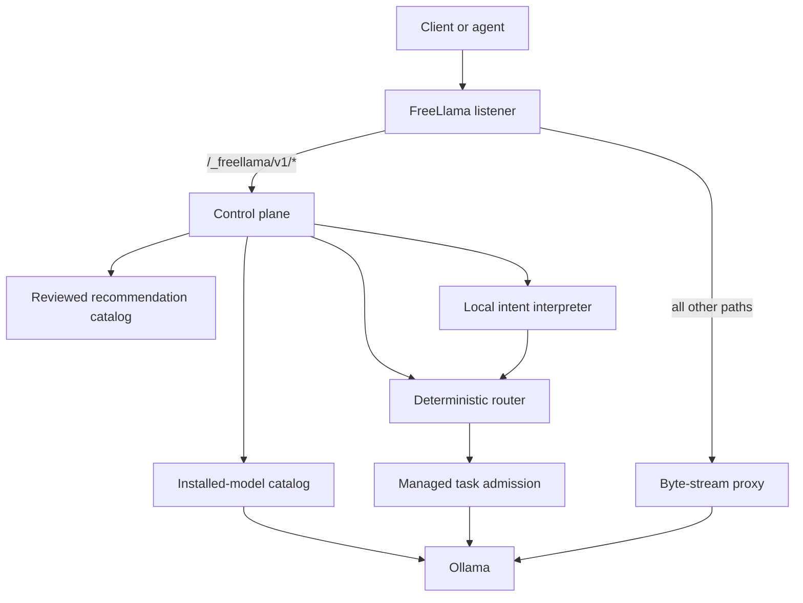

# FreeLlama architecture

FreeLlama is a localhost control plane and compatibility facade in front of Ollama. Ollama owns model storage, model loading, inference, native APIs, and OpenAI-compatible APIs. FreeLlama owns discovery, policy, routing, admission, and evidence.

## Request paths

The control plane exposes health, machine, models, sessions, routes, recommendations, natural routes, and tasks. The fallback proxy preserves Ollama endpoints and streaming behavior.

Recommendations join installed-model discovery, a reviewed static catalog, and the machine profile. The result can contain an installed route or a side-effect-free installation plan. FreeLlama never runs the plan.

## Route selection

Structured routing filters installed models by capability and requested context before ranking them. Explicit model selection never substitutes another model. `balanced` and `quality` require policy-qualified candidates; `fastest` can fall back to capability or functional benchmark evidence with lower confidence.

Natural-language routing has two stages:

1. A small local Ollama model converts text to a strict task, objective, context, tool, and vision schema. It cannot name the final model.
2. Deterministic guards correct explicit constraints and pass the normalized intent to the evidence router.

The natural-language endpoint returns the normalized intent and route. It does not execute the task atomically. Use the managed task endpoint or invoke the selected model separately.

## State and concurrency

Sessions and the model catalog reside in memory. Sessions bind related requests to an eligible model. FreeLlama caches static catalog metadata for 30 seconds and refreshes residency from Ollama.

Managed resident tasks share an admission permit. A managed nonresident task receives exclusive transition admission. Passthrough requests remain under Ollama's scheduler and do not join those permits.

## Product boundary

FreeLlama is a local gateway, an embeddable Rust server, and an MCP tool server (`packages/mcp/`, built on the NAPI bindings in `packages/rust-core/src/napi.rs`). It is not a remote provider marketplace, billing layer, remote model registry, installation executor, agent runtime, or A2A coordinator. Those capabilities require separate public contracts and tests before they become part of the platform.

For endpoint details, run `cargo run -- --help` or inspect `packages/rust-core/src/platform.rs` directly.
