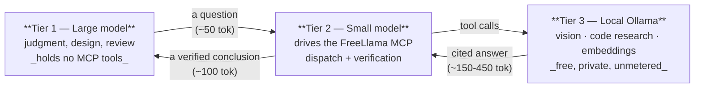
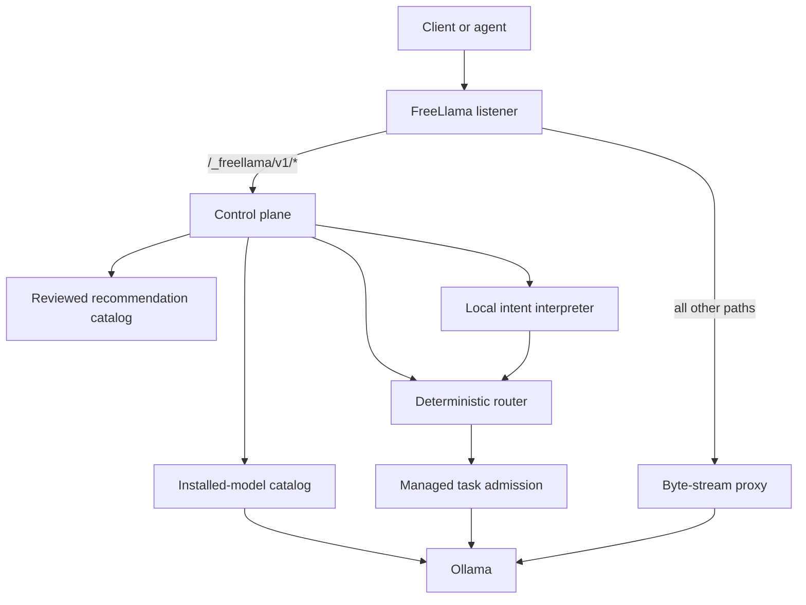
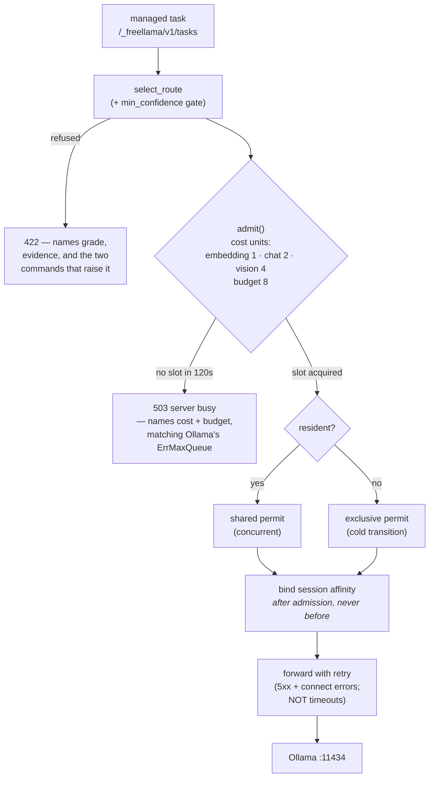

# FreeLlama architecture

## The shape: three tiers, and the expensive one never touches raw data



The point of the shape is what each arrow does **not** carry. Tier 3 reads whole files and produces
raw vectors; none of that reaches tier 1. Tier 2 holds the tool schemas; tier 1 never pays for them.

**Each hop strips tokens, and the cost of being wrong falls as you go down.** That ordering is the
whole design: work moves down only as far as accuracy still holds, and the tier that decides what
matters stays at the top.

### Why the *small* model holds the MCP, not the large one

This is the part that is easy to get backwards. The obvious wiring gives the frontier model the MCP
tools directly. That is worse, for three measured reasons:

1. **Schema cost is paid per turn, forever.** FreeLlama's eight tools cost **~2,990 tokens** of
   schema (measured: `doctor` 198, `models` 352, `route` 419, `search_models` 499, `run_task` 521,
   `ollama_manage` 272, `ollama_delete` 290, `delegate_research` 436). Attached to tier 1 that is
   billed on every single turn of a long session whether or not a tool is called. Attached to tier
   2 it is paid once inside a short, bounded sub-session.
2. **Tool dispatch is not judgment.** Choosing `delegate_research` over `run_task`, filling in a
   `workspacePath`, reading a verdict and retrying once — that is mechanical routing, which is
   exactly the profile small models handle well. The thing they are *bad* at is judgment, and
   dispatch is not judgment.
3. **A small model can drive these tools — but verify that it did.** Tested here: a Haiku-class
   agent loaded the tool schemas and successfully called `doctor`, returning real output. Its
   *judgment* was sound too — asked whether to delegate a trivial `ls`-shaped lookup, it correctly
   declined because "round-trip overhead exceeds the value gained". But in a second run under a
   heavier three-task load, the same class of model **drifted off the tools entirely**, answered
   via shell commands instead, and then reported that the MCP tools "were not directly invokable" —
   a confident, specific, and false explanation for its own failure. It also misread the chip as
   "M3 Max class" (it is an M4 Pro) from raw `sysctl` output rather than calling `doctor`, which
   reports it correctly.

   This is the same failure this whole design is built around, one tier up: the small model is
   unreliable at judging *its own run*, in the same confident tone it uses when correct. So tier 1
   must check what tier 2 **did** — which tools it actually called — not what tier 2 says it did.
   Tier 2's self-report is exactly as untrustworthy as tier 3's.

4. **A verifier must be independent.** A local model cannot check its own work, which is why
   `delegate_research` computes its verdict from what the run *did* — files read, model used —
   never from what the model claims. Tier 2 is the independent checker that reads the evidence
   trail. Tier 1 is reserved for when tier 2 disagrees with tier 3.

### What each tier is for

| Tier | Give it | Never give it | Why |
|---|---|---|---|
| **1 — Large** | judgment, design, review, "is this good", deciding what matters | bulk reading, raw vectors, tool-schema overhead | it is the only tier that can be trusted when being wrong is costly |
| **2 — Small** | tool dispatch, verifying a claim against cited evidence, reconciling fan-out, summarising results | anything needing real judgment; anything needing local machine state it cannot query | good at mechanical work, cheap enough to spend freely |
| **3 — Local Ollama** | embeddings, grounded code lookups, OCR and image description, bulk transforms | judgment (measured ~67%), anything under ~12B, "find the relevant file" (grep wins) | free and private, but only inside its verified competence zone |

### What tier 3 is actually good at, measured on this machine

Ranked by value per second. The ordering matters more than the numbers, and the top entry is not a
generation task at all.

| Work | Measured | Preserved | Verdict |
|---|---|---:|---|
| **Embeddings** (`run_task`) | 4 × 768-dim in **307 ms**; raw floats withheld behind a ~200-token envelope | **98.9%** | Strongest by a distance — no sampling, so nothing to hallucinate |
| **Grounded code research** (`delegate_research`) | 6 questions: 59,208 tokens of source → 1,742 returned | **97.1%** | Real, but read the verdict |
| **Vision / OCR** | 2 images, byte-exact incl. `QX7-4419-ZK` and `8823-KP-0071`; ~1,970 image tokens local → 37 back | **98.1%** | Works; 19–25 s per image |
| **Tool schemas** | 2,987 tokens/turn, paid by tier 2 instead of tier 1 | **100%** | Only if the tiers are actually split |
| Finding which file is relevant | **lost to `grep`** twice | — | Do not delegate |

Scaled to 20 grounded questions + 200 turns + one 322-chunk index: **≈ 605,000 tokens preserved**,
about 3 × a 200K window. That figure already discounts schema rent by ~90% for prompt caching;
undiscounted it would read 1.14M, which would be dishonest — cached input is far cheaper, and the
rent only accrues if a separate small model holds the tools.

### The cost side, stated plainly

Grounded questions take 7–62 s versus ~1 s for a frontier model that already holds the file. This
trades wall-clock for context, and it is only worth it when the source is large enough — past
roughly 1k tokens of input the token maths already wins, below that just read the file.

### The failure mode this shape exists to prevent

A local model is ~99% accurate on grounded lookups and ~67% on judgment, **in an identical
confident tone**. The answer text carries no signal about which one you got. So the architecture
never asks a reader to judge the answer — it routes on what the run *did*:

- read no files → `escalate` (that is recall, not research)
- model measured unusable → `escalate`, refused *before* generating
- outside the measured 1-5 file envelope → `verify`
- grounded, lookup-shaped, strong model → `accept`

Measured on the first benchmark run: `accept` was correct 3/3, `verify` was correct 0/3. The verdict
did the separating, not the prose.

---

## The plumbing: a control plane in front of Ollama

FreeLlama is a localhost control plane and compatibility facade. Ollama owns model storage, model
loading, inference, native APIs, and OpenAI-compatible APIs. FreeLlama owns discovery, policy,
routing, admission, and evidence.



The control plane exposes health, machine, models, sessions, routes, recommendations, natural
routes, and tasks. The fallback proxy preserves Ollama endpoints and streaming behavior.

Recommendations join installed-model discovery, a reviewed static catalog, and the machine profile.
The result can contain an installed route or a side-effect-free installation plan. FreeLlama never
runs the plan.

**Not every control-plane route is an MCP tool.** `/_freellama/v1/recommendations` and
`/_freellama/v1/natural-routes` are reachable over HTTP and from the CLI, but were deliberately
removed from the MCP surface — the NAPI bindings (`recommend`, `naturalRoute`) still exist so they
can be restored. Treat the eight registered tools as the agent-facing contract, not the endpoint
list.

## Admission and throttling

`managed_execution` alone does not bound concurrency: resident tasks take a *shared* permit, so any
number could be admitted together and pile into Ollama — which then queues them
(`OLLAMA_MAX_QUEUE`, 512) and 503s the overflow, while each queued request burns its own 900 s
budget waiting. A cost-weighted semaphore turns that burst into bounded, visible backpressure.



Three orderings in that diagram are load-bearing and each fixes a real defect:

- **Slot before lock, in both branches.** The reverse order deadlocks: the non-resident path would
  hold the write lock while waiting for a slot that resident readers hold.
- **Bind affinity after admission.** Binding at routing time meant a 503'd task had already pinned
  the session's model — the caller saw a refusal and concluded nothing happened.
- **Timeouts are not retried.** The per-attempt budget is 900 s and the caller holds the admission
  slot *and* the exclusive lock across attempts, so retrying a timeout blocked the whole managed
  plane for up to 45 minutes. Connection errors still retry: they fail fast and cost nothing.

At the default `OLLAMA_NUM_PARALLEL=1` this bounds bursts and adds observability but buys no parallel
decoding — measured 1.12× on two concurrent requests against a resident model. Raise
`OLLAMA_NUM_PARALLEL` with `--max-concurrent-tasks`, and pair it with `OLLAMA_KV_CACHE_TYPE=q8_0`
so the extra KV cache roughly pays for itself.

### The load-shedding signal

`GET /_freellama/v1/health` answers "delegate, queue, or do it myself" for the cost of one request:

```json
{ "status": "ok", "admission": { "slots_total": 8, "slots_available": 8,
  "max_queue_wait_seconds": 120, "costs": { "embedding": 1, "chat": 2, "vision": 4 } } }
```

`slots_available: 0` means "expect to queue". The snapshot is racy and advisory by design — a
readiness signal, not a reservation — but without it the only way to learn the queue state was to
submit and possibly eat the full wait or a 503.

## KV-cache behaviour, measured

Prefix reuse is real, large, and survives interleaving — measured on this machine's MLX backend:

| Probe (`/api/chat`, 2,462-token prefix) | prompt_eval |
|---|---:|
| turn 1, cold | 18,631 ms |
| turn 2, warm | **281 ms** |
| a different conversation interjected | 22,467 ms (its own cold prefill) |
| turn 3 of the original, afterwards | **285 ms — cache survived** |

Do not measure this with `prompt_eval_count` — it counts all prompt tokens whether or not they were
served from cache, and misreading it produced a false "reuse is broken" conclusion here. Durations
are the truth.

Three consequences:

- **The byte-preserving proxy is load-bearing for performance, not just correctness.** Prefix reuse
  needs byte-identical prefixes; a proxy that re-serialized bodies would silently destroy it.
- **Context compaction is cache-hostile.** `fit_to_context` edits old messages when the window is
  nearly full, changing the prefix and invalidating the cache from the edit onward. The mitigation
  is headroom: `q8_0` halves KV memory, doubling cacheable context for the same footprint;
  `FREELLAMA_AGENT_NUM_CTX` raises the adapter window (16K at q8_0 costs what 8K costs at f16).
- **Per-turn cost is prefill of *new* tokens (~130 tok/s) plus generation (~40 tok/s)**, not
  re-reading old context. Latency scales with tool calls (`seconds ≈ 9.8 × calls`, r = 0.81), so
  fewer, better-aimed commands remain the only real latency lever.

## Route selection — inspectable, not just gated

Structured routing filters installed models by capability and requested context before ranking them.
Explicit model selection never substitutes another model. `balanced` and `quality` require
policy-qualified candidates; `fastest` can fall back to capability or functional benchmark evidence
with lower confidence.

**`confidence` is derived, never asserted.** A single word invites being read as a calibrated
probability, which it is not — so every decision reports the dimensions it is derived from, plus
why each losing candidate lost:

```
selected        : qwen3.8:27b-mlx
quality_evidence: none          # no policy vouches for this model on this task
task_evidence   : none          # no functional benchmark measured it
hardware_fit    : strong        # strong | insufficient_context | unknown — never a silent pass
confidence      : low           # derived from the three above
rejected        : [{model, reason, resident}, …]
```

`medium` requires quality **and** task evidence both `strong` — i.e. both a policy file and a
benchmark report. With neither (a fresh install), everything grades `low` and
`minConfidence: "medium"` refuses everything. Deliberate fail-closed behaviour: the gate is inert
until `bench-all` and `policy-from-eval` have produced real evidence.

**One gate, in the router.** `enforce_min_confidence` runs inside `select_route`, so the CLI
(`--min-confidence`), the HTTP API, the MCP, and anyone embedding `freellama-core` inherit the same
behaviour. This is not a nicety: the gate originally lived only in the TypeScript MCP wrapper, and
its rank map defaulted unknown grades to the lowest rank — so `minConfidence: "high"` (a natural
guess; the router never issues "high") *silently passed*. The same fail-open bug then turned up a
second time in the MCP layer after the core was fixed, because the napi bindings never forwarded
the field. Both are closed, both are contract-tested, and the refusal a caller receives names the
grade, the evidence, the model it would have picked, and the two commands that raise the grade.

Natural-language routing has two stages:

1. A small local Ollama model converts text to a strict task, objective, context, tool, and vision
   schema. It cannot name the final model.
2. Deterministic guards correct explicit constraints and pass the normalized intent to the evidence
   router.

The natural-language endpoint returns the normalized intent and route. It does not execute the task
atomically. Use the managed task endpoint or invoke the selected model separately.

## State and concurrency

Sessions and the model catalog reside in memory. Sessions bind related requests to an eligible
model. FreeLlama caches static catalog metadata for 30 seconds and refreshes residency from Ollama.

Managed resident tasks share an admission permit. A managed nonresident task receives exclusive
transition admission. Passthrough requests remain under Ollama's scheduler and do not join those
permits.

Both retry-capable callers — the passthrough (`proxy::send_with_retries`) and the managed-task path
(`platform::post_json_with_retries`) — share one backoff schedule via `proxy::retry_delay`. They
keep separate `reqwest::Client`s on purpose, because a managed generation needs a 900s budget while
discovery calls need 30s, but the retry policy itself is not duplicated.

## Context management in the research adapters

The adapters that tier 3 runs (`benchmark/local/scripts/`) drive their own chat loop, so they own
their context budget. Four behaviours are load-bearing (full detail and the loop diagram in
`AGENTS.md`; contracts in `test_agent_context.py`):

- **Pagination, never truncation.** Tool output is stored in full; the model sees one page plus an
  exact next-page action. Clipping used to discard 89% of a routine repo-wide grep — which is how a
  model concludes "not found" from a window that never contained the answer. Reassembled pages are
  asserted byte-identical to the input.
- **Context fitting.** Ollama silently truncates an over-long prompt from the *front* — the system
  prompt — after which the agent stops emitting JSON. `fit_to_context` pins the system prompt and
  question and compacts oldest observations instead.
- **JSON repair.** One unparseable reply used to abort the whole run, discarding every tool result
  gathered. It is now corrected in place, bounded at two repairs.
- **Repeat suppression.** An exact repeat is answered from the stored prior step, never re-executed.

What comes back up the stack is equally structured: `delegate_research` returns `verification`
(recommendation + why, computed from what the run *did*) and `citations[]` — full, unclipped
commands and paths, successful steps only, because a failed command is not a citation for anything.

## Product boundary

FreeLlama is a local gateway, an embeddable Rust server, and an MCP tool server (`packages/mcp/`,
built on the NAPI bindings in `packages/rust-core/src/napi.rs`). It is not a remote provider
marketplace, billing layer, remote model registry, installation executor, agent runtime, or A2A
coordinator. Those capabilities require separate public contracts and tests before they become part
of the platform.

It also does not make inference faster. A 2026-08-23 audit measured a 43.9% throughput gain and
traced it entirely to Ollama's MLX artifact, not to FreeLlama; holding the artifact constant, the
proxy added 0.330ms median transport overhead and no speedup. **Use Ollama directly if the goal is
raw speed for one exact model.** FreeLlama's value is the token offload above, plus policy,
admission, and evidence.

For endpoint details, run `cargo run -- --help` or inspect `packages/rust-core/src/platform/`.
