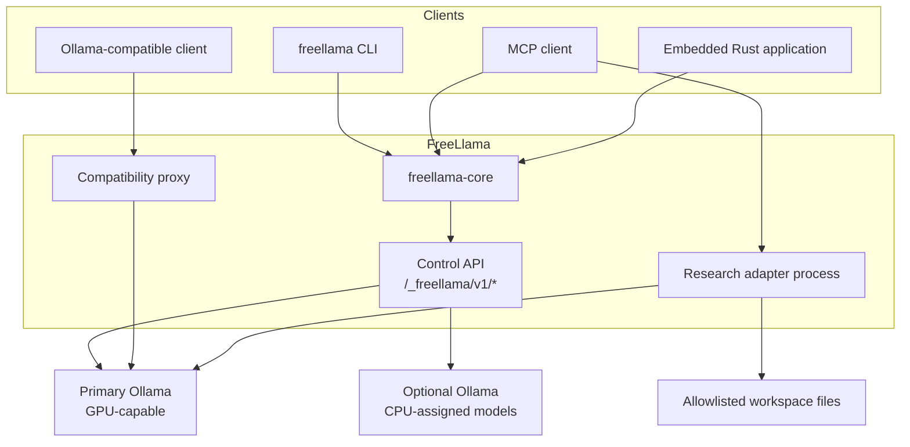
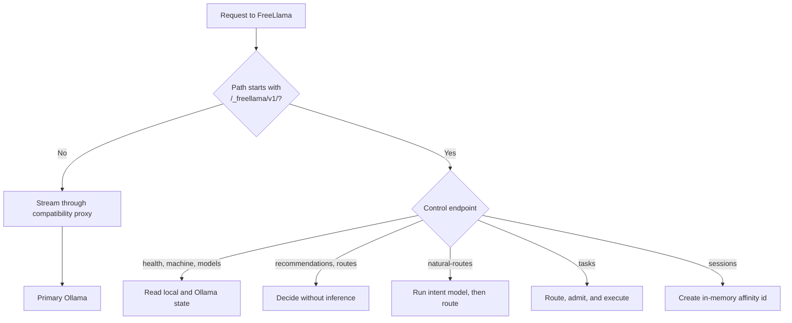
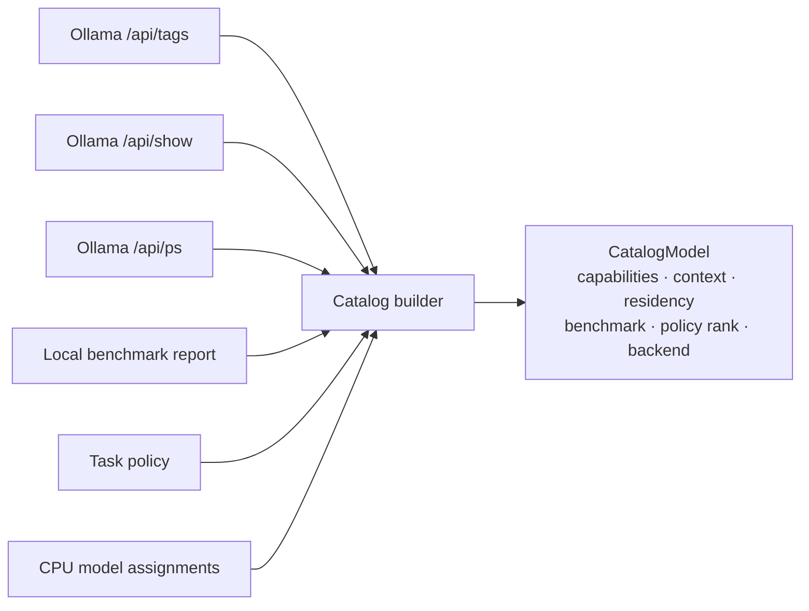
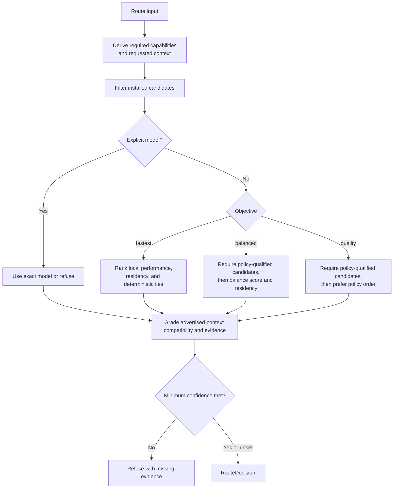
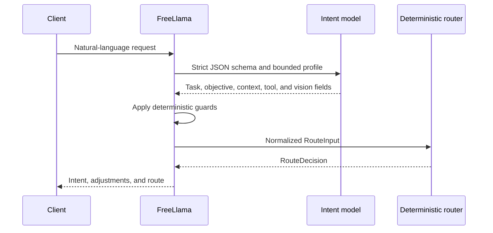
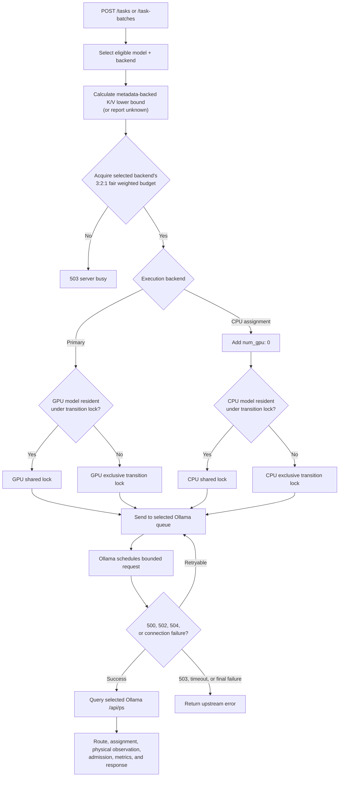
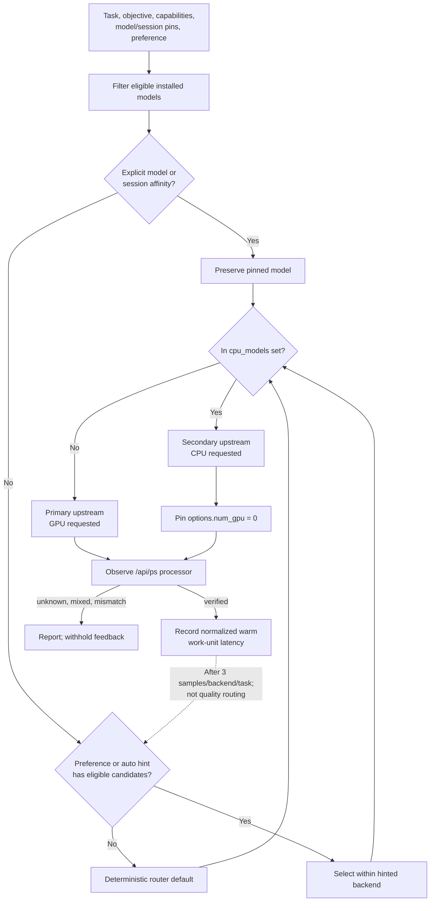
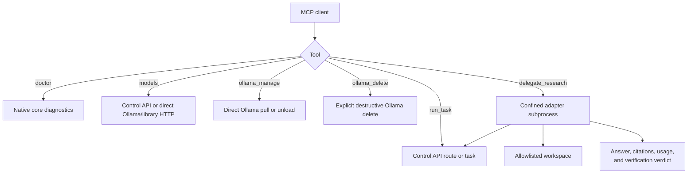
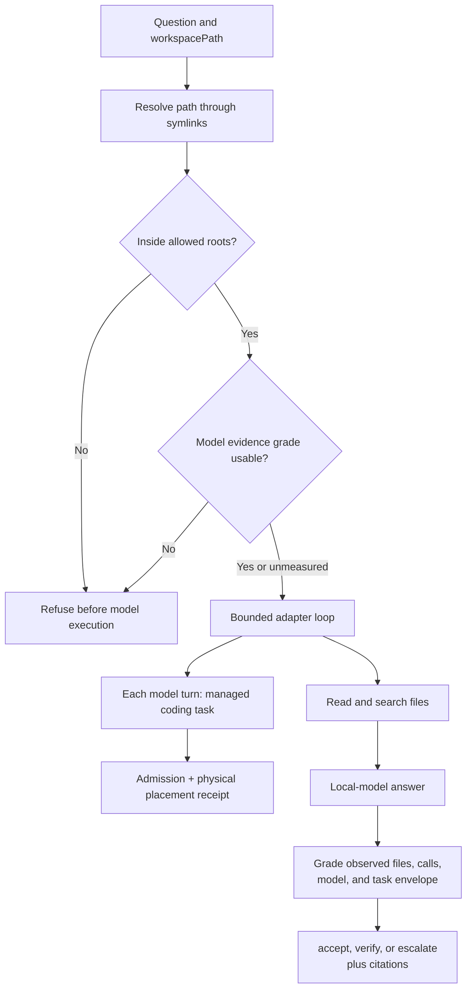
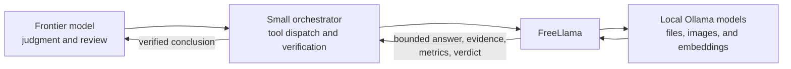

# FreeLlama architecture

FreeLlama is a localhost control plane in front of Ollama. Ollama owns model storage, model loading,
scheduling, inference engines, and token generation. FreeLlama owns model-aware policy around those
operations.

## Responsibility boundary

The following table defines the ownership boundary:

| Responsibility | Owner |
|---|---|
| Model files, runners, Metal, MLX, llama.cpp, and token generation | Ollama |
| Native `/api/*` and OpenAI-compatible `/v1/*` semantics | Ollama |
| Installed-model discovery and capability normalization | FreeLlama |
| Task routing, advertised-context compatibility, K/V lower-bound preflight, evidence policy, and model rejection reasons | FreeLlama |
| Managed admission, session affinity, and model-transition coordination | FreeLlama |
| Explicit per-model CPU/GPU backend assignment | FreeLlama and separate Ollama processes |
| Grounded research adapters, citations, and verification verdicts | FreeLlama MCP server |

FreeLlama remains a sidecar rather than an Ollama fork. For the compatibility rationale, see the
[Ollama sidecar boundary](OLLAMA_SIDECAR.md).

## System topology

Every public surface uses the Rust core or calls a narrow local dependency:

The CLI and MCP server do not reimplement routing. The CLI calls the core directly. The MCP server
uses the feature-gated NAPI boundary for native operations and the control API for serve-backed
operations.

## Request classification

The listener classifies requests by path before any model-aware work occurs:

The control API exposes these endpoints:

| Method and path | Purpose | Inference |
|---|---|---|
| `GET /_freellama/v1/health` | Health, admission capacity, and configured backends | No |
| `GET /_freellama/v1/machine` | Machine profile | No |
| `GET /_freellama/v1/models` | Normalized installed catalog, evidence, residency, and execution backend | No |
| `POST /_freellama/v1/recommendations` | Installed route or reviewed installation plan | No |
| `POST /_freellama/v1/routes` | Deterministic route decision | No |
| `POST /_freellama/v1/natural-routes` | Schema-bound intent interpretation followed by deterministic routing | Intent model only |
| `POST /_freellama/v1/sessions` | New model-affinity session | No |
| `DELETE /_freellama/v1/sessions/:session_id` | Release model-affinity session | No |
| `POST /_freellama/v1/tasks` | Managed chat, vision, tools, or embedding task | Yes |

The machine profile is host-derived rather than model-name-derived. It reports total physical
memory on macOS (`sysctl`), Linux (`/proc`), and Windows (system APIs), along with CPU, OS,
architecture, and disk. `memory_bytes` is portable host RAM. `unified_memory_bytes` is populated
only when host and accelerator memory are known to share a pool; it must not be treated as discrete
GPU VRAM. Ollama's `/api/ps` remains the placement authority.

All other paths use the compatibility proxy. It buffers request bodies up to 64 MB so a retry can
resend identical bytes, then streams the upstream response. It does not apply CPU model assignment.

## Model discovery

The catalog joins data from Ollama and FreeLlama's optional evidence files:

FreeLlama fetches tags and residency from each configured backend. Models assigned to CPU are
removed from the primary catalog view and included only from the secondary backend. Static catalog
metadata is cached for 30 seconds; residency is refreshed before routing.

A failed `/api/show` response skips that model instead of failing the entire catalog. An unreachable
configured backend fails catalog discovery closed because FreeLlama cannot prove the assigned model's
state.

## Deterministic routing

Routing starts with an explicit task contract. Supported task kinds are `completion`, `coding`,
`code_repair`, `tools`, `browser`, `vision`, `embedding`, and `long_context`.

Explicit model selection never substitutes another model. Every rejected candidate includes a
reason so callers can distinguish capability, context, policy, and installation failures.

`context_window_fit` means only that requested `num_ctx` fits the model's advertised context
window. It is not a live-memory, free-VRAM, K/V-cache, thermal, or runner-admission verdict.
Execution separately reports a conservative model-metadata K/V lower-bound preflight and post-run
placement evidence; Ollama remains authoritative for actual runner allocation and admission.

### Confidence evidence

Confidence is a grade derived from independent evidence dimensions:

| Policy evidence | Benchmark evidence | Confidence | Meaning |
|---|---|---|---|
| Present | Present | `medium` | The task policy qualifies the model and the machine has measured it |
| Present | Missing | `low` | Quality evidence exists without local functional measurement |
| Missing | Present | `low` | Local throughput exists without a quality contract |
| Missing | Missing | `low` | Routing relies on capability metadata only |

`minConfidence: "medium"` refuses before generation when either input is missing. The gate lives in
`select_route`, so the HTTP API, CLI, MCP server, and embedded core share the same behavior.

## Natural-language routing

Natural-language routing cannot select a model directly:

Word-boundary guards prevent incidental substrings such as `photosynthesis` from creating a vision
requirement. Explicit requirements in the original text override weak or unsupported inferred fields.

The natural route endpoint does not run the selected task. Submit a managed task to execute it.

## Managed task execution

Managed tasks combine routing with admission and backend-aware transition coordination:

Admission is independent per backend and uses weighted fair round robin: interactive gets three
turns, normal two, and background one, preserving FIFO inside each class and preventing starvation.
The primary/GPU pool defaults to two weighted units and the
optional CPU pool defaults to one. A saturated GPU burst therefore cannot consume the permit held
for a small CPU helper. Those values represent one ordinary chat and one embedding, not detected
hardware capacity; operators can tune both budgets from queue-wait and resident-memory evidence.
After FreeLlama admission, each Ollama process applies its own `OLLAMA_MAX_QUEUE`, scheduler,
`OLLAMA_NUM_PARALLEL`, and loaded-model limit. Raw proxy requests bypass FreeLlama admission and
enter the primary Ollama queue directly.

| Task | Cost |
|---|---:|
| Embedding | `ceil(input_items / 4)` |
| Chat, coding, tools, browser, or long context | 2 |
| Vision | 4 |

FreeLlama acquires the admission slot before a transition lock to avoid deadlock. A model marked
resident during discovery is checked again while the shared transition lock is held; stale or
unavailable residency falls back to the exclusive transition path. Session affinity is bound only
after successful upstream execution, so refused and failed tasks cannot change later routing.

`POST /_freellama/v1/task-batches` is for caller-declared independent work only: every item has a
stable ID and `independent:true`; dependent workflow execution is rejected before any upstream call.
It bounds local dispatch and returns ordered per-item success/error receipts. Every child still
passes the same global admission and transition path above.

The K/V preflight derives F16 K+V bytes-per-token only when `/api/show` exposes the required model
shape. It blocks only a known weights-plus-cache lower bound above 80% of total CPU/unified memory.
It deliberately reports unknown rather than guessing for other architectures or discrete GPU free
VRAM; Ollama remains the live loader and final memory authority.

Resident tasks share a backend lock. Nonresident tasks take that backend's exclusive lock so a cold
load cannot race another managed task on the same server. CPU and GPU backends have separate locks
and admission pools, so they can progress independently.

HTTP `500`, `502`, and `504` status codes and connection failures use bounded retry with backoff.
FreeLlama does not retry `503 Service Unavailable` because retrying while holding admission can
amplify overload. It does not retry a generation timeout because the first request might still run.

## CPU and GPU backend selection

CPU eligibility is an explicit operator assignment. Within that safe set, a caller may provide a
guarded preference and `auto` may learn from warm runtime receipts:

The hint never changes the operator's CPU assignment. If the preferred backend has no eligible
model, routing falls back and returns `preference_satisfied: false`. Feedback is task-specific,
bounded, versioned, and prompt-free. The CLI persists it with atomic file replacement by default;
restart-reset behavior is available only through the explicit `--ephemeral-feedback` mode. It
records normalized latency only for already-resident, physically verified tasks so prompt size and
cold-load cost do not poison the comparison. It requires more than a 10% advantage; capacity can
break a tie before the sample threshold. Quality routing, explicit model selection, and session
affinity do not follow the latency loop.

The same selection function supplies preview/recommendation receipts, intent-model execution, and
managed task execution. This keeps advertised placement and actual request routing aligned.

Raw proxy traffic always uses the primary upstream. For setup and runtime verification, see
[Run models on CPU and GPU](CPU_GPU_ROUTING.md).

## MCP tool flow

The MCP server keeps general model work separate from file-backed research and destructive lifecycle
operations:

The tool split prevents `run_task` from acquiring file access and prevents lifecycle operations from
being hidden inside a generic action. For schemas and security annotations, see the
[MCP server reference](../packages/mcp/README.md).

## Grounded research flow

Use `delegate_research` for narrow questions that require reading repository files:

The verdict does not ask the local model whether it researched the answer. It uses the adapter's
recorded calls, successful file evidence, the selected model's measured grade, and the question's
shape.

The adapter loop preserves its control contract through four mechanisms:

- Pagination keeps complete output on disk while showing bounded pages to the model.
- Context fitting byte-preserves the system prompt and question by default, compacts older
  observations, and fails before Ollama if pinned content cannot fit. The first estimate is
  configurable; real `prompt_eval_count` values calibrate subsequent fits conservatively.
- JSON repair retains gathered evidence across a bounded format correction.
- Repeat suppression serves an identical earlier result without rerunning the subprocess command.

For the benchmark implementation of this loop, see [`AGENTS.md`](../AGENTS.md).

## Context and token boundary

The intended orchestration pattern keeps judgment in the strongest model and token-heavy operations
local:

Raw source, images, and embedding vectors do not need to enter the frontier model's context.
Embedding vectors are withheld by default because they are large and not human-readable. For the
measured accounting, see [Token economics](ECONOMICS.md).

## State and failure behavior

FreeLlama keeps these values in memory:

- Catalog metadata cache
- Current residency snapshots
- Session-to-model affinity
- Independent GPU and CPU priority-fair weighted admission pools
- Per-task normalized warm latency and queue feedback for each backend, restored from an optional
  versioned atomic snapshot
- Separate CPU and GPU transition locks

Sessions are bounded (default 1024) and expire after idle time (default one hour); they store only
model affinity, never prompts or Ollama KV. Restarting `freellama serve` clears sessions and the catalog cache. Persisted placement feedback is
reloaded; `--ephemeral-feedback` intentionally resets it. Ollama owns model residency, so loaded
models survive a FreeLlama restart.

The design fails closed when it cannot establish a required contract. Examples include an
unreachable configured backend, an unknown confidence grade, a policy without qualified models, an
explicit model that is not installed, or a task that exceeds the advertised context window.

## Product boundary

FreeLlama is not an inference engine, remote provider marketplace, billing layer, hosted model
registry, general agent runtime, or A2A coordinator. It can authenticate every route with one
operator-managed bearer token and refuses unauthenticated nonloopback listeners. An external layer
must still provide TLS, tenant authorization, tenant-specific limits, and isolation.

Use Ollama directly when a caller only needs raw speed from one exact model. Use FreeLlama when the
workload needs routing evidence, bounded admission, backend placement, compatibility proxying,
grounded research, or inspectable receipts.
