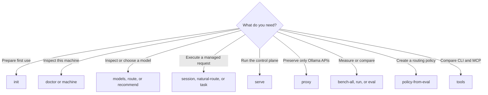
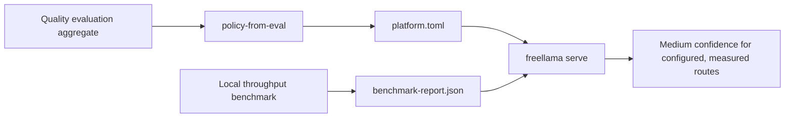

# CLI reference

The `freellama` command exposes local diagnostics, deterministic model routing, managed task
execution, benchmarking, and the Ollama-compatible proxy. The front page covers the shortest path;
this page is the complete command map.

## Choose a command



| Command | Purpose | Needs `freellama serve` |
|---|---|---|
| `init` | Inspect prerequisites and print a side-effect-free first-run plan | No |
| `serve` | Run the control plane and Ollama-compatible proxy | Starts it |
| `auth-token` | Create a new mode-0600 bearer-token file without printing the secret | No |
| `models` | List installed models, capabilities, residency, and evidence | Yes |
| `machine` | Print portable host RAM, CPU, OS, architecture, disk, and the local Ollama endpoint | Yes |
| `session` | Create an affinity scope for related tasks | Yes |
| `route` | Choose a model and request profile without executing it | Yes |
| `recommend` | Return an installed route or a reviewed installation plan | Yes |
| `natural-route` | Convert natural language to a route intent locally, then route it | Yes |
| `task` | Route and execute one nonstreaming task | Yes |
| `proxy` | Run only the Ollama-compatible retry and telemetry sidecar | No |
| `bench-all` | Measure installed models by capability group | No |
| `policy-from-eval` | Generate policy from quality-evaluation pass rates | No |
| `tools` | Print MCP tools and their CLI equivalents | No |
| `doctor` | Inspect Ollama, hardware, versions, and effective settings | No |
| `run` | Run a frozen suite against one Ollama build | No |
| `eval` | Compare the same frozen suite against stock and candidate builds | No |

Run `npx freellama <command> --help` for every accepted flag and enum value. The executable's help
is authoritative; this page explains how the commands fit together.

## Start the control plane

```bash
npx freellama serve --recommendation-catalog recommendations.example.toml
```

The default listener is `http://127.0.0.1:11435`, and the default Ollama upstream is
`http://127.0.0.1:11434`. Use `--listen` and `--upstream` to change them. Nonloopback listeners
require `--allow-remote` and a token from `--auth-token-file` or
`FREELLAMA_AUTH_TOKEN_FILE`. Authentication applies to managed and passthrough routes.

`serve` persists bounded adaptive feedback under the platform data directory by default. Override
the path with `--feedback-file`; use `--ephemeral-feedback` only for disposable runs. See the
[production runbook](PRODUCTION.md) for token generation, state files, and ingress requirements.

`serve` exposes both managed routes under `/_freellama/v1/*` and byte-preserving Ollama routes under
`/api/*` and `/v1/*`. Use `proxy` when you need only the latter. See
[Architecture](ARCHITECTURE.md) for the request flow.

### Assign exact models to CPU

Use `--cpu-upstream` with one or more `--cpu-model` values to send named models to a second Ollama
process. Other managed models and all raw passthrough traffic remain on the primary process.

```bash
npx freellama serve \
  --upstream http://127.0.0.1:11434 \
  --cpu-upstream http://127.0.0.1:11436 \
  --cpu-model nomic-embed-text:latest
```

FreeLlama rejects a CPU upstream with no assignments, nonloopback upstreams, and endpoints that are
aliases for the same socket. It also sets `options.num_gpu=0` on CPU-assigned managed requests.
Read [CPU and GPU model routing](CPU_GPU_ROUTING.md) before deploying this layout.

After startup, require `contracts.placement_observation` and `placement_evidence_gate`, then inspect
the declared upstreams:

```bash
curl --silent http://127.0.0.1:11435/_freellama/v1/health |
  jq '{contracts, backends}'
```

A missing contract identifies a stale `serve` binary; rebuild and restart it before evaluating
placement.

### Bound admission

`--max-concurrent-tasks` is the primary/GPU cost budget, not a request count; it defaults to 2.
`--cpu-max-concurrent-tasks` controls the independent CPU pool and defaults to 1. Embedding costs 1,
chat costs 2, and vision costs 4 (capped to the selected backend's pool). A saturated GPU pool does
not consume CPU permits. `--max-queue-wait-seconds` defaults to 120; when no permit becomes
available, FreeLlama refuses the task with HTTP 503 instead of waiting forever.

These are conservative workload-unit defaults, not detected core or RAM counts. Tune them from
queue-wait receipts and resident-memory observations on the target host. Ollama still controls
decoding concurrency with `OLLAMA_NUM_PARALLEL`.

`route`, `recommend`, and `task` accept
`--execution-preference auto|prefer-cpu|prefer-gpu`. This is a fallback-capable hint over models
already assigned by the operator; it never rewrites raw passthrough and never makes an ineligible
model eligible. Preview the route and inspect the `execution` receipt to confirm whether the hint
was satisfied. Add `--min-placement-evidence observed` to refuse cold or physically mismatched
placement; the default `configured` accepts the operator assignment and observes after execution.

## Inspect and route

Start with the read-only guided receipt, then inspect available models. `init` never pulls a model;
it stops at exact-tag approval and prints the next prerequisite, serve, managed-task, and MCP steps.

```bash
npx freellama init
npx freellama doctor
npx freellama models
npx freellama machine
```

Preview a deterministic decision without spending generation tokens:

```bash
npx freellama route --task coding --objective fastest
npx freellama route \
  --task vision \
  --objective fastest \
  --required-capability vision
```

Task kinds are `completion`, `coding`, `code-repair`, `tools`, `browser`, `vision`, `embedding`, and
`long-context`. Objectives are `fastest`, `balanced`, and `quality`. `fastest` can use capability
and local benchmark evidence alone; `balanced` and `quality` require a policy for that task.

`recommend` is side-effect-free. If no installed model qualifies, it can return an installation
plan from the reviewed recommendation catalog, but it never pulls a model.

`natural-route` asks the configured local intent model to produce structured intent, validates that
intent, and then invokes the same deterministic router as `route`. It does not let the intent model
choose the final model directly.

## Execute tasks

The prompt for `task` is positional:

```bash
npx freellama task --task completion --objective fastest "Reply with exactly OK."
npx freellama task --task coding --min-confidence medium "Explain this patch."
```

Useful task options include:

- `--model` for an exact installed model.
- `--session` for affinity across related requests.
- `--context-tokens` for a minimum context requirement.
- repeatable `--required-capability` constraints.
- repeatable `--image` paths for vision tasks.
- `--input-file` for batched embedding input, one item per line.
- `--min-confidence low|medium` to refuse insufficiently evidenced routes before generation.

Create a session with `session`, then pass its identifier to related `route` or `task` calls. The
router reuses the selected model when it remains eligible; it does not bypass capability, policy,
or memory checks.

The CLI has no keep-alive flag. MCP `run_task` accepts `keepAlive`: `"0"` unloads after the request,
`"-1"` pins the runner, and omission leaves Ollama's default in place.

## Earn medium routing confidence

Every route starts at low confidence. Medium confidence requires both a task policy and a local
benchmark record for the selected model.



Generate the policy from correctness data and the benchmark report from local runtime data:

```bash
npx freellama policy-from-eval \
  --aggregate benchmark/local/results/<model>/aggregate.json \
  --task coding \
  --min-pass 0.8 \
  --out platform.toml

npx freellama bench-all --output benchmark-report.json
npx freellama serve --recommendation-catalog recommendations.example.toml
```

`serve` discovers `platform.toml` and `benchmark-report.json` in its working directory. Explicit
`--policy-file` and `--benchmark-report` values take precedence.

`policy-from-eval` reads `pass_at_1`, not the throughput produced by `bench-all`. It refuses expired
aggregates and fewer than three trials unless `--allow-smoke` is explicit, and it skips models that
are not installed. This prevents speed data from being mislabeled as quality evidence.

## Compare the CLI and MCP surfaces

```bash
npx freellama tools
```

The command prints the maintained parity map. MCP-only operations are `delegate_research` and the
online `models { view: "library" }` view. CLI-only operations include `serve`, `proxy`, `session`,
`recommend`, `natural-route`, `bench-all`, `policy-from-eval`, `run`, and `eval`.

For the six MCP tool contracts, read the [MCP package reference](../packages/mcp/README.md).
