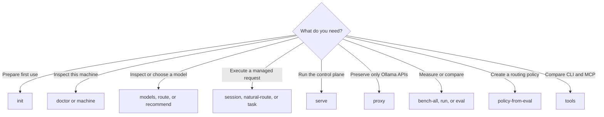
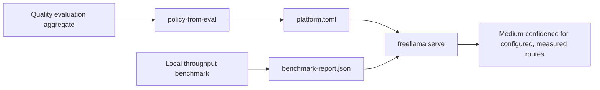

# CLI reference

The `freellama` command exposes local diagnostics, deterministic model routing, managed task
execution, benchmarking, and the Ollama-compatible proxy. The front page covers the shortest path;
this page is the complete command map.

## Choose a command


```mermaid
flowchart TD
    Q{"What do you need?"}
    Q -->|"Prepare first use"| I["init"]
    Q -->|"Inspect this machine"| D["doctor or machine"]
    Q -->|"Inspect or choose a model"| M["models, route, or recommend"]
    Q -->|"Execute a managed request"| T["session, natural-route, or task"]
    Q -->|"Run the control plane"| S["serve"]
    Q -->|"Preserve only Ollama APIs"| P["proxy"]
    Q -->|"Measure or compare"| B["bench-all, run, or eval"]
    Q -->|"Create a routing policy"| E["policy-from-eval"]
    Q -->|"Compare CLI and MCP"| L["tools"]
```

| Command | Purpose | Needs `freellama serve` |
|---|---|---|
| `init` | Inspect prerequisites and print a side-effect-free first-run plan with readiness flags | No |
| `serve` | Run the control plane and Ollama-compatible proxy | Starts it |
| `auth-token` | Create a new mode-0600 bearer-token file without printing the secret | No |
| `models` | List installed models, capabilities, residency, and evidence | Yes |
| `machine` | Print portable host RAM, CPU, OS, architecture, disk, and the local Ollama endpoint | Yes |
| `status` | Live queues (also as a page at `http://127.0.0.1:11435/_freellama/ui`), current and adaptive limits, circuit breakers, loaded models, host memory, Ollama's effective settings, today's usage | Yes |
| `usage` | Task and token totals per day and per model (`--days`, default 7) | Yes |
| `config` | Effective runtime settings and the source of each; `--reload` re-reads the runtime file | Yes |
| `session` | Create model affinity for related tasks | Yes |
| `scope` | Create, inspect, fork, or delete bounded message history | Yes |
| `warm` | Warm an installed model through managed admission | Yes |
| `route` | Choose a model and request profile without executing it | Yes |
| `recommend` | Return an installed route or a reviewed installation plan | Yes |
| `natural-route` | Convert natural language to a route intent locally, then route it | Yes |
| `task` | Route and execute one nonstreaming task | Yes |
| `jobs` | List, inspect, cancel, or remove deferred tasks and warming operations | Yes |
| `proxy` | Run only the Ollama-compatible retry and telemetry sidecar | No |
| `bench-all` | Measure installed models by capability group | No |
| `policy-from-eval` | Generate policy from quality-evaluation pass rates | No |
| `tools` | Print MCP tools and their CLI equivalents | No |
| `doctor` | Inspect Ollama, hardware, versions, and effective settings | No |
| `run` | Run a frozen suite against one Ollama build | No |
| `eval` | Compare the same frozen suite against stock and candidate builds | No |

Run `npx @octocodeai/freellama <command> --help` for every accepted flag and enum value. The executable's help
is authoritative; this page explains how the commands fit together.

## Start the control plane

```bash
npx @octocodeai/freellama serve --recommendation-catalog recommendations.example.toml
```

The default listener is `http://127.0.0.1:11435`, and the default Ollama upstream is
`http://127.0.0.1:11434`. Use `--listen` and `--upstream` to change them. Nonloopback listeners
require `--allow-remote` and a token from `--auth-token-file` or
`FREELLAMA_AUTH_TOKEN_FILE`. Authentication applies to managed and passthrough routes.

`serve` persists bounded adaptive feedback under the platform data directory by default. Override
the path with `--feedback-file`; use `--ephemeral-feedback` only for disposable runs. See the
[production runbook](PRODUCTION.md) for token generation, state files, and ingress requirements.

`serve` exposes both managed routes under `/_freellama/v1/*` and byte-preserving Ollama routes under
`/api/*` and `/v1/*`. Use `proxy` when you need only the latter. See
[Architecture](ARCHITECTURE.md) for the request flow.

### Assign exact models to CPU

Use `--cpu-upstream` with one or more `--cpu-model` values to send named models to a second Ollama
process. Other managed models and all raw passthrough traffic remain on the primary process.

```bash
npx @octocodeai/freellama serve \
  --upstream http://127.0.0.1:11434 \
  --cpu-upstream http://127.0.0.1:11436 \
  --cpu-model nomic-embed-text:latest
```

FreeLlama rejects a CPU upstream with no assignments, nonloopback upstreams, and endpoints that are
aliases for the same socket. It also sets `options.num_gpu=0` on CPU-assigned managed requests.
Read [CPU and GPU model routing](CPU_GPU_ROUTING.md) before deploying this layout.

After startup, require `contracts.placement_observation` and `placement_evidence_gate`, then inspect
the declared upstreams:

```bash
curl --silent http://127.0.0.1:11435/_freellama/v1/health |
  jq '{contracts, backends}'
```

A missing contract identifies a stale `serve` binary; rebuild and restart it before evaluating
placement.

### Bound admission

`--max-concurrent-tasks` is the primary/GPU cost budget, not a request count. Without a flag,
environment variable, or runtime-file value it defaults to 2 units per `OLLAMA_NUM_PARALLEL` slot of
the Ollama server (read from its process environment where visible; Ollama's own default is 1, so 2).
`freellama config` shows the effective value and where it came from.
`--cpu-max-concurrent-tasks` controls the independent CPU pool and defaults to 1. Default base costs
are embedding 1, chat 2, and vision 4. Embeddings multiply their base by `ceil(input_items/4)`;
the acquired charge is capped to the selected backend's pool. Configure overrides in `[task_costs]`;
see [monitoring controls](MONITORING.md#adaptive-concurrency). A saturated GPU pool does
not consume CPU permits. `--max-queue-wait-seconds` defaults to 120; when no permit becomes
available, FreeLlama refuses the task with HTTP 503 (`admission_timeout`) instead of waiting forever.
A task can ask for a shorter wait with `max_wait_seconds` (`maxWaitSeconds` in MCP); it can never
exceed the configured one. Omit it to use the server's waiting budget.
That deadline covers weighted admission, host-resource waiting, and model-transition locking together.
`--max-queued-tasks` (default 16) and `--cpu-max-queued-tasks` (default 8) also bound how many
parsed requests can be retained per backend; a full queue receives 429 (`admission_queue_full`)
immediately, and cancelled clients release their waiter. Every capacity refusal carries a
`Retry-After` header and `retry_after_seconds`, estimated from queue depth and the backend's recent
task duration, so clients back off instead of retrying hot. Health exposes the queue depth, oldest wait, in-flight work, and
refusal/timeout/cancellation counters.

These are conservative workload-unit defaults, not detected core or RAM counts. Tune them from
queue-wait receipts and resident-memory observations on the target host. Ollama still controls
decoding concurrency with `OLLAMA_NUM_PARALLEL`. It also owns a separate internal queue through
`OLLAMA_MAX_QUEUE`: managed tasks enter that queue only after FreeLlama admission, while raw proxy
traffic enters it directly. Start an unmeasured deployment with one loaded model and one parallel
stream per Ollama process. In `serve`, raw passthrough defaults to one full-lifetime streaming
request; override with `--raw-proxy-max-concurrent-requests` only after measurement. A raw request
over the cap waits up to `--raw-queue-wait-seconds` (default 10) and is then refused with 429 and
`Retry-After`; `0` restores immediate refusal.

All of these, plus pinned models, idle eviction, adaptive concurrency, the circuit breaker, and
context sizing, can also live in a runtime file (`--runtime-config`) that `serve` re-reads when it
changes. See [Monitoring and live tuning](MONITORING.md). The standalone
`proxy` command keeps its cap opt-in for compatibility.

The local host-pressure gate defaults to holding below 15% available RAM and resuming above 20%
after two healthy samples; minimum reserves are 1 GiB and 2 GiB, respectively. Tune the percentages
with `--resource-hold-available-percent` and `--resource-resume-available-percent`; the hold value
must be lower than the resume value, and neither can exceed 100. Health reports the policy, sampled
signals, unknown measurements, and reserved memory. These flags do not change Ollama or OS settings.
Both `serve` and `proxy` accept `--resource-telemetry-policy`:

- `require-memory` (default): wait or refuse local inference when available RAM is unknown, including
  raw requests with zero forecast bytes. Missing thermal data alone does not block this policy.
- `require-all`: require all signals applicable to the collector. The built-in Linux collector does
  not provide OS pressure or thermal signals and marks those as unsupported; custom collectors must
  provide them. Unsupported signals are not evidence of healthy hardware.
- `best-effort`: explicitly permit unknown telemetry unless an observed pressure hold is active.

Remote upstreams bypass local host policy. Raw metadata and empty unload requests remain available
during a hold. Route receipts separate `queue_readiness` from `resource_readiness`, and include
`resource_assessment` without acquiring a permit. Resource refusals return a human-readable `error`,
a stable `code`, and an object-valued `resource_admission`; timeout during metadata inspection reports
its phase and omits estimates that were not obtained.

See [resource admission](ARCHITECTURE.md#managed-task-execution) for scope and limitations.

`route`, `recommend`, and `task` accept
`--execution-preference auto|prefer-cpu|prefer-gpu`. This is a fallback-capable hint over models
already assigned by the operator; it never rewrites raw passthrough and never makes an ineligible
model eligible. Preview the route and inspect the `execution` receipt to confirm whether the hint
was satisfied. Add `--min-placement-evidence observed` to refuse cold or physically mismatched
placement; the default `configured` accepts the operator assignment and observes after execution.

## Inspect and route

Start with the read-only guided receipt, then inspect available models. `init` never pulls a model;
it stops at exact-tag approval and prints the next prerequisite, serve, managed-task, and MCP steps.
Its `status` is `blocked` when Ollama is unavailable, `setup_required` when the managed service or
installed models are missing, and `ready` when all three are present. Separate `readiness` flags
identify the missing part. Readiness does not qualify a model for a particular task; use a route
preview to inspect eligibility and rejection reasons.

```bash
npx @octocodeai/freellama init
npx @octocodeai/freellama doctor
npx @octocodeai/freellama models
npx @octocodeai/freellama machine
```

Preview a deterministic decision without spending generation tokens:

```bash
npx @octocodeai/freellama route --task coding --objective fastest
npx @octocodeai/freellama route \
  --task vision \
  --objective fastest \
  --required-capability vision
```

Task kinds are `completion`, `coding`, `code-repair`, `tools`, `browser`, `vision`, `embedding`, and
`long-context`. Objectives are `fastest`, `balanced`, and `quality`. `fastest` can use capability
and local benchmark evidence alone. Default `balanced` prefers eligible task-policy candidates;
without them it falls back to capability/context-compatible models and reports low confidence
and missing quality evidence. `quality` requires a policy unless you supply an explicit model.
An explicit minimum-confidence gate still refuses insufficient evidence in every objective.

`recommend` is side-effect-free. If no installed model qualifies, it can return an installation
plan from the reviewed recommendation catalog, but it never pulls a model.

`natural-route` asks the configured local intent model to produce structured intent, validates that
intent, and then invokes the same deterministic router as `route`. It does not let the intent model
choose the final model directly.

## Execute tasks

The prompt for `task` is positional:

```bash
npx @octocodeai/freellama task --task completion --objective fastest "Reply with exactly OK."
npx @octocodeai/freellama task --task coding --min-confidence medium "Explain this patch."
```

Useful task options include:

- `--model` for an exact installed model.
- `--session` for affinity across related requests.
- `--scope-id` and `--scope-revision` together for bounded message history.
- `--keep-alive` for an explicit residency duration.
- `--context-tokens` for the complete input and output context window (`num_ctx`).
- repeatable `--required-capability` constraints.
- repeatable `--image` paths for vision tasks.
- `--input-file` for batched embedding input, one item per line.
- `--min-confidence low|medium` to refuse insufficiently evidenced routes before generation.
- `--priority interactive|normal|background` for fair admission scheduling.
- `--max-wait-seconds` for a shorter admission/resource wait budget.
- `--timeout-seconds` for a total deadline including discovery, waiting, loading, and inference.
- `--defer` to return a job ID immediately.

Inspect deferred work with `jobs`, retrieve a result with `jobs --id <uuid>`, and cancel one task
with `jobs --id <uuid> --cancel`. Remove one task with `jobs --id <uuid> --remove`: active work is
cancelled first, then its retained record and result are deleted. Use the exact ID returned at
submission; `--cancel` and `--remove` are mutually exclusive. The same operations are available
through MCP `task_jobs`.
Cancellation and removal wait for local execution permits to be released; they do not unload a shared model
or confirm that the physical runner has stopped.

Jobs stay in server memory: at most 64 receipts, 1 MiB per input, and 2 MiB per retained result or
error. Finished receipts expire after 10 minutes and can be evicted earlier to make room for new
work. A restart discards all jobs. Admission queue limits still apply, and deferred work can fail
after acceptance. See [monitoring](MONITORING.md) for states and waiting reasons.

Create a session with `session`, then pass its identifier to related `route` or `task` calls. A
route preview honors an existing affinity but does not create or change one. Only a successfully
admitted task execution binds the session to its selected model. Reuse never bypasses capability,
policy, or memory checks.

`task --keep-alive` and MCP `run_task.keepAlive` control residency: `"0"` requests immediate
unload, `"-1"` requests indefinite retention, and omission selects finite adaptive retention.
`session` retains affinity only; use `scope` for revision-protected message history and `warm`
for an admitted runner load. See [Scope history and model warming](SCOPES_AND_WARMING.md) for
input shapes, limits, and CLI examples.

## Earn medium routing confidence

Every route starts at low confidence. Medium confidence requires both a task policy and a local
benchmark record for the selected model.


```mermaid
flowchart LR
    Q["Quality evaluation aggregate"] --> P["policy-from-eval"]
    P --> PF["platform.toml"]
    T["Local throughput benchmark"] --> BR["benchmark-report.json"]
    PF --> S["freellama serve"]
    BR --> S
    S --> C["Medium confidence for configured, measured routes"]
```

Generate the policy from correctness data and the benchmark report from local runtime data:

```bash
npx @octocodeai/freellama policy-from-eval \
  --aggregate benchmark/local/results/MODEL/aggregate.json \
  --task coding \
  --min-pass 0.8 \
  --out platform.toml

npx @octocodeai/freellama bench-all --output benchmark-report.json
npx @octocodeai/freellama serve --recommendation-catalog recommendations.example.toml
```

`serve` discovers `platform.toml` and `benchmark-report.json` in its working directory. Explicit
`--policy-file` and `--benchmark-report` values take precedence.

Replace `MODEL` with the directory containing your completed quality-evaluation aggregate.

`policy-from-eval` reads `pass_at_1`, not the throughput produced by `bench-all`. It refuses expired
aggregates and fewer than three trials unless `--allow-smoke` is explicit, and it skips models that
are not installed. This prevents speed data from being mislabeled as quality evidence.

## Compare the CLI and MCP surfaces

```bash
npx @octocodeai/freellama tools
```

The command prints the maintained parity map. MCP-only operations are `delegate_research` and the
online `models { view: "library" }` view. CLI-only operations include `serve`, `proxy`,
`recommend`, `natural-route`, `bench-all`, `policy-from-eval`, `run`, and `eval`.

For the MCP tool contracts, read the [MCP package reference](../packages/mcp/README.md).
