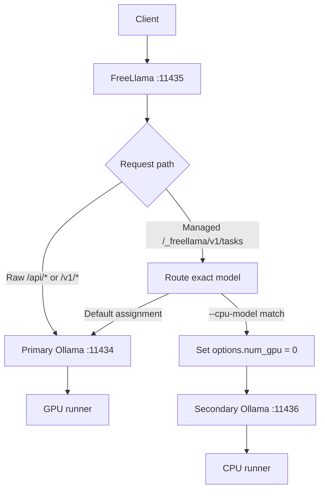
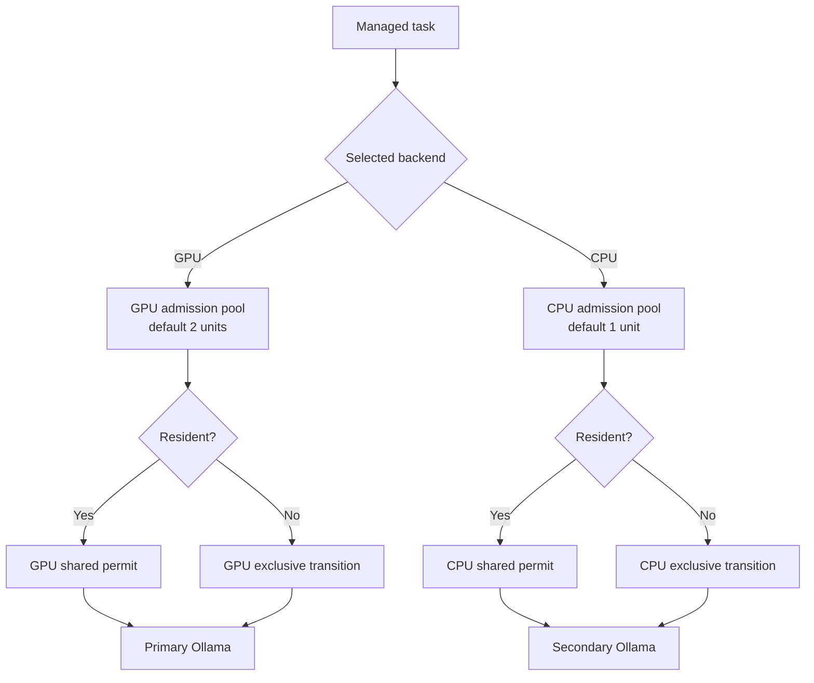
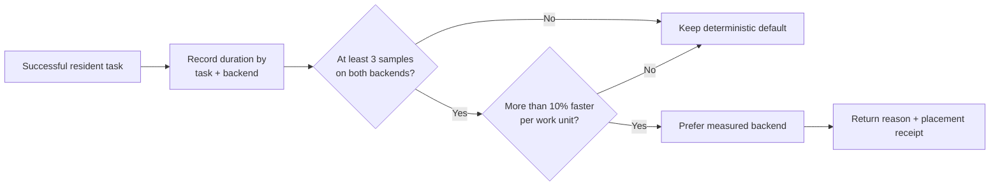

# Run models on CPU and GPU

Use two Ollama processes when a large model should remain on the GPU while smaller helper models run
on the CPU. FreeLlama assigns exact model tags to the secondary process, pins those managed requests
with `num_gpu: 0`, and reports the selected backend in catalog and task responses.

This configuration is useful for embeddings, intent interpretation, and other small helper models.
Benchmark large CPU workloads before adopting them. Apple silicon shares memory bandwidth; systems
with discrete GPUs have different contention and transfer costs, so neither result transfers
without measurement.

## Adapt the design to your hardware

The two-process contract is portable; the device-control mechanism and useful workload are
machine-specific:

| Host | Primary process | CPU process defense in depth | Capacity evidence |
|---|---|---|---|
| Apple silicon | Metal auto-detection | Managed `num_gpu: 0`; `OLLAMA_LLM_LIBRARY=cpu` is only a hint | Total unified memory plus `/api/ps` |
| Linux or Windows with NVIDIA | CUDA auto-detection | `CUDA_VISIBLE_DEVICES=-1` plus managed `num_gpu: 0` | Host RAM, `nvidia-smi`, and `/api/ps` |
| Linux or Windows with AMD | ROCm or Vulkan auto-detection | `ROCR_VISIBLE_DEVICES=-1` or `GGML_VK_VISIBLE_DEVICES=-1`, plus managed `num_gpu: 0` | Host RAM, vendor tools, and `/api/ps` |
| CPU-only | CPU | A second process can isolate helpers, but it does not create a second accelerator | Host RAM and measured overlap |

`doctor` reports `machine.memory_bytes` on macOS, Linux, and Windows. It reports
`machine.unified_memory_bytes` only when unified memory is known; that compatibility field is not a
VRAM estimate on discrete-GPU hosts. Model-library fit is therefore a host-memory preflight, and
actual accelerator placement must come from Ollama's resident-runner report.

An agent can choose `auto`, `prefer_cpu`, or `prefer_gpu`, but it cannot invent topology. The
operator owns the backend endpoints and exact CPU-eligible tags. This split lets the same schema
work on a laptop, a CPU-only server, or a multi-GPU workstation without silently moving arbitrary
client requests.

## Understand the boundary

The primary upstream owns the compatibility API and GPU-default managed tasks. The secondary
upstream owns only exact tags configured with `--cpu-model`:



FreeLlama does not inspect or rewrite raw passthrough request bodies. A direct Ollama client that
needs model-aware CPU placement must use the managed task endpoint instead.

## Start the backends

Start the primary Ollama process with a conservative local-only baseline:

```bash
OLLAMA_HOST=127.0.0.1:11434 OLLAMA_NO_CLOUD=1 \
    OLLAMA_MAX_LOADED_MODELS=1 OLLAMA_NUM_PARALLEL=1 ollama serve
```

Start a second process on another loopback port:

```bash
OLLAMA_HOST=127.0.0.1:11436 OLLAMA_NO_CLOUD=1 \
    OLLAMA_MAX_LOADED_MODELS=1 OLLAMA_NUM_PARALLEL=1 \
    OLLAMA_LLM_LIBRARY=cpu ollama serve
```

The library override is experimental and varies by Ollama build. On the measured Apple Metal 0.33.2
server, Ollama accepted `OLLAMA_LLM_LIBRARY=cpu` but still selected Metal until the request included
`num_gpu: 0`. FreeLlama adds that option to CPU-assigned managed requests.

On other GPU backends, Ollama also documents process-level device controls:

- NVIDIA: `CUDA_VISIBLE_DEVICES=-1`
- ROCm: `ROCR_VISIBLE_DEVICES=-1`
- Vulkan: `GGML_VK_VISIBLE_DEVICES=-1`

Use a device control appropriate for the Ollama build in addition to FreeLlama's request option when
you need defense in depth.

## Assign models

Start FreeLlama with the two upstreams and at least one exact CPU model tag:

```bash
./target/release/freellama serve \
    --upstream http://127.0.0.1:11434 \
    --cpu-upstream http://127.0.0.1:11436 \
    --cpu-model nomic-embed-text:latest
```

Repeat `--cpu-model` to assign more tags:

```bash
./target/release/freellama serve \
    --upstream http://127.0.0.1:11434 \
    --cpu-upstream http://127.0.0.1:11436 \
    --cpu-model nomic-embed-text:latest \
    --cpu-model qwen2.5:0.5b
```

Use the exact name returned by Ollama, including `:latest` when present. FreeLlama rejects these
unsafe or ambiguous configurations:

- A CPU upstream without a CPU model assignment
- A CPU model assignment without `--cpu-upstream`
- Empty model names
- The same socket expressed through aliases such as `localhost:11434` and `127.0.0.1:11434`
- A non-loopback listener or upstream

Set independent admission budgets when the defaults do not fit the workload:

```bash
./target/release/freellama serve \
    --upstream http://127.0.0.1:11434 \
    --cpu-upstream http://127.0.0.1:11436 \
    --cpu-model nomic-embed-text:latest \
    --max-concurrent-tasks 2 \
    --cpu-max-concurrent-tasks 1
```

The defaults above admit one ordinary primary-backend chat (cost 2) and one CPU embedding (cost 1)
at the same time. They are conservative workload units for the common `OLLAMA_NUM_PARALLEL=1`
layout, not a profile of the development Mac. Increase them only after measuring queue wait,
resident memory, and Ollama's own parallel setting on the target host.

## Let an agent express placement intent

MCP `run_task` and the managed HTTP route accept `executionPreference`: `auto`, `prefer_cpu`, or
`prefer_gpu` (HTTP: `execution_preference`). `minPlacementEvidence` accepts `configured` or
`observed` (HTTP: `min_placement_evidence`). Always preview consequential work:

```json
{
  "task": "embedding",
  "objective": "fastest",
  "executionPreference": "prefer_cpu",
  "minPlacementEvidence": "observed",
  "preview": true
}
```

A preview accepts routing constraints only. Add the embedding input when submitting the execution
request after accepting the route.

The agent does not gain authority to assign models. FreeLlama first applies model installation,
capability, policy, context, explicit-model, and session-affinity constraints. It only honors the
preference if an eligible model is already assigned to that backend. Inspect
`execution.preference_satisfied`, `execution.backend`, `execution.observation`, and
`execution.reason`. `observed` fails closed for cold models: warm once with `configured`, inspect
the receipt, then retry with observed evidence.

## Verify placement

Inspect FreeLlama's declared backend contract:

```bash
curl --silent http://127.0.0.1:11435/_freellama/v1/health | jq '.backends'
```

The output is similar to the following:

```json
{
  "gpu": {
    "upstream": "http://127.0.0.1:11434"
  },
  "cpu": {
    "upstream": "http://127.0.0.1:11436",
    "models": ["nomic-embed-text:latest"]
  }
}
```

Run a managed embedding task:

```bash
curl --silent http://127.0.0.1:11435/_freellama/v1/tasks \
    --header 'content-type: application/json' \
    --data '{
      "task": "embedding",
      "objective": "fastest",
      "model": "nomic-embed-text:latest",
      "input": "placement check",
      "keep_alive": "-1"
    }' | jq '{execution, admission, route}'
```

The `execution` object separates the configured `backend`, requested compatibility `placement`, and
post-run `observation`. The source is Ollama `/api/ps`; direct inspection remains useful:

```bash
curl --silent http://127.0.0.1:11434/api/ps | jq '.models[] | {name, size_vram}'
curl --silent http://127.0.0.1:11436/api/ps | jq '.models[] | {name, size_vram}'
```

A fully CPU-loaded model reports `size_vram:0`; a fully GPU-loaded model reports positive resident
VRAM. `observation.status` is `verified`, `mismatch`, or unavailable. Unknown, mixed, and mismatched
samples are reported but excluded from adaptive feedback.

## Understand concurrency

Each backend has its own weighted admission pool and its own resident/shared and
transition/exclusive lock. CPU and GPU model transitions therefore do not block each other, and a
GPU burst cannot spend the CPU helper's permit:



FreeLlama can overlap requests across the two servers even when each Ollama process uses
`OLLAMA_NUM_PARALLEL=1`. Raising `OLLAMA_NUM_PARALLEL` affects parallel requests within one server
and multiplies K/V-cache memory; it is a separate tuning decision. `OLLAMA_MAX_QUEUE` likewise
bounds each Ollama process after FreeLlama admission. It does not replace either backend's weighted
FreeLlama budget or queue-wait deadline.

## Understand automatic feedback

With `executionPreference: "auto"`, unpinned `fastest` and `balanced` work can select a backend from
observed warm task duration. The loop is deliberately bounded:



Generation compares decode nanoseconds per output token; embeddings compare total nanoseconds per
input token. Buckets are model-specific and reset when the selected model changes. Only physically
verified placement contributes; cold transitions and assignment mismatches do not. A difference
of 10% or less is treated as noise. Feedback never overrides an explicit model, session affinity,
capability or policy guards, or the `quality` objective. The CLI persists the bounded, versioned,
prompt-free aggregate snapshot atomically by default; `--ephemeral-feedback` opts into reset-on-
restart behavior. `GET /_freellama/v1/health` exposes persistence status, sample counts, readiness,
and per-backend admission capacity so an agent can inspect the loop instead of guessing.

## Interpret the measured Mac result

The local benchmark warmed both models, then ran three matched sequential and parallel trials using
a 100-line Qwen completion and a 256-item Nomic embedding batch:

| Trial | Sequential | Parallel |
|---|---:|---:|
| 1 | 34.586 s | 27.499 s |
| 2 | 38.988 s | 28.233 s |
| 3 | 37.997 s | 38.167 s |
| Median | 37.997 s | 28.233 s |

The median parallel result was 1.346 times faster, a 25.70% wall-time reduction. The third trial
shows why this feature is workload-dependent: CPU work can slow Metal work through host and unified-
memory contention.

The placement and compatibility guardrails also passed:

| Guardrail | Observed result |
|---|---|
| GPU placement | `qwen3.8:27b-mlx`, `size_vram: 19,175,677,668` |
| CPU placement | `nomic-embed-text:latest`, `size_vram: 0` |
| Managed execution | Every recorded request returned HTTP 200 with the correct upstream receipt |
| Admission | `queue_wait_ms: 0` for every request |
| GPU output | Identical output length in every sequential and parallel trial |
| Raw compatibility | `/api/version` through FreeLlama returned primary Ollama 0.33.2 |

An earlier, lighter overlap check paired a small CPU embedding with a cold GPU completion. The CPU
request completed in 60 ms while the GPU request continued and completed in 7.391 seconds. This is
the intended sweet spot: a small helper can finish without waiting for unrelated GPU generation.

A fresh post-build smoke check repeated the concurrent path through the persistent services. Both
requests returned HTTP 200 in 8.303 seconds wall time, both reported zero queue wait, Qwen returned
`OK` from the primary backend, and Nomic returned one embedding from the CPU backend. That runner
snapshot reported 18,486,900,456 GPU bytes for Qwen and zero for Nomic. The positive GPU byte count
is the placement invariant; its absolute value can change with the request profile and runner state.

A production-gate adversarial trial assigned `qwen3.8:27b-mlx` to the CPU endpoint with
`num_gpu:0`. Ollama still reported all 18,490,183,380 resident bytes in VRAM. FreeLlama returned
`observation.status:"mismatch"`, `feedback.accepted:false`, kept CPU samples at zero, and refused a
subsequent `min_placement_evidence:"observed"` preview with HTTP 422. This is why assignment and
physical processor are distinct fields.

Immediate unload is a managed transaction. For `keep_alive:0`, FreeLlama temporarily retains the
runner, observes `/api/ps`, records feedback only when placement is verified, requests an explicit
unload, and verifies that the runner is no longer resident. Inspect both `execution.observation`
and `execution.lifecycle`; a failed unload is reported without discarding the completed task output.

Prefer the following assignments:

- Small embedding models
- Lightweight intent models
- Short extraction or classification helpers with measured CPU behavior

Benchmark these assignments before adopting them:

- Large generative models on CPU
- Large embedding batches that saturate memory bandwidth
- Two workloads whose combined resident memory approaches system capacity

The local measurement receipt is written to
`.octocode/evals/cpu-gpu-concurrency-benchmark.md`. Git intentionally ignores that path, so the
trial table in "Interpret the measured result" carries the durable result while the local artifact
retains the full run detail.

## Troubleshoot the secondary backend

If an assigned model does not appear, check the following conditions:

1. Confirm that the exact tag appears in `GET http://127.0.0.1:11436/api/tags`.
2. Confirm that the secondary server is listening on the configured port.
3. Run a managed task, then confirm `size_vram: 0` on the secondary `/api/ps` response.
4. Inspect the secondary Ollama log for a runner command containing `-ngl 0` or equivalent CPU
   placement evidence.
5. Confirm that the request used `/_freellama/v1/tasks`, not raw `/api/chat` passthrough.

A configured but unreachable CPU backend causes model discovery to fail closed. GPU-managed tasks
can also be unavailable until the secondary server returns. Raw passthrough to the primary server
continues to work because it does not depend on catalog discovery.

For the surrounding runtime settings, see
[Ollama and FreeLlama optimization](OLLAMA_SYSTEM_OPTIMIZATION.md). For all `serve` flags, see the
[CLI reference](CLI.md).

## Upstream sources

- [Ollama hardware support](https://docs.ollama.com/gpu) documents GPU visibility controls and
  Apple Metal support.
- [Ollama FAQ](https://docs.ollama.com/faq) documents concurrency, residency, `/api/ps` processor
  reporting, and K/V-cache behavior.
- [Ollama troubleshooting](https://github.com/ollama/ollama/blob/main/docs/troubleshooting.mdx)
  documents the experimental `OLLAMA_LLM_LIBRARY` override.
- [Ollama API types](https://github.com/ollama/ollama/blob/main/api/types.go) defines `num_gpu` as a
  runner-load option.
