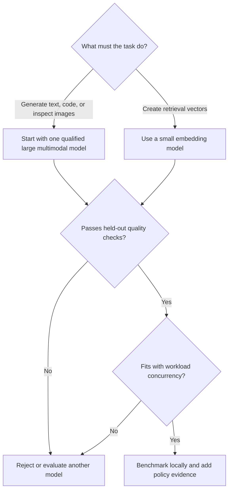

# Choose local models

Choose models from local evidence, not model-card popularity. The measurements below come from one
Apple M4 Pro machine with 48 GB unified memory and are not compiled into routing. Re-run
`npx freellama doctor`, `models`, `bench-all`, and your quality suite on the target hardware.
`doctor.machine.memory_bytes` is host RAM; a discrete GPU's usable VRAM must be observed separately.

## Text, code, and vision

`qwen3.8:27b-mlx` was the strongest general model in the local evaluations. It handled coding,
grounded research, image description, OCR, and summarization. Using one large multimodal model also
avoided contention between separate heavy text and vision runners.

`muse-glimmer:30b-mlx` was a credible alternative and answered 29 of 30 questions correctly
(96.7%) with the Bash adapter, but it was slower and did not add a required capability in this
workload.

Do not assume small research models are adequate. The local grounded-lookup sample fell to 2/8 at
7B, 3/8 at 3B, and 0/8 at 0.5B. `delegate_research` can refuse models whose runtime evidence marks
them unusable rather than spending tokens on a known-poor route.

## Embeddings

`nomic-embed-text` matched the highest recall with the lowest measured index time and model size in
the repository retrieval sample:

| Model | Recall at 3 | Index time | Dimensions | Size |
|---|---:|---:|---:|---:|
| `nomic-embed-text` | 5/6 | 4.2 seconds | 768 | 274 MB |
| `embeddinggemma:300m` | 5/6 | 4.9 seconds | 768 | 622 MB |
| `qwen3-embedding:0.6b` | 4/6 | 14.8 seconds | 1,024 | 639 MB |

Use embeddings for semantic similarity, grouping, deduplication, and classification. For exact code
keywords, repository search was both faster and more accurate in the measured sample.

## Place helper models on CPU when useful

A small embedding or intent model can be assigned to a second CPU Ollama process while a large
generation model remains resident on the primary GPU-capable process. This can overlap independent
work, but it does not make CPU inference fast. Apple silicon shares memory bandwidth; discrete-GPU
systems have different transfer and contention costs and need their own benchmark.

The measured warmed embedding-plus-completion workload improved from a 37.997-second sequential
median to a 28.233-second parallel median, a 1.346-times speedup. Treat that result as evidence for
this machine and workload, not a universal model-placement rule. Follow
[CPU and GPU model routing](CPU_GPU_ROUTING.md) to reproduce it.

## Turn measurements into routing evidence

`bench-all` measures local performance. A quality benchmark measures correctness. FreeLlama needs
both the generated task policy and local benchmark data before grading a route medium confidence.
See the [CLI reference](CLI.md#earn-medium-routing-confidence) for the commands.
