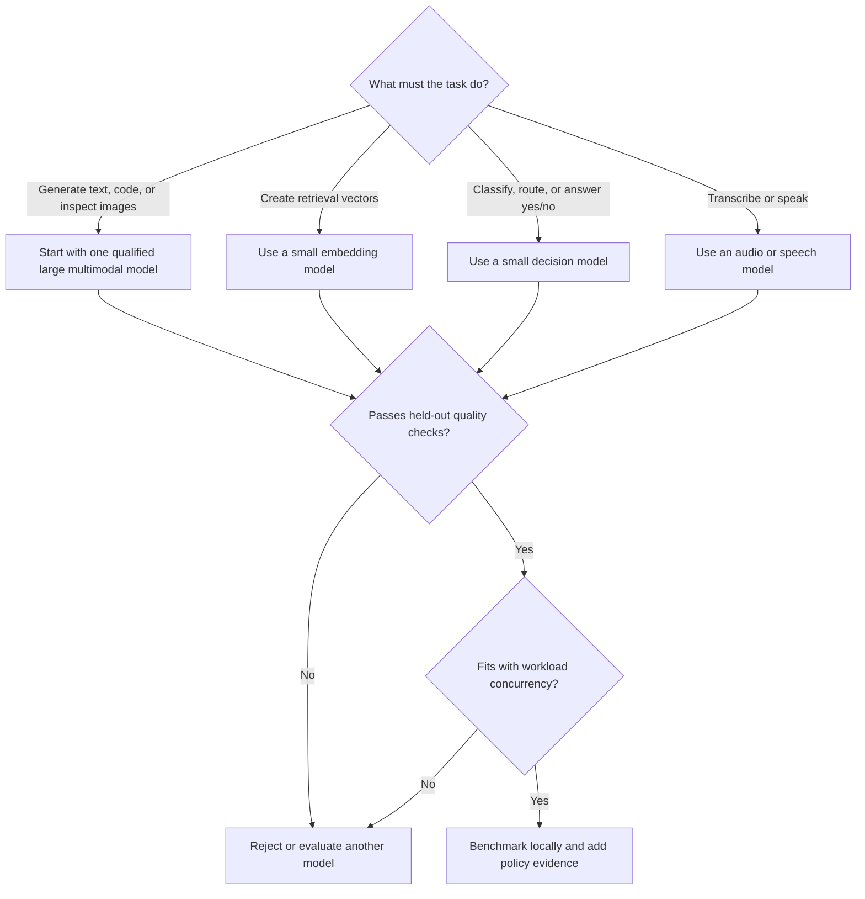

# Choose local models

To offload a task, select an installed model with the required capabilities and measured quality,
then check its memory fit under the intended concurrency. FreeLlama applies model eligibility
and admission; the calling agent still verifies the output.

The measurements in this guide come from single machines and are not compiled into routing:
[Recommended starting points](#recommended-starting-points-by-form) from an Apple M2 Pro with 32 GB,
the sections after it from an Apple M4 Pro with 48 GB unified memory. Re-run
`npx @octocodeai/freellama doctor`, `models`, `bench-all`, and your quality suite on the target hardware.
`doctor.machine.memory_bytes` is host RAM; a discrete GPU's usable VRAM must be observed separately.

For the best model per job measured on one machine, with newer candidates, see the [local model catalog](LOCAL_MODELS.md).

For supported features and sourced publisher use-case guidance, inspect
`models {view:"installed", includeLibrary:true}` through MCP. [Model metadata](#model-metadata) explains digest matching, variant capabilities,
custom-model fallbacks, and how to read family claims without treating them as quality measurements.


```mermaid
flowchart TD
    T{"What must the task do?"}
    T -->|"Generate text, code, or inspect images"| L["Start with one qualified large multimodal model"]
    T -->|"Create retrieval vectors"| E["Use a small embedding model"]
    T -->|"Classify, route, or answer yes/no"| D["Use a small decision model"]
    T -->|"Transcribe or speak"| A["Use an audio or speech model"]
    L --> Q{"Passes held-out quality checks?"}
    E --> Q
    D --> Q
    A --> Q
    Q -->|"No"| N["Reject or evaluate another model"]
    Q -->|"Yes"| M{"Fits with workload concurrency?"}
    M -->|"No"| N
    M -->|"Yes"| B["Benchmark locally and add policy evidence"]
```

## Recommended starting points by form

Measured on an Apple M2 Pro with 32 GB, Ollama 0.40.8 and FreeLlama 0.6.1 on 2026-10-30, while
other builds kept the one-minute load near 14 on 12 cores. Every check had a known answer; the
batteries are small, so treat these as first picks to re-check on your machine, not rankings. The
calls shown are the current ones. Later and larger measurements, audio and memory needs are in the
[local model catalog](LOCAL_MODELS.md).

| Form | Model (download) | Measured | Speed (warm) | How an agent calls it |
|---|---|---|---|---|
| Text, tools, JSON, reasoning | `gpt-oss:20b` (13.8 GB) | 7/7: exact output, arithmetic, bat-and-ball, code reading, JSON extraction, tool call, 9/9 ticket routing | 1.4 s per routed ticket | `run_task {model:"gpt-oss:20b", prompt, think:"low"}`; add `tools` or `format:"json"` |
| Embeddings | `nomic-embed-text:v1.5` (274 MB) | Retrieval 4/4 top-1; ticket routing 9/9 from two examples per team | 51 ms per item, batched | `run_task {task:"embedding", files:["src/**/*.rs"] or input:[...], nearest:{query:"..."}}`: ranked labels, not vectors |
| Decisions (classify, route, score) | `strands-decider:2b-nvfp4` (1.3 GB) | Ticket routing 9/9, return-policy yes/no 3/3, damage rubric 2/3 | 0.17 s per question | `run_task {task:"decision", model, state or files:[path], questions}`; one line per answer |
| OCR | `hf.co/openbmb/MiniCPM-OCR-1.0-gguf:Q4_K_M` (1.4 GB) | 30/30 rendered text images in all 3 rounds | 257 ms median | `run_task {workflow:"read-text", files:[path]}` (or `job:"ocr"`) |

`gpt-oss:20b` reasons before answering, and its reasoning counts as output. FreeLlama sends no
output cap of its own and sizes the context from what the model has needed before, so leave room
for the reasoning if you set `num_predict` yourself. It needed about 17 GB available, so FreeLlama held
it when other work left less. OCR models read text from images only; asked a chat question, one keeps generating to its output
limit. Use them through the `ocr` job's trained prompts. `stopOnRepetition` stops one that loops and is
on by default without `num_predict`; set it explicitly if you also cap the output. The `strands-decider` tags need Apple silicon, and decision
models answer only through Ollama's decision API, which `run_task {task:"decision"}` reaches with
FreeLlama's routing and memory checks. A busy CPU does not refuse them; low memory does.

### Classify text three ways

The same nine support tickets, routed to billing, technical or returns:

| Approach | Model | Correct | Per item | Use when |
|---|---|---:|---:|---|
| Embeddings and per-class centroids | `nomic-embed-text:v1.5` | 9/9 | 51 ms | Many items, stable classes, a few labeled examples per class |
| Decision model | `strands-decider:2b-nvfp4` | 9/9 | 0.5 s (first call includes the load) | You need probabilities, yes/no policy checks or rubric scores |
| Instruction model with JSON output | `gpt-oss:20b` | 9/9 | 1.4 s | Classes change per request or need explanation |

A request names its questions, and each answer comes back under the same name. `run_task` takes the
same `state` and `questions`; this is the raw form for scripts:

```bash
curl -s http://127.0.0.1:11435/v1/systemone -H 'content-type: application/json' -d '{
  "model": "strands-decider:2b-nvfp4",
  "state": "Why did my credit card get billed two times?",
  "questions": {"team": {"type": "choice", "instructions": "Which team handles this ticket?",
    "criteria": {"billing": "Charges and invoices", "technical": "App errors", "returns": "Returns and refunds"}}}
}'
```

Ollama answers `noul` (yes/no), `choice` (2–26 options for most models, up to 255 for `kev`) and
`score` (2–10 levels for most models) questions here, not `box`, which it refuses with 400, up to 64
per request. Text and schema must fit in 64 KiB (1 MiB for `kev` and `d1`); larger requests get 413,
and input is never truncated. The request takes no `options`, so `keep_alive` is its only residency
control. Images go in a top-level `images` array of base64 strings shared by every question, or in
`run_task {files}`. Only a vision decision model reads them: `strands-decider` refuses them with 400.
Models with audio input also take WAV clips there, and videos are refused. Ollama drops a
TypeSafe-style `assets` map without an error, so `serve` moves those images into `images` when every
image applies to every question and refuses the request otherwise. Find decision models with
`models {view:"library", capabilities:["decision"]}`.

### Use it as Octocode's classifier

Octocode's `clasify` speaks the same System One format, so FreeLlama can serve it locally. In the
shell or the Octocode home `.env`:

```bash
OCTOCODE_CLASSIFICATION_API_HOST=http://127.0.0.1:11435
OCTOCODE_CLASSIFICATION_MODEL=strands-decider:2b-nvfp4
OCTOCODE_CLASSIFICATION_API=local   # any nonblank value; the local server ignores it
```

`clasify` `evaluate` and `sections` work with yes/no, choice and score questions, and image
questions work with a vision decision model. `operation:"models"` works and lists every installed
model, not only decision models, so name a decision model in `OCTOCODE_CLASSIFICATION_MODEL`. Box
questions do not exist in Ollama. Raw requests share one slot by default, so Octocode's
parallel calls queue behind each other; a busy queue answers 429 with `Retry-After`, which
Octocode honors. Inline `classification` on search results asks a three-level score question, where
the 2B model's distributions are flat and few candidates clear the 0.5 selection threshold.

## Text, code, and vision

`qwen3.8:27b-mlx` was the strongest general model in the local evaluations. It handled coding,
grounded research, image description, OCR, and summarization. These evaluations ran on 48 GB; at
18 GB it does not fit a 32 GB machine in normal use (FreeLlama asks for 28.7 GB available for the
similarly sized `qwen3.6:27b-q4_K_M`). Using one large multimodal model also
avoided contention between separate heavy text and vision runners.

In those evaluations it was strong at grounded lookup, long-context retrieval and strict instruction
following, needed `think:true` and a generous output budget for multi-step reasoning, and about a
third of its unsupervised code-review findings were false or context-limited.
These examples do not establish that a tag is installed or suitable on your host.

Dedicated OCR models answer best to the prompts their model card documents; name the image in
`run_task {files}` rather than pasting base64 `images`. A model that repeats its answer until its
output limit stops early with `stopOnRepetition`, on by default without `num_predict`. See [Loop control](FEATURES.md#loop-control)
for the early stop and the `output_check` receipt.

`muse-glimmer:30b-mlx` was a credible alternative and answered 29 of 30 questions correctly
(96.7%) with the Bash adapter, but it was slower and did not add a required capability in this
workload.

Do not assume small research models are adequate. The local grounded-lookup sample fell to 2/8 at
7B, 3/8 at 3B, and 0/8 at 0.5B. `delegate_research` can refuse models whose runtime evidence marks
them unusable rather than spending tokens on a known-poor route.

## Embeddings

`nomic-embed-text` matched the highest recall with the lowest measured index time and model size in
the repository retrieval sample:

| Model | Recall at 3 | Index time | Dimensions | Size |
|---|---:|---:|---:|---:|
| `nomic-embed-text` | 5/6 | 4.2 seconds | 768 | 274 MB |
| `embeddinggemma:300m` | 5/6 | 4.9 seconds | 768 | 622 MB |
| `qwen3-embedding:0.6b` | 4/6 | 14.8 seconds | 1,024 | 639 MB |

Use embeddings for semantic similarity, grouping, deduplication, and classification. For exact code
keywords, repository search was both faster and more accurate in the measured sample.
`run_task {nearest}` ranks items inside the server and returns labels, so an agent never reads vectors;
files are split into line chunks labelled `path:Lstart-Lend`. `embeddinggemma-2` adds image and audio
items for a multimodal model; see the [local model catalog](LOCAL_MODELS.md) for how it compared.

## Place helper models on CPU when useful

A small embedding or helper model can be assigned to a second CPU Ollama process while a large
generation model remains resident on the primary GPU-capable process. This can overlap independent
work, but it does not make CPU inference fast. Apple silicon shares memory bandwidth; discrete-GPU
systems have different transfer and contention costs and need their own benchmark.

The measured warmed embedding-plus-completion workload improved from a 37.997-second sequential
median to a 28.233-second parallel median, a 1.346-times speedup. Treat that result as evidence for
this machine and workload, not a universal model-placement rule. Follow
[CPU and GPU model routing](CPU_GPU_ROUTING.md) to reproduce it.

## Turn measurements into routing evidence

`bench-all` measures local performance. A quality benchmark measures correctness. FreeLlama needs
both the generated task policy and local benchmark data before grading a route medium confidence.
See the [CLI reference](CLI.md#earn-medium-routing-confidence) for the commands.

## Model metadata

The MCP `models` tool reads your Ollama instance and can enrich results with Ollama's public model
library, and its library view also searches Hugging Face GGUF repositories. Supported features and advertised use cases are metadata: they do not change routing
confidence, and exact-model benchmarks and policy remain the quality evidence. The CLI's `models`
command reports the core catalog and does not expose these enrichment flags.

| Request | Result | External access |
|---|---|---|
| `models {view:"installed"}` | Managed inventory with a `knowledge` object for each model | Local backend data only |
| `models {view:"installed", includeLibrary:true}` | Inventory enriched with public guidance for verified local tags | Fetches model family and tag pages from ollama.com |
| `models {view:"detail", model:"gemma3:1b"}` | Ollama details, maximum context, and supported-use explanations | Selected Ollama endpoint only |
| `models {view:"detail", model:"gemma3:1b", includeLibrary:true}` | Details plus public guidance after a tag and digest check | Selected Ollama endpoint and ollama.com |
| `models {view:"library", query:"coding"}` | Public family search with descriptions and advertised feature chips, plus Hugging Face GGUF repositories | ollama.com, huggingface.co, and optional local inventory/profile reads |
| `models {view:"library", model:"gemma3"}` | All public tags with size, digest prefix, context, modalities, and cloud status | ollama.com and optional local inventory/profile reads |
| `models {view:"library", model:"hf.co/<owner>/<repo>"}` | The repository's GGUF tags with size and memory fit | huggingface.co and optional local inventory/profile reads |


| Option | Valid views | Default | Meaning |
|---|---|---|---|
| `includeLibrary` | `installed`, `detail` | `false` | Requests public metadata; the default makes no website calls |
| `includeReadme` | Library step 2, or `detail` with `includeLibrary:true` | `false` | Returns the README text with its format |
| `includeVerbose` | `installed`, `resident`, `detail` | `false` | `installed`/`resident`: full per-model records (benchmark, policy rank, execution observation, thinking, context defaults) instead of the slim set; `detail`: Ollama's license and Modelfile fields, independently of README enrichment |
| `limit`, `cursor` | `raw`, library tag listings; `limit` also applies to library search | Tag/raw page size 20; search limit 10; maximum 50 | Pages large lists; the tag cursor rejects a changed tag list |
| `query`, `capabilities`, `order`, `source` | Library search | Popular order, both sources | Filter by capability word (such as `decision`), order by `popular` or `newest`, or limit to `ollama` or `huggingface` |
| `ollamaEndpoint` | Direct Ollama views and library inventory reads | Configured Ollama endpoint | Chooses the Ollama instance; enriched managed inventory uses each model's assigned backend |

An incompatible option returns an error before any lookup. Installed enrichment omits full READMEs;
request one model's detail to read its README.

### Supported features

`knowledge.supportedFeatures` preserves the feature strings from the selected source
(`supportedFeaturesSource`: `ollama_api` or `freellama_catalog`). Unknown future strings stay visible
but do not create routing requirements. `knowledge.supportedUseCases` explains each recognized
feature with `capability`, `use`, `reason`, and `basis:"supported_feature"`;
`knowledge.quality` stays `"metadata_only"`.

| Feature | Supported workflow | What to evaluate separately |
|---|---|---|
| `completion` | Text generation | Coding, summarization, reasoning, and instruction-following accuracy |
| `tools` | Tool calls | Argument correctness, tool selection, and agent-loop reliability |
| `vision` | Image input | OCR and visual understanding accuracy |
| `audio` | Audio workflows advertised by the model | Supported audio task and accuracy |
| `embedding` | Retrieval and similarity vectors | Retrieval quality on your documents |
| `decision` | Typed questions through `run_task {task:"decision"}` | Accuracy and calibration on your labeled examples |
| `speech` | Text to speech through the `audio` tool | Intelligibility and supported voices |
| `thinking` | A thinking mode | Reasoning accuracy, latency, and token cost |
| `insert` | Suffix-based text insertion | Completion accuracy in the target code or text |
| `image` | Image generation | Output quality and supported controls |


### Public guidance and provenance

For a verified installed model, `knowledge.library` contains the source page, tag-page URL,
`fetchedAt`, `expiresAt`, `cached`, exact public tag metadata, and:

| Field | Meaning |
|---|---|
| `description` | The public family description |
| `advertisedFamilyCapabilities` | Family feature chips; these do not extend the local tag's capabilities |
| `advertisedUseCases` | Recognized coding, tool-calling, image-understanding/OCR, reasoning, embedding, summarization, question-answering, translation, and long-context claims |
| `advertisedUseCases[].evidence` | A bounded source excerpt, source URL, and fetch timestamp |
| `usageNotes` | Sentences about requirements, restrictions, context, memory, languages, or query prefixes |
| `readmeAvailable` | Whether a README was extracted |
| `readme` | Requested text with `format` (`markdown` or `text`) |


Advertised uses have `basis:"advertised"`, `scope:"family"`, and `quality:"unmeasured"`. Extraction
skips fenced code and negative statements; an omitted use means no recognized claim, not absence.
These labels are not the `run_task` task enum. Local capabilities filter advertised uses: a family
vision chip cannot make `gemma3:1b` a vision candidate.

Installed enrichment requires the exact public tag and a digest-prefix match of at least 12 hex
characters. Custom names are never mapped by architecture or guessed base model; without a verified
match, public guidance is withheld. Library step 2 describes public models before installation, so
its guidance stays family-scoped; each `tags[]` entry carries its own modalities, context, digest
prefix, and `cloud` flag. Search's `cloudAvailable` badge does not prove local downloads are absent.

### Lookup states

| `library.status` | Meaning | Next action |
|---|---|---|
| `not_requested` | Website enrichment was not requested | Set `includeLibrary:true` if external lookup is useful |
| `matched` | Installed tag and public digest prefix match | Read the sourced guidance, then evaluate the exact tag |
| `available` | Public family and tag pages were parsed in library step 2 | Inspect the exact tag before recommending a download |
| `unverified` | Digest or current backend inventory could not be verified | Recheck local inventory; retain local feature information |
| `digest_mismatch` | The public tag differs from the installed digest | Treat public guidance as unavailable for this installed model |
| `tag_not_found` | The parsed public tag list has no exact matching tag | Check the source and custom-model provenance |
| `unmatched` | The name cannot resolve to an exact public Ollama name | Keep use-case suitability unknown until provenance is verified |
| `not_found` | A requested public page returned HTTP 404 | Check the source URL or custom name |
| `unavailable` | Transport, timeout, HTTP refusal, or page-size limit prevented lookup | Retry later; local results remain available |
| `parse_error` | HTML content or tag rows were not recognized | Inspect the source; do not conclude the model is absent |
| `remote_model`, `remote_tag` | Remote Ollama fields or a hosted tag identify cloud execution | Select a local download tag for local execution |


`localModel:false` flags detected remote entries; cloud tags never become local trial
recommendations. This metadata is not processor-placement evidence.

### Cache and request bounds

Each MCP process caches at most 128 families: successes for one hour, failures for one minute;
concurrent requests share one lookup and a restart clears the cache. Installed enrichment runs at
most four family lookups concurrently. Requests use GET, refuse redirects, cap each page at 2 MiB,
and time out after the smaller of 10 seconds and `FREELLAMA_MCP_FETCH_TIMEOUT_SECONDS`. They disclose
the requested public family name to ollama.com, and a library search query or `hf.co` name to
huggingface.co. Download size does not establish runtime memory
fit, placement, or quality, and model discovery never authorizes a pull. Sources:
[model details API](https://docs.ollama.com/api-reference/show-model-details),
[model-list API](https://docs.ollama.com/api/tags).
