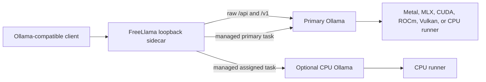
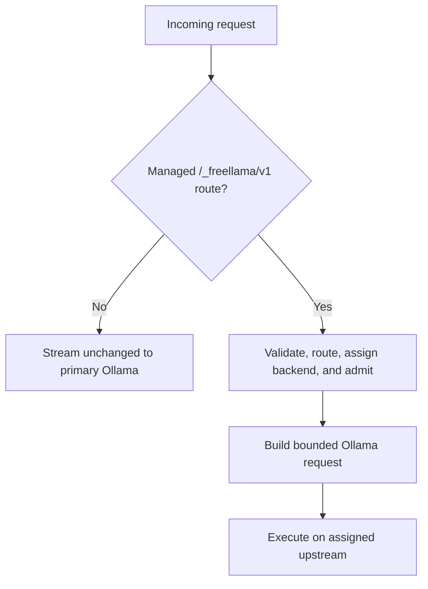

# Ollama sidecar boundary

FreeLlama integrates with Ollama as a loopback HTTP sidecar, not an in-process inference plugin.
Ollama owns model execution; FreeLlama owns policy and coordination around it.

This boundary avoids an Ollama fork and preserves its documented HTTP contract. It also makes a
second, process-isolated CPU backend possible without changing arbitrary client payloads.

## Divide ownership

| Problem | Owner |
|---|---|
| Kernels, prompt processing, and token generation | Ollama and its runner dependencies |
| Runner loading, eviction, and scheduling within one server | Ollama |
| Prompt templates and model defaults | Ollama model metadata or a `Modelfile` |
| Capability and memory filtering | FreeLlama managed routes |
| Evidence policy, confidence, and route receipts | FreeLlama managed routes |
| Session affinity, per-backend bounded admission, and warm runtime feedback | FreeLlama managed routes |
| Exact model assignment to an optional CPU process | FreeLlama configuration |
| Guarded CPU/GPU preference within assigned eligible models | FreeLlama managed routes |
| Authentication and remote exposure | FreeLlama bearer middleware; external ingress owns TLS and tenant authorization |

FreeLlama does not make an individual model decode faster. It can improve workload completion by
avoiding unsuitable routes, reducing avoidable transitions, refusing unsupported work early, and
overlapping independent CPU and GPU model requests when the machine benefits from that layout.

## Preserve compatibility

`packages/rust-core/src/proxy.rs` forwards paths, queries, request bodies, and streaming response
bodies. It removes hop-by-hop headers and adds `x-freellama-proxy: 1` to responses. Raw `/api/*`
and `/v1/*` requests always target the primary upstream and are not rewritten for CPU placement.

The distinction is intentional: existing Ollama clients retain predictable compatibility, while
clients that opt into the managed API receive routing and policy behavior.

## Know the remaining limits

Native passthrough traffic remains under Ollama's scheduler and does not participate in FreeLlama's
transition locks. The managed sidecar also does not enforce live memory-pressure or thermal
admission. A configured but unreachable CPU backend makes managed catalog discovery fail closed;
raw primary passthrough remains usable.

Runtime feedback is task-specific, token-normalized, and warm-only. It can steer
unpinned `fastest` or `balanced` work after three samples on each backend and a greater-than-10%
advantage; it cannot change CPU eligibility or steer quality routing. The CLI persists a bounded,
versioned snapshot atomically by default, so verified evidence survives restart without changing
Ollama residency.

Read [Architecture](ARCHITECTURE.md) for all managed flows,
[CPU and GPU model routing](CPU_GPU_ROUTING.md) for the two-process procedure, and
[Ollama and FreeLlama optimization](OLLAMA_SYSTEM_OPTIMIZATION.md) for the full tuning boundary.

## Sources

- [Ollama API introduction](https://docs.ollama.com/api/introduction)
- [Ollama streaming behavior](https://docs.ollama.com/api/streaming)
- [Ollama usage metrics](https://docs.ollama.com/api/usage)
