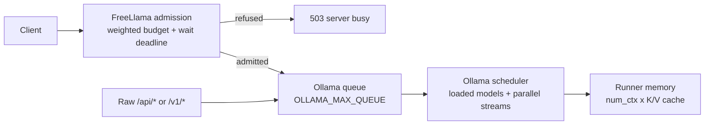

# Prepare FreeLlama for production

This runbook prepares a single-operator or trusted-team FreeLlama deployment. FreeLlama now
supports authenticated nonloopback listeners, but it is not a multi-tenant authorization or
billing service. Put TLS and tenant-specific rate limits at an external ingress when traffic
crosses a machine boundary.

## Meet the prerequisites

- Install one Ollama CLI and server version. Run `freellama doctor` and resolve any mismatch.
- Install Node.js 20 or later for MCP and npm distribution use.
- Use the release artifacts for your operating system, or build with Rust 1.85 or later.
- Preinstall and benchmark exact model tags. Discovery never authorizes a pull.
- Keep the primary and optional CPU Ollama processes on distinct loopback sockets.

After a tag has been published, install that exact checksummed release on macOS or Linux:

```bash
curl -fsSLO https://raw.githubusercontent.com/bgauryy/FreeLlama/main/scripts/install.sh
sh install.sh --version vX.Y.Z
```

The installer downloads the exact-version binary and verifies it against the release's
`SHA256SUMS`. From a Windows checkout, run the following command after replacing `VERSION` with the
published tag:

```powershell
powershell -ExecutionPolicy Bypass -File .\scripts\install.ps1 -Version VERSION
```

There is no repository-hosted release automation. Build and test every claimed target in a clean
environment, place each executable and matching addon under `release-artifacts/<target>/`, run
`yarn release:assemble release-artifacts release` and `yarn release:verify:publish`, then attach
`release/SHA256SUMS` and binaries to the release. Publish the eight `@octocodeai/freellama-native-*` packages
first, followed by the exact-version `@octocodeai/freellama` and `@octocodeai/freellama-mcp-server` packages. Configure
registry credentials in the release environment; never store them in the repository.

## Configure Ollama explicitly

Start with one model and one decode stream per Ollama process. Increase either value only after a
representative workload proves that the additional weights, contexts, and K/V caches fit without
swap, eviction churn, or unacceptable queueing.

| Setting | Starting value | Reason |
|---|---:|---|
| `OLLAMA_HOST` | Primary `127.0.0.1:11434`; CPU `127.0.0.1:11436` | Keeps both inference processes on distinct loopback sockets |
| `OLLAMA_NO_CLOUD` | `1` for local-only deployments | Makes the local-only privacy boundary explicit |
| `OLLAMA_FLASH_ATTENTION` | auto | Ollama enables it automatically on supported backends. Force `1` only after a measured compatibility check; quantized K/V cache requires Flash Attention. |
| `OLLAMA_KV_CACHE_TYPE` | `q8_0` after qualification | Reduces K/V memory; retain `f16` until each important model passes a quality comparison |
| `OLLAMA_NUM_PARALLEL` | `1` | Avoids multiplying context memory before measuring same-model concurrency |
| `OLLAMA_MAX_LOADED_MODELS` | `1` per process | Prevents an automatic multi-model limit from overcommitting an unmeasured host |
| `OLLAMA_MAX_QUEUE` | Workload-specific, bounded value | Limits Ollama's internal queue independently of FreeLlama admission |

Do not set a global `OLLAMA_CONTEXT_LENGTH` merely to maximize the advertised window. Managed
FreeLlama tasks send the smallest sufficient request-specific `num_ctx`; a larger context and a
larger `OLLAMA_NUM_PARALLEL` multiply K/V-cache memory. Direct Ollama clients still follow the
server's context configuration, which defaults to 4096 tokens in current Ollama.

`freellama doctor` returns `local_conservative_config_posture` as a **non-mutating** portable
starting profile. It names the source of each value (`observed_process` or `configuration_hint`),
requires `OLLAMA_NO_CLOUD=1` for a local-only deployment, and recommends one loaded model, one
parallel stream, and a finite internal queue before benchmarking. It also reports
`host_runtime_signals` with source and permission scope. Treat unavailable GPU-memory, thermal, or
power signals as unavailable; do not substitute host RAM or a guessed value.

FreeLlama and Ollama have separate queues. FreeLlama acquires a weighted backend permit and waits
for at most `--max-queue-wait-seconds`. An admitted request can then enter Ollama's internal queue,
which is bounded by `OLLAMA_MAX_QUEUE`. Raw compatibility traffic bypasses FreeLlama admission and
enters the primary Ollama queue directly. Set both limits from observed latency and overload
behavior; changing one does not configure the other.

The following flow shows where each production setting applies:



These values are conservative starting points, not universal constants. NVIDIA, AMD, Apple, and
CPU-only hosts must pass hardware validation before promotion. See
[Ollama and FreeLlama optimization](OLLAMA_SYSTEM_OPTIMIZATION.md) for the ownership boundary and
[Run models on CPU and GPU](CPU_GPU_ROUTING.md) for device-specific controls.

Put the values in the service manager that owns each Ollama process: launchd on macOS, systemd or
the container definition on Linux, and the Windows service wrapper. Shell exports and
`launchctl setenv` are useful diagnostics but are login-session state, not a reboot-persistent
production configuration. After a real service restart, rerun `doctor` and `scripts/check.sh` and
require the same visible values before admitting work.

## Create the security and state files

Generate a token without placing the secret in shell history or the process list:

```bash
freellama auth-token --out ~/.local/share/freellama/auth.token
```

The command creates a new file with mode `0600` on Unix and refuses to overwrite an existing
token. Start the service with persistent feedback and authentication:

```bash
freellama serve \
  --feedback-file ~/.local/share/freellama/feedback.json \
  --auth-token-file ~/.local/share/freellama/auth.token \
  --upstream http://127.0.0.1:11434 \
  --cpu-upstream http://127.0.0.1:11436 \
  --cpu-model nomic-embed-text:latest
```

Set `FREELLAMA_AUTH_TOKEN_FILE` to the same file for the CLI, MCP server, and bundled research
adapters. Authentication covers both `/_freellama/v1/*` and Ollama-compatible passthrough routes.
Use `--allow-remote` only with an authentication token. The server refuses unauthenticated
nonloopback listeners.

The feedback snapshot is versioned, bounded by backend and task type, and replaced atomically.
Only physically verified warm samples are saved. A corrupt or unsupported snapshot makes startup
fail instead of silently discarding routing evidence. Use `--ephemeral-feedback` only for
disposable tests.

## Configure MCP

Set these values in the MCP host environment:

- `FREELLAMA_AUTH_TOKEN_FILE`: bearer-token file used by native and adapter HTTP clients.
- `FREELLAMA_AGENT_TOKEN_CALIBRATION_DIR`: persistent, per-model token-estimate records.
- `FREELLAMA_MCP_ALLOWED_ROOTS`: exact directories available to `delegate_research`.
- `FREELLAMA_SERVE_ENDPOINT`: authenticated FreeLlama endpoint.

Persistent token calibration eliminates the repeated “uncalibrated first call” after a model has
been observed on that host. A genuinely new model/template still starts from the conservative
configurable estimate because Ollama exposes no stable preflight tokenizer API. Records contain
only model identifiers, scale, and sample count; they contain no prompts.

Keep adapter context settings distinct from Ollama server context. `FREELLAMA_AGENT_NUM_CTX`
budgets the adapter conversation; older tool observations are compacted inside that budget while
the system prompt and original question remain pinned by default. `OLLAMA_CONTEXT_LENGTH` controls
direct Ollama requests, and managed FreeLlama tasks send their own `num_ctx`.

## Verify lifecycle and placement

`keep_alive:0` no longer sacrifices placement evidence. FreeLlama temporarily holds the runner,
observes `/api/ps`, records eligible feedback, explicitly unloads it, and verifies that it is no
longer resident before returning. Inspect both `execution.observation` and
`execution.lifecycle.status`.

Require these health contracts before admitting traffic:

- `placement_feedback_persistence: versioned_atomic_snapshot_v1`
- `authentication: optional_bearer_all_routes`
- `immediate_unload_observation: observe_then_unload`
- `placement_observation: ollama_api_ps_after_execution`
- `placement_evidence_gate: configured_or_observed`

Run `skills/freellama/scripts/check.sh` with `FREELLAMA_AUTH_TOKEN_FILE` set. It verifies the
active versions, visible Ollama settings, persisted-feedback contract, authentication contract,
backend topology, and binary freshness. Also inspect the service definition for any setting that
the Ollama process does not expose to FreeLlama.

## Validate every hardware class

Run compile and deterministic test checks from clean checkouts on Windows, Linux, and macOS. Live
accelerator acceptance is separate because build machines do not necessarily represent production
GPU drivers or memory topology. Prepare Apple Metal, NVIDIA Linux, AMD Linux, and NVIDIA Windows
hosts, then run `benchmark/hardware/run_validation.py` directly on each host.

Each environment supplies its exact GPU and CPU model tags and a running FreeLlama endpoint. The
portable runner in `benchmark/hardware/run_validation.py` executes GPU coding and CPU embedding
concurrently, verifies physical processor receipts, checks admission receipts, and writes a JSON
artifact. Add `--vision-model` and `--vision-image` for that host's OCR/vision gate.

Do not mark a hardware row validated until its archived receipt says `verdict: accept`. Missing
hardware is an explicit release gap, not a result that documentation can waive.

## Promotion checklist

Promote a release only when all conditions pass:

1. `cargo fmt --all --check`, Clippy, Rust tests, typecheck, unit, integration, and live E2E pass.
2. Release packaging contains every declared target and `SHA256SUMS` verifies.
3. The active CLI and Ollama server versions match.
4. Reboot-persistent service definitions carry the explicit Ollama settings and FreeLlama args.
5. Health reports authentication, atomic feedback persistence, and current placement contracts.
6. Restart testing proves feedback reloads and a corrupt snapshot fails startup.
7. Immediate unload reports verified pre-unload placement and verified post-unload absence.
8. Every claimed hardware row has a real archived acceptance receipt.
9. The MCP schema remains eight tools and within its context budget.

Rollback by returning the listener to loopback, stopping the new service, and starting the prior
checksummed binary with the same policy and feedback snapshot. Never downgrade across an unsupported
feedback schema without preserving the old binary and snapshot together.
