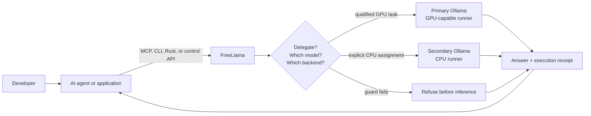
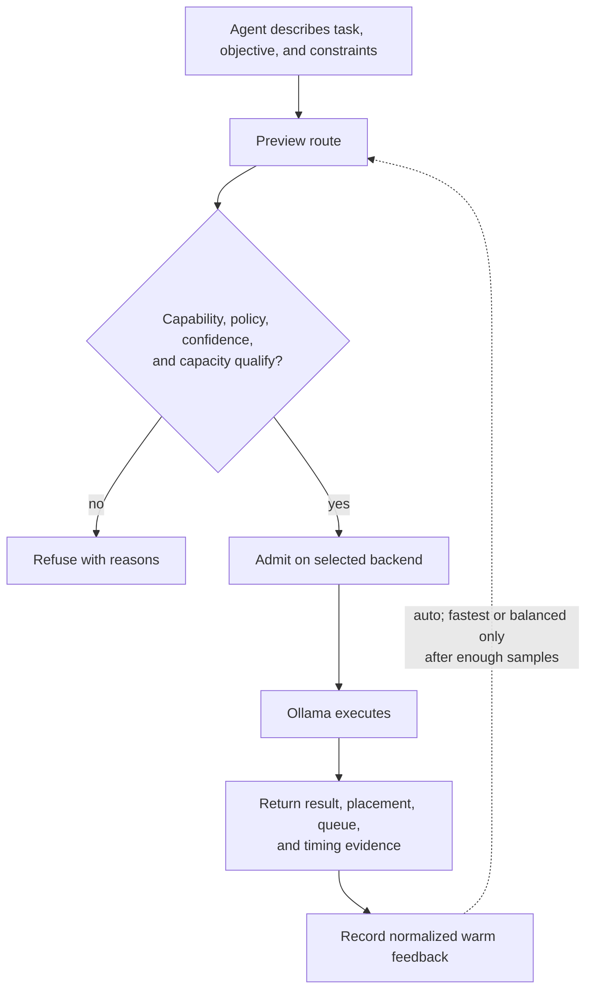
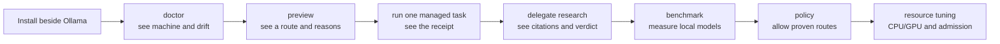

# Product positioning

FreeLlama is a **governed local-model delegation layer for developers who run AI agents on
Ollama**. It helps an agent decide whether local inference is appropriate and select an eligible
installed model. It executes within machine and policy limits and returns evidence about what happened.

The shortest accurate description is:

> Ollama runs local models. FreeLlama helps agents use them deliberately.

This positioning is intentionally narrower than “AI gateway” and more useful than “Ollama proxy.”
FreeLlama preserves Ollama's API, but its distinctive work is the decision and evidence layer around
inference: model qualification, fail-closed routing, admission, CPU/GPU placement, grounded
research, and execution receipts.

## Product category decision

| Question | Decision |
|---|---|
| Product category | Local-model delegation control plane |
| Primary audience | Developers operating coding or research agents with Ollama |
| Core job | Move suitable work to local models without silently lowering quality or losing control of the machine |
| Primary alternative | Call Ollama directly and implement routing, verification, and resource coordination in every agent |
| Product promise | Make local delegation explicit, bounded, observable, and measurable |
| Not the product | A chat UI, an Ollama fork, a hosted inference service, or a generic multi-provider gateway |

“Trustworthy local-model delegation” is the clearest value phrase. “Localhost control plane” is an
accurate architectural phrase, but it supports the explanation rather than leads it.

## How the product fits

[Ollama](https://docs.ollama.com/api/introduction) owns model execution and its API. FreeLlama
owns the policy around managed use of that runtime. The [Model Context Protocol
(MCP)](https://modelcontextprotocol.io/specification/2025-06-18/architecture) makes those controls
available to compatible agent hosts as six bounded tools. Native Ollama requests can still pass
through unchanged to the primary upstream.

See [FreeLlama architecture](ARCHITECTURE.md) for the complete responsibility and request-flow
contracts.

## Audience hierarchy

### Primary: developers operating AI agents

The strongest user is a developer who already uses a capable cloud or local agent and wants to
delegate bounded work to Ollama. Examples include grounded repository research, embeddings, OCR,
bulk transforms, and helper-model tasks.

Their job is not merely “run a model.” It is:

1. Determine whether a local model is suitable for the task.
2. Avoid sending work to an incapable, unmeasured, or oversized model.
3. Keep large files, vectors, images, and intermediate tool output out of the orchestrator's
   context.
4. Coordinate concurrent work without uncontrolled model loads or memory pressure.
5. Receive citations, verdicts, placement, queue, and timing signals that the agent can inspect.

FreeLlama fits this user because its MCP server, CLI, agent skill, and control API expose exactly
those decisions. The core job-to-be-done is:

> When my agent encounters expensive but bounded work, decide whether a local model can handle it,
> run it under explicit limits, and give the agent enough evidence to trust or reject the result.

### Secondary: Ollama power users and local-AI operators

An operator with several installed models can use FreeLlama to diagnose environment drift, inspect
residency, preview routes, coordinate admission, assign selected helpers to a CPU backend, and turn
benchmark results into routing policy.

This audience can use the CLI without an MCP host. The relevant value is machine-aware operation,
not agent integration alone. FreeLlama discovers the current host and observes Ollama state instead
of embedding assumptions from the development Mac. See [model selection](MODEL_SELECTION.md) and
[CPU/GPU routing](CPU_GPU_ROUTING.md).

### Secondary: developers embedding local-model policy

Library and tool authors can use the Rust core, Node native boundary, or HTTP control API instead
of rebuilding discovery, routing, admission, and evaluation. This is an integration audience, not
the clearest first-run story.

### Adjacent: Ollama developers and contributors

FreeLlama can help Ollama contributors as a downstream compatibility and workload testbed. Its
diagnostics expose version drift, native passthrough tests protect API compatibility, and its
dual-process experiments document observed runner placement.

Ollama developers are not the primary audience. FreeLlama does not replace Ollama's scheduler,
runner, model storage, accelerator backends, or token generation. It is a sidecar that exercises
and governs Ollama from the client side. Describe the relationship as complementary:

> Ollama makes local inference possible; FreeLlama makes agent delegation to it governable.

### Not a target: mainstream users

FreeLlama is not a mainstream local-AI product. It has no end-user chat interface. Meaningful use
assumes familiarity with Ollama and its model tags. Users also need a terminal or MCP host and an
understanding of policy or benchmark concepts.
[Open WebUI](https://github.com/open-webui/open-webui) already addresses approachable self-hosted
AI interfaces.

A separate desktop or web interface can sit on top of FreeLlama as a new product layer. Keep that
layer from blurring the current audience or forcing consumer concerns into the control plane.

## The gap FreeLlama fills

Calling Ollama directly is the correct path when the caller already knows the exact model
and request. FreeLlama becomes useful when the caller has to make and defend a delegation decision.

| Direct Ollama question | FreeLlama question |
|---|---|
| Which model tag receives this request? | Which installed model qualifies for this task and confidence threshold? |
| Did the request return HTTP 200? | Was it admitted, where did it execute, and what did it cost? |
| Can the model call tools? | Did bounded research read evidence and produce verifiable citations? |
| Can Ollama load this model? | Does it fit the discovered machine and current resident workload? |
| Can I set request options? | Can this managed model use the explicitly assigned CPU backend without changing raw traffic? |

This distinction also separates FreeLlama from a broad gateway such as
[LiteLLM](https://github.com/BerriAI/litellm). LiteLLM unifies many providers and adds centralized
authentication, budgets, spend tracking, and load balancing. FreeLlama is Ollama-specific,
machine-aware, and centered on agent delegation evidence. Its bearer boundary supports a trusted
operator or team; it does not attempt LiteLLM's tenant, spend, or provider-management scope.

[RouteLLM](https://github.com/lm-sys/RouteLLM) is the closer routing-specific comparison. It trains
and evaluates routers that select between stronger and weaker model endpoints. FreeLlama does not
implement a learned prompt router. It applies deterministic local eligibility and operator policy,
then adds host fit, admission, physical CPU/GPU placement evidence, and grounded-research receipts.

## The product loop

The flexible part of FreeLlama is not an unconstrained agent choosing hardware. It is a guarded
feedback loop with explicit operator and policy boundaries.

An agent can request `auto`, `prefer_cpu`, or `prefer_gpu`, but the request remains a preference.
Explicit model choice, session affinity, capability requirements, policy, confidence, and operator
CPU assignments remain authoritative. Runtime feedback only influences eligible `auto` routes for
speed-oriented objectives after comparable warm samples exist; it never overrides a quality
objective. This design lets the system adapt to another machine without turning resource placement
into an opaque autonomous decision.

## Message hierarchy

Use one message at each level:

| Context | Message |
|---|---|
| Category | Local-model delegation control plane |
| One line | FreeLlama helps AI agents use Ollama deliberately, with routing, resource limits, and evidence. |
| Problem | Local inference is direct to call but hard to delegate to safely across different models and machines. |
| Promise | Move suitable work local without silently lowering quality or destabilizing the runtime. |
| Mechanism | Qualify, preview, admit, execute, and return a receipt. |
| Boundary | Ollama runtime underneath; FreeLlama policy around it. |

Good headline directions are outcome-first:

- **Use local models without lowering your standards.**
- **Give your AI agent a governed path to Ollama.**
- **Delegate locally. Keep the evidence.**

Avoid “AI orchestration platform.” It is broad enough to hide the product. Avoid leading with
“proxy,” because raw passthrough is a compatibility feature rather than the principal value.

## Build credible attention

Create interest through short, reproducible contrasts rather than market-size or
speed claims.

### Demonstration 1: refuse before wasting work

Show an agent previewing a task, rejecting an unqualified model, and returning the reason without
an inference call. The story is not “the router is smart”; it is “a weak local model cannot quietly
produce a confident answer.”

### Demonstration 2: preserve frontier context

Give `delegate_research` a narrow repository question. Show the local adapter reading allowlisted
files and returning an answer, citations, and a verification verdict instead of returning all source
material and intermediate tool output to the orchestrator.

One measured six-question run reduced 59,208 source tokens to 1,742 returned tokens, or 97.1%
context offload. That is a single measured workload, not a universal savings rate. The durable
claim is context isolation; see [token economics](ECONOMICS.md).

### Demonstration 3: use the machine as a system

Run a large GPU completion and a small CPU helper concurrently, then show both placement receipts.
On the measured 48 GB Apple M4 Pro, three warmed trials reduced median wall time from 37.997 to
28.233 seconds, a 1.346-times speedup. One of the three parallel trials was slower than sequential,
so the claim is “these workloads can overlap,” not “CPU/GPU mode is always faster.” See the full
[CPU/GPU measurement](CPU_GPU_ROUTING.md#interpret-the-measured-mac-result).

These demonstrations map directly to three memorable benefits: **trust, context, and resources**.
Turn them into a short terminal recording, copyable README recipes, and versioned benchmark
receipts. Each demo needs the command, machine profile, model tags, policy, result, and
failure conditions.

## Adoption path

The first-use sequence needs to reveal value before asking for sophisticated configuration:

The product must not require a new user to understand every tool, KV-cache setting, or routing
objective before the first managed task. Advanced controls become relevant after the first receipt
makes the control loop visible.

## Claim and naming guardrails

| Do not say | Say instead |
|---|---|
| Free local inference | Local inference uses hardware, power, memory, and time; FreeLlama can preserve paid frontier context. |
| Automatically picks the optimal model | Routes among eligible installed models using explicit policy and available evidence. |
| Makes Ollama faster | Can improve workload efficiency; it does not increase one model's decode speed. |
| Runs CPU and GPU in parallel on every machine | Can overlap explicitly assigned workloads when the host and Ollama backends support them; measure the result. |
| Works the same on any hardware | Uses platform-specific host discovery on macOS, Linux, and Windows. Portable defaults do not remove the need to observe accelerator behavior. |
| Replaces Ollama | Runs beside Ollama and preserves its native API. |
| For everyone | Built first for developers and local-AI operators. |
| Llama models only | Works with qualifying models exposed by Ollama; “Llama” is the product name, not a model-family restriction. |

Use the word “Free” to refer to reducing reliance on metered frontier inference, not zero-cost
computing. Readers can misread “Llama” as Meta Llama-only, so put the Ollama relationship and model
agnosticism within Ollama near the first description.

## Product decision

Narrow the story before broadening the product:

1. Lead with developers operating AI agents, not all developers.
2. Make trustworthy delegation the category-defining job.
3. Use MCP as the primary agent integration and the CLI as the operator surface.
4. Treat Ollama power users and embedders as secondary audiences.
5. Treat Ollama contributors as an adjacent ecosystem audience, not the main customer.
6. Do not pursue a mainstream chat interface until the developer onboarding loop is clear and
   repeatable.

This decision matches the code that exists today. The Rust core, CLI, MCP server, proxy, agent
skill, benchmark harnesses, and policy system all support a developer control plane. Positioning it
as a consumer app promises a product surface the repository does not provide.

## Related documentation

- [Architecture](ARCHITECTURE.md): ownership boundaries and request flows
- [MCP server](../packages/mcp/README.md): six agent-facing tools and their contracts
- [CLI](CLI.md): operator commands and control-plane workflows
- [Model selection](MODEL_SELECTION.md): evidence, qualification, and recommendation
- [CPU/GPU routing](CPU_GPU_ROUTING.md): portable configuration, feedback, and measured limits
- [Testing](TESTING.md): verification tiers and live-runtime boundaries
- [Token economics](ECONOMICS.md): measured context isolation and its limits

## Sources

- [Ollama API introduction](https://docs.ollama.com/api/introduction)
- [Ollama tool calling](https://docs.ollama.com/capabilities/tool-calling)
- [Model Context Protocol architecture](https://modelcontextprotocol.io/specification/2025-06-18/architecture)
- [Open WebUI](https://github.com/open-webui/open-webui)
- [LiteLLM](https://github.com/BerriAI/litellm)
- [RouteLLM](https://github.com/lm-sys/RouteLLM)
