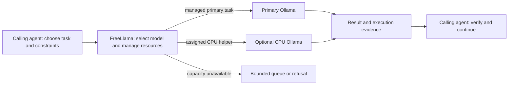

# Product positioning

FreeLlama gives AI agents a managed way to offload tasks to local models through Ollama.
Agents submit bounded work through MCP; FreeLlama handles model selection, queues, memory checks,
residency coordination, and routing to configured CPU/GPU backends. It returns results with
execution evidence so the calling agent can verify them.

> Agents delegate tasks. FreeLlama manages local resources. Ollama runs inference.

The CLI and control API expose the same management layer to operators and applications.
See [architecture](ARCHITECTURE.md) for the ownership contract and the
[README](../README.md) for installation and first use.

## Audience and purpose

The primary audience is developers operating coding or research agents with Ollama. Typical work
includes grounded repository lookup, embeddings, image/OCR tasks, supplied-content transforms,
and helper-model requests. Local-AI operators can use the CLI for the same routing and resource
controls without an MCP host.

The purpose is to make suitable local delegation bounded and inspectable. Eligibility checks,
policy, and benchmark evidence help an agent choose a model; they do not prove that an individual
answer is correct. The calling agent retains judgment and final verification.

## How the layers fit

```mermaid
flowchart LR
    A["Calling agent: choose task and constraints"] --> F["FreeLlama: select model and manage resources"]
    F -->|"managed primary task"| G["Primary Ollama"]
    F -->|"assigned CPU helper"| C["Optional CPU Ollama"]
    F -->|"capacity unavailable"| Q["Bounded queue or refusal"]
    G --> R["Result and execution evidence"]
    C --> R
    R --> V["Calling agent: verify and continue"]
```

| Layer | Owns |
|---|---|
| Calling agent | What to offload, prompts, task dependencies, independent concurrency, and answer verification |
| FreeLlama | Installed-model eligibility, policy, managed admission, memory forecasts, residency coordination, bounded history, and execution evidence |
| Operator | Ollama installation, endpoints, exact CPU model assignments, lifecycle approval, and runtime configuration |
| Ollama and the host | Model storage, runner loading, inference, and physical CPU/GPU scheduling |

Start with one Ollama process. A second process is optional for explicitly assigned CPU helpers.
An agent's placement preference chooses only among eligible configured models. Inspect observed
placement before treating CPU/GPU assignment as physical evidence.

## What agents receive

| Need | Surface | Result |
|---|---|---|
| Inspect the machine and models | `doctor`, `models` | Host diagnostics, installed capabilities, and resident-runner observations |
| Preview suitability | `run_task {preview:true}` | A decision and reasons without running inference |
| Execute supplied content | `run_task` | Model output with routing, admission, timing, and placement evidence |
| Look up repository facts | `delegate_research` | A bounded read-only answer, citations, and `accept`, `verify`, or `escalate` verdict |
| Dispatch independent work | `run_task_batch` | Bounded dispatch and separate results or errors |
| Manage longer work | `task_jobs` | Process-local status, result retrieval, cancellation, and removal |
| Reuse conversation history | `scope`, `session`, `warm_model` | Separate controls for message history, model affinity, and residency |

Preview accepts routing fields only. Submit prompts, messages, images, embedding input, tools,
and runtime controls in a separate execution call. A preview does not reserve capacity.
For requests and result fields, use the [MCP reference](../packages/mcp/README.md).

## Resource management

FreeLlama manages requests before they reach the inference runtime. Its resource controls include:

- Per-backend weighted admission, finite queues, priorities, wait budgets, and deadlines.
- Host-pressure checks and forecast memory reservations for managed work.
- Model-transition coordination and requests to unload idle, unpinned models when a cold load needs room.
- Explicit routing to the primary or operator-assigned CPU backend.
- Bounded warm execution feedback for eligible speed-oriented automatic routes.
- Receipts and status views that expose queues, resource holds, residency, timing, and placement.

The operator configures topology and limits. FreeLlama does not preempt inference or control other
processes that call Ollama directly. It coordinates model use through Ollama rather than allocating
physical GPU cores or implementing inference kernels.

Read [CPU/GPU routing](CPU_GPU_ROUTING.md) for placement and
[monitoring](MONITORING.md) for effective settings and runtime observations.

## Context and cost

Delegated research keeps source files and intermediate local-tool observations out of the calling
agent's prompt. The local worker still consumes input/output tokens and hardware time. Embedding
vectors stay out of MCP results by default unless the caller requests them.

This can reduce the calling agent's context burden. It does not imply zero-cost computation or a
universal savings rate. The [token economics report](ECONOMICS.md) separates historical measurements,
client-envelope sizes, and session estimates.

## Describe the product consistently

| Context | Wording |
|---|---|
| Category | Local-model delegation and resource management layer |
| One line | FreeLlama helps AI agents offload tasks to local models while managing model selection and resources. |
| Mechanism | Inspect, qualify, preview, admit, execute, and return evidence. |
| Runtime relationship | FreeLlama manages requests around Ollama; Ollama runs inference. |
| Verification | The calling agent verifies answers against the task and returned evidence. |

Describe model eligibility, verification controls, and measured workload performance. Describe
CPU/GPU overlap as a supported workload arrangement that needs measurement on
the target machine. Local inference consumes hardware, memory, power, and time.

The name refers to reducing reliance on metered inference. Models are not restricted to the Meta
Llama family: FreeLlama works with eligible models exposed by Ollama.

## Evidence and boundaries

The [findings report](dev/FINDINGS_AND_POSITIONING.md) records dated assessments and comparisons.
[Benchmarks](../benchmark/README.md) separate model correctness, adapter behavior, and hardware
validation. Historical measurements describe their declared model, machine, and workload.

Managed tasks are non-streaming; raw Ollama passthrough retains upstream streaming behavior.
Scopes and deferred jobs are process-local. A scope is history, a session is affinity, and a warm
model is residency; none is a tenant credential or an engine-cache snapshot.

FreeLlama targets one operator or a trusted team. Use the [production runbook](PRODUCTION.md) for
authentication, remote access, persistence, and recovery.
