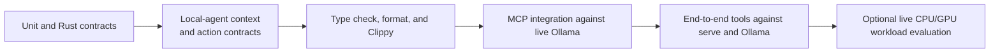

# Test FreeLlama

FreeLlama separates fast deterministic checks from live-system tests. Run the narrowest relevant
tier during development, then run the full matrix before release.



## Install and build

```bash
yarn install
yarn build
```

The root build compiles the host Rust release binary, NAPI addon, and single-file MCP JavaScript
bundle. The native `.node` addon remains external to the JavaScript bundle because it is selected
by platform triple at runtime. Published packages resolve it from an OS/CPU/libc-specific optional
dependency rather than compiling Rust during installation.

## Run the test tiers

| Tier | Command | External requirements |
|---|---|---|
| JavaScript unit | `yarn test` | None |
| JavaScript watch | `yarn test:watch` | None |
| Rust contracts | `yarn test:rust` | Rust toolchain |
| Local-agent contracts | `yarn test:agents` | Python 3 standard library |
| TypeScript | `yarn typecheck` | None after install |
| MCP integration | `yarn test:integration` | Ollama on `127.0.0.1:11434` |
| MCP end to end | `yarn test:e2e` | Ollama, `freellama serve`, and required models |
| All configured tiers | `yarn test:all` | Requirements of every included tier |
| Production verification | `yarn verify:production` | Build, formatting, strict Clippy, all test tiers, and package verification |

The end-to-end suite checks behavior rather than schema shape: confidence refusal happens before
generation, embedding vectors are withheld by default, impossible models are excluded by memory,
and models with unusable research evidence are refused without tool calls. Tests that require a
specific unavailable model report a skip reason.

## Run static Rust checks

```bash
cargo fmt --all --check
cargo clippy --all-targets -- -D warnings
```

Routing regressions run in the default Rust suite; none are hidden behind `#[ignore]`. Add a
focused contract test for each repaired behavior and keep it enabled in ordinary release checks.
The local-agent tier runs all context fitting, compaction, pagination, repeat-suppression, and
strict action-shape contracts. It is included in `yarn test:all`, so adapter regressions cannot be
missed by the root release matrix.

`yarn test:all` does not run formatting, Clippy, a release build, or package inspection. Use
`yarn verify:production` for the complete local promotion gate.

Before claiming platform support, run the deterministic Rust and JavaScript/native lanes from a
clean checkout on macOS, Linux, and Windows. The machine profile contract test requires a positive
CPU count, host-memory value, and free-disk value on each machine; it reports unified memory only
on Apple-silicon macOS. This catches an OS branch that compiles but returns no usable capacity to
recommendations. Record the commands, toolchain versions, commit, and results with the release.

`platform_contract` also pins the resource-control loop: a CPU preference is honored only for an
operator-assigned eligible model, an explicit model overrides that hint and reports the fallback,
two warm samples do not steer `auto`, the third sample on both backends enables a token-normalized
comparison, differences of 10% or less remain noise, and one GPU plus one CPU request overlap even
when both admission pools contain one unit.

## Validate CPU and GPU concurrency

Start the two Ollama processes and FreeLlama as described in
[CPU and GPU model routing](CPU_GPU_ROUTING.md). Verify placement with both backend `/api/ps`
responses, then compare matched sequential and concurrent requests. Record at least three warmed
trials and use the median so one cold load does not decide the result.

The local validated workload used a CPU-assigned `nomic-embed-text:latest` request and a resident
GPU `qwen3.8:27b-mlx` completion. It measured a 1.346-times median speedup with successful responses,
zero FreeLlama queue wait, `size_vram: 0` for the CPU runner, and positive `size_vram` for the GPU
runner.

The placement guard recorded 19,175,677,668 GPU-resident bytes for Qwen, identical GPU output
length across all trials, correct upstream receipts, and primary Ollama 0.33.2 through raw
passthrough. A separate small-helper trial returned the CPU embedding in 60 ms while the cold GPU
completion continued to 7.391 seconds.

After rebuilding the release, a fresh concurrent smoke check completed both managed requests in
8.303 seconds. It returned HTTP 200, zero queue wait, the expected upstream receipts, `OK` from
Qwen, one embedding from Nomic, positive Qwen VRAM, zero Nomic VRAM, and primary Ollama 0.33.2
through raw passthrough.

For promotion, use the portable [hardware acceptance runner](../benchmark/hardware/README.md) and
archive its JSON receipt with the release evidence. Compilation alone does not validate a driver,
physical placement, shared-memory contention, or OCR quality.

## Verify release packages

```bash
# Collect each target's `freellama` executable and `freellama.<target>.node`
# under release-artifacts/<target>/, then stage all eight platform packages.
yarn release:assemble release-artifacts release
yarn release:verify:publish
```

Build every claimed CLI/native target in a clean environment, assemble `SHA256SUMS`, run the full
deterministic suite, and inspect every platform package dry run before publishing explicitly.
Publish the eight `@octocodeai/freellama-native-*` packages before `@octocodeai/freellama` and `@octocodeai/freellama-mcp-server`, all
at the exact same version. A successful local pack dry run proves package contents; it does not
prove registry publication or another hardware class.

## Test one layer while iterating

```bash
yarn build:native
yarn workspace @octocodeai/freellama-mcp-server build
yarn workspace @octocodeai/freellama-mcp-server test
yarn workspace @octocodeai/freellama test
```

The MCP integration and end-to-end setup rebuilds its bundle. The CLI package tests its launcher and
published-file contract; Rust tests own the executable's command and routing behavior.
