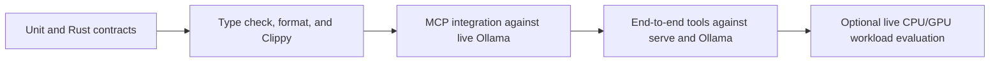

# Test FreeLlama

FreeLlama separates fast deterministic checks from live-system tests. Run the narrowest relevant
tier during development, then run the full matrix before release.



## Install and build

```bash
yarn install
yarn build
```

The root build compiles the Rust release binary, NAPI addon, single-file MCP JavaScript bundle, and
vendored CLI binary. The native `.node` addon remains external to the JavaScript bundle because it
must be loaded by platform triple at runtime.

## Run the test tiers

| Tier | Command | External requirements |
|---|---|---|
| JavaScript unit | `yarn test` | None |
| JavaScript watch | `yarn test:watch` | None |
| Rust contracts | `yarn test:rust` | Rust toolchain |
| TypeScript | `yarn typecheck` | None after install |
| MCP integration | `yarn test:integration` | Ollama on `127.0.0.1:11434` |
| MCP end to end | `yarn test:e2e` | Ollama, `freellama serve`, and required models |
| All configured tiers | `yarn test:all` | Requirements of every included tier |

The end-to-end suite checks behavior rather than schema shape: confidence refusal happens before
generation, embedding vectors are withheld by default, impossible models are excluded by memory,
and models with unusable research evidence are refused without tool calls. Tests that require a
specific unavailable model report a skip reason.

## Run static Rust checks

```bash
cargo fmt --all -- --check
cargo clippy --all-targets -- -D warnings
```

The Rust edge-case suite includes ignored regression pins for previously confirmed routing bugs.
Run ignored tests explicitly when repairing one of those contracts:

```bash
cargo test -- --ignored
```

GitHub Actions runs the Rust and JavaScript/native lanes on macOS, Linux, and Windows. The machine
profile contract test requires a positive CPU count, host-memory value, and free-disk value on each
runner; it reports unified memory only on Apple-silicon macOS. This catches an OS branch that
compiles but returns no usable capacity to recommendations.

`platform_contract` also pins the resource-control loop: a CPU preference is honored only for an
operator-assigned eligible model, an explicit model overrides that hint and reports the fallback,
two warm samples do not steer `auto`, the third sample on both backends enables a token-normalized
comparison, differences of 10% or less remain noise, and one GPU plus one CPU request overlap even
when both admission pools contain one unit.

## Validate CPU and GPU concurrency

Start the two Ollama processes and FreeLlama as described in
[CPU and GPU model routing](CPU_GPU_ROUTING.md). Verify placement with both backend `/api/ps`
responses, then compare matched sequential and concurrent requests. Record at least three warmed
trials and use the median so one cold load does not decide the result.

The local validated workload used a CPU-assigned `nomic-embed-text:latest` request and a resident
GPU `qwen3.8:27b-mlx` completion. It measured a 1.346-times median speedup with successful responses,
zero FreeLlama queue wait, `size_vram: 0` for the CPU runner, and positive `size_vram` for the GPU
runner.

The placement guard recorded 19,175,677,668 GPU-resident bytes for Qwen, identical GPU output
length across all trials, correct upstream receipts, and primary Ollama 0.33.2 through raw
passthrough. A separate small-helper trial returned the CPU embedding in 60 ms while the cold GPU
completion continued to 7.391 seconds.

After rebuilding the release, a fresh concurrent smoke check completed both managed requests in
8.303 seconds. It returned HTTP 200, zero queue wait, the expected upstream receipts, `OK` from
Qwen, one embedding from Nomic, positive Qwen VRAM, zero Nomic VRAM, and primary Ollama 0.33.2
through raw passthrough.

For promotion, use the portable [hardware acceptance runner](../benchmark/hardware/README.md) and
upload its JSON receipt through the manual hardware workflow. Compile-only CI does not validate a
driver, physical placement, shared-memory contention, or OCR quality.

## Verify release packages

```bash
node scripts/verify-release-packages.mjs
```

Tag releases build five CLI/native targets, assemble checksums and universal npm packages, run the
full deterministic suite, and publish only when npm credentials are configured. A successful local
pack dry run proves package contents; it does not prove registry publication or another hardware
class.

## Test one layer while iterating

```bash
yarn build:native
yarn workspace freellama-mcp-server build
yarn workspace freellama-mcp-server test
yarn workspace freellama test
```

The MCP integration and end-to-end setup rebuilds its bundle. The CLI package tests its launcher and
published-file contract; Rust tests own the executable's command and routing behavior.
