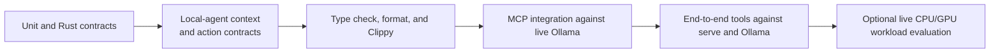

# Test FreeLlama

FreeLlama separates fast deterministic checks from live-system tests. Run the narrowest relevant
tier during development, then run the full matrix before release.

The checks cover the management layer agents use to offload tasks: model eligibility, admission,
context and runtime controls, resource receipts, and adapter behavior. Physical CPU/GPU activity
and throughput require the separate hardware procedures linked in this guide.


```mermaid
flowchart LR
    U["Unit and Rust contracts"] --> A["Local-agent context<br/>and action contracts"]
    A --> T["Type check, format, and Clippy"]
    T --> I["MCP integration against live Ollama"]
    I --> E["End-to-end tools against serve and Ollama"]
    E --> L["Optional live CPU/GPU workload evaluation"]
```

## Install and build

```bash
yarn install
yarn build
```

The root build compiles the host Rust release binary, NAPI addon, and single-file MCP JavaScript
bundle. The native `.node` addon remains external to the JavaScript bundle because it is selected
by platform triple at runtime. Published packages resolve it from an OS/CPU/libc-specific optional
dependency rather than compiling Rust during installation.

## Run the test tiers

| Tier | Command | External requirements |
|---|---|---|
| JavaScript unit | `yarn test` | None |
| JavaScript watch | `yarn test:watch` | None |
| Rust contracts | `yarn test:rust` | Rust toolchain |
| Local-agent contracts | `yarn test:agents` | Python 3 standard library |
| Hardware runner contracts | `python3 -m unittest discover -s benchmark/hardware -p 'test_*.py'` | Python 3 standard library; no inference |
| TypeScript | `yarn typecheck` | None after install |
| MCP integration | `yarn test:integration` | Ollama at `FREELLAMA_OLLAMA_ENDPOINT` (default `127.0.0.1:11434`) |
| MCP end to end | `yarn test:e2e` | Ollama, `freellama serve`, and required models |
| All configured tiers | `yarn test:all` | Requirements of every included tier |
| Production verification | `yarn verify:production` | Build, formatting, strict Clippy, all test tiers, and package verification |

The end-to-end suite checks behavior rather than schema shape: confidence refusal happens before
generation, embedding vectors are withheld by default, impossible models are excluded by memory,
and models with unusable research evidence are refused without tool calls. Tests that require a
specific unavailable model report a skip reason.

Isolated end-to-end services inherit `FREELLAMA_OLLAMA_ENDPOINT`; they use the same selected Ollama
endpoint as the prerequisite check. A controlled endpoint fixture verifies this wiring without
inference.

Live inference tests also inspect routing readiness and report a skip when the host cannot admit
the model. These skips do not qualify inference throughput or physical placement. The pull/delete
lifecycle test is disabled unless the operator explicitly sets `FREELLAMA_TEST_PULL_TAG` to
`qwen2.5:0.5b` and `FREELLAMA_TEST_PULL_SIZE_BYTES` to the exact reported download size. The test
rechecks that size and reads every installed-model page before allowing the round trip.

## Model metadata contracts

Model metadata unit contracts cover README extraction, complete tag pages, family-versus-variant
features, digest matching, cloud aliases, cache expiry and eviction, response bounds, and lookup
failures. MCP integration's `model-knowledge.test.ts` exercises the built server with deterministic
local HTTP fixtures for both Ollama API data and public HTML. It checks optional enrichment,
assigned-backend inventory, tag pagination, validation, and preservation of benchmark/policy evidence.
The fixture tests perform no inference, pulls, or deletions. See the
[metadata reference](MODEL_METADATA.md) for the public states these tests protect.

## Run static Rust checks

```bash
cargo fmt --all --check
cargo clippy --all-targets -- -D warnings
```

Routing regressions run in the default Rust suite; none are hidden behind `#[ignore]`. Add a
focused contract test for each repaired behavior and keep it enabled in ordinary release checks.
Resource contracts cover conservative full host-memory reservations when discrete-GPU telemetry is
missing, and immediate-unload cleanup after a failed inference response body. The latter also checks
that uncertain inference is never replayed and ordinary keep-alive requests retain their runner.
The local-agent tier runs all context fitting, compaction, pagination, repeat-suppression, and
strict action-shape contracts. It is included in `yarn test:all`, so adapter regressions cannot be
missed by the root release matrix.

`yarn test:all` does not run formatting, Clippy, a release build, or package inspection. Use
`yarn verify:production` for the complete local promotion gate.

Before claiming platform support, run the deterministic Rust and JavaScript/native lanes from a
clean checkout on macOS, Linux, and Windows. The machine profile contract test requires a positive
CPU count, host-memory value, and free-disk value on each machine; it reports unified memory only
on Apple-silicon macOS. This catches an OS branch that compiles but returns no usable capacity to
recommendations. Record the commands, toolchain versions, commit, and results with the release.

`platform_contract` also pins the resource-control loop: a CPU preference is honored only for an
operator-assigned eligible model, an explicit model overrides that hint and reports the fallback,
two warm samples do not steer `auto`, the third sample on both backends enables a token-normalized
comparison, differences of 10% or less remain noise, and one GPU plus one CPU request overlap even
when both admission pools contain one unit.

`resource_governor_contract` verifies that tasks held for memory remain counted in the bounded
queue after releasing execution slots, resume when memory recovers, and release their queue entries
and reservations on cancellation. A separate contract requires released reservations to wake
waiters before the next telemetry sample. MCP integration checks forward `maxWaitSeconds` for
single and batch execution and reject it in a decision-only preview.
Admission contracts also cover expired deadlines, queue-limit reductions during resource-to-slot
handoff, and cancellation after that handoff. Governor contracts require CPU pressure to recover
independently while a memory hold still protects cold loads.
MCP integration also requires native refusals to preserve error codes, retry timing, resource
assessments, and unload receipts in both text and structured output.
GET and DELETE refusals retain scope codes and job error details, while successful DELETE accepts an
empty HTTP 204 body. Unknown top-level tool arguments are rejected before any server request;
caller-owned message and function-definition extension fields remain preserved.

`task_jobs_contract` covers deferred acceptance, metadata privacy, memory recovery, cancellation
of waiting and active requests, removal of active and completed jobs without affecting other IDs,
total deadlines during inference, and input-size/batch boundaries.
Registry unit tests cover active-job limits, terminal eviction, expiry, and result-size limits.
Cancellation must retain its receipt even when another operation evicts the completed record.
`scope_warming_contract` covers opt-in history replay, message-field preservation, isolated forks,
failed/stale append refusal, and payload-free managed warming. The warming unit contract
exercises bounded reuse, load, and pressure adjustments. For request fields and failure codes, see
[Scope history and model warming](SCOPES_AND_WARMING.md).
`warming_receipt_contract` separates observed residency from processor verification, retains unknown
residency when inspection fails, rejects incomplete chat responses, and verifies unload after failure.
`resident_placement_contract` distinguishes installed file size from resident runner size across
fresh discovery, cache refresh, observed routing, and scoped execution. Missing total runner memory
with positive VRAM stays unknown and cannot qualify observed GPU routing or adaptive feedback.
The MCP resident-view fixture checks percentages against resident bytes and preserves disk size.

Usage-ledger unit contracts cover ordered writes, bounded queue overflow, failed writes, regular-file
validation, replay, and flush behavior. `monitoring_contract` also checks that a blocked ledger path
does not hold task completion. Persistence remains best effort, not a zero-loss promise.

MCP `serve.test.ts` checks startup permission failure, retry, and child-lifecycle isolation. The
protocol integration contracts verify that spawn failure leaves the MCP connection usable and that
fixture-backed library requests fail on unexpected product errors. External catalog availability
is separate from these deterministic checks. Runtime-view `app-windows.test.ts` checks legitimate
Windows static paths alongside traversal refusal.

Launcher fixtures use `process.execPath` to avoid an extra PATH-resolved shell wrapper. After the
MCP fixture's real executable-permission refusal, a test-only transport launches that exact fixture
script through the same Node executable. Real child processes, HTTP listeners, signals, and exit
tracking still exercise the lifecycle contract. On the October 2, 2026 host, raw process samples
placed the failed fixture launches in the macOS dynamic loader before JavaScript loaded. This
fixture correction preserves test and production deadlines; it does not measure production
startup performance or identify the underlying host loader policy.

Request-validation contracts preserve structured JSON errors for invalid task and batch bodies.
MCP `task-jobs.test.ts` exercises submission, inspection, result retrieval, cancellation, and removal through
the native binding, plus preview rejection and embedding-vector summaries. Separate footprint and
process-attribution tests require independent CPU/GPU settings; `smart_placement_contract` requires
a resident routing preview to agree with execution under a low-memory-only hold.

Run the isolated control timing experiments separately from the full suite:

```bash
cargo test --test control_timing_contract -- --include-ignored --nocapture
cargo test --test task_jobs_contract measure_deferred_control_latency -- --ignored --nocapture
```

These fixed-budget experiments use simulated backends to measure status, discovery, queue
controls, and resource recovery. They emit `CONTROL_TIMING` records with 20 samples, median, and
95th-percentile latency. They verify both backend inventories and released reservations; they
do not measure model tokens per second. Process-refresh contracts require updated observations
after cache expiry and reject old footprint measurements after parallelism changes.

## Validate CPU and GPU concurrency

Start the two Ollama processes and FreeLlama as described in
[CPU and GPU model routing](CPU_GPU_ROUTING.md). Verify placement with both backend `/api/ps`
responses, then compare matched sequential and concurrent requests. Record at least three warmed
trials and use the median so one cold load does not decide the result.

The local validated workload used a CPU-assigned `nomic-embed-text:latest` request and a resident
GPU `qwen3.8:27b-mlx` completion. It measured a 1.346-times median speedup with successful responses,
zero FreeLlama queue wait, `size_vram: 0` for the CPU runner, and positive `size_vram` for the GPU
runner.

The placement guard recorded 19,175,677,668 GPU-resident bytes for Qwen, identical GPU output
length across all trials, correct upstream receipts, and primary Ollama 0.33.2 through raw
passthrough. A separate small-helper trial returned the CPU embedding in 60 ms while the cold GPU
completion continued to 7.391 seconds.

After rebuilding the release, a fresh concurrent smoke check completed both managed requests in
8.303 seconds. It returned HTTP 200, zero queue wait, the expected upstream receipts, `OK` from
Qwen, one embedding from Nomic, positive Qwen VRAM, zero Nomic VRAM, and primary Ollama 0.33.2
through raw passthrough.

For promotion, use the portable [hardware acceptance runner](../benchmark/hardware/README.md) and
archive its JSON receipt with the release evidence. Compilation alone does not validate a driver,
physical placement, shared-memory contention, or OCR quality.

The runner measures separate sequential and parallel runs of identical workloads across at least
three pairs, and checks every result before reporting successful-task throughput. It requires a
configurable median gain (default 5%). Resident GPU bytes establish placement; they do not measure
device busy percentage, bandwidth or energy efficiency. Sustained throughput and tail latency
require a representative workload and separate device/thermal observations.

The historical CPU/GPU observations above predate the corrected paired-run acceptance gate.
They remain records of those runs, and do not qualify a release under the current gate.

For a GPU workload with independent expected answers, use
`benchmark/hardware/run_workload.py --workload MANIFEST.json --output RECEIPT.json`. It accepts
distinct generation or vision cases, runs at least three alternating pairs, retains every
result, and rejects incomplete or incorrect workloads. Its client deadline also bounds a hung
measurement worker. See the [hardware guide](../benchmark/hardware/README.md) for the manifest
contract.

## Verify release packages

```bash
# Collect each target's `freellama` executable and `freellama.<target>.node`
# under release-artifacts/<target>/, then stage all eight platform packages.
yarn release:assemble release-artifacts release
yarn release:verify:publish
```

Build every claimed CLI/native target in a clean environment, assemble `SHA256SUMS`, run the full
deterministic suite, and inspect every platform package dry run before publishing explicitly.
Publish the eight `@octocodeai/freellama-native-*` packages before `@octocodeai/freellama` and `@octocodeai/freellama-mcp-server`, all
at the exact same version. A successful local pack dry run proves package contents; it does not
prove registry publication or another hardware class.

## Test one layer while iterating

The October 2, 2026 fixture investigation retained failed launches, raw dynamic-loader samples,
and passing reruns. After the executable-fixture correction described above, the normal
`yarn test` command passed 152 tests in 1.83 seconds of suite time. Test and production deadlines
remain unchanged. Preserve failed and passing receipts together; this result does not qualify
production startup timing.

```bash
yarn build:native
yarn workspace @octocodeai/freellama-mcp-server build
yarn workspace @octocodeai/freellama-mcp-server test
yarn workspace @octocodeai/freellama test
```

The MCP integration and end-to-end setup rebuilds its bundle. The CLI package tests its launcher and
published-file contract; Rust tests own the executable's command and routing behavior.
