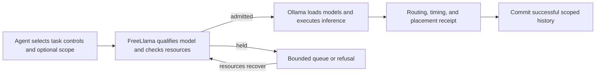

# FreeLlama findings and open-source comparison

Reviewed on October 3, 2026, for developers and local-AI operators evaluating the `0.2.1` candidate.

The diagram describes managed tasks. Raw Ollama API requests retain the primary-backend compatibility path.

**Feature and logic assessment: 8.5/10 for local Ollama agent workflows.**
The [feature assessment](#feature-and-logic-assessment) excludes speed, utilization, thermal measurements, packaging, and release readiness.
The earlier evidence-based control-plane assessment remains 8/10 under its broader rubric.
Real inference throughput, hardware efficiency, and sustained thermal behavior remain unqualified for this candidate on the latest Mac.
This review combines repository contracts, retained local receipts, an independent SOL examination, and primary project documentation.
It does not establish a speed ranking among projects.

## What the findings establish

| Finding | Established behavior | Evidence boundary |
|---|---|---|
| Model discovery and qualification | FreeLlama checks installed models, capabilities, policy, and requested controls. | Model names alone do not establish fit, placement, or task quality. |
| Preview and execution | A preview returns a decision without submitting inference or reserving capacity. Execution checks admission again. | A preview does not reserve later admission. |
| Resource control | Managed tasks use weighted admission, bounded queues, deadlines, cancellation, and host resource holds. | This controls submitted work; it does not schedule hardware kernels or prove optimal utilization. |
| Per-task controls | Callers select model, task profile, runtime controls, priority, and placement requirements through supported contracts. | Ollama and its runners retain final execution authority. |
| CPU/GPU routing | Explicit assignments can direct eligible tasks to separate Ollama backends. Returned receipts distinguish configuration from observed residency. | Overlap remains unqualified for this candidate on the latest Mac; an older M4 measurement is summarized below. |
| Placement feedback | Runtime feedback uses bounded samples and comparable work units before changing a placement preference. | These checks do not establish optimal placement for every task or machine. |
| Independent work | Batches dispatch caller-declared independent tasks with bounded fairness. | FreeLlama does not infer task dependencies from prompts. |
| Scoped history | Scope IDs retain managed chat history, support forks, and reject stale revisions. Successful scoped execution commits history within storage limits. | Scope storage is process-local and does not own an engine KV cache. |
| Model affinity and warming | Sessions retain model affinity. Managed warming checks resources and requests residency from Ollama. | Cached context, future admission, and placement require separate checks. |
| Research delegation | Bounded adapters provide read-only code lookup, pagination, context fitting, repair, and repeat suppression. | The caller retains decomposition, judgment, mutation authority, and verification. An escalation result must be discarded. |
| Compatibility | Native Ollama APIs pass through to the primary upstream. | Managed routing contracts apply to managed calls. |

The architecture is coherent for agents that must decide whether local delegation is admissible.
Its value lies in explicit decisions, bounded execution, and inspectable evidence.
The reviewed receipts do not establish faster decoding or a universal model-quality improvement.

See [Architecture](../ARCHITECTURE.md), [CPU/GPU routing](../CPU_GPU_ROUTING.md),
[Scopes and warming](../SCOPES_AND_WARMING.md), and [MCP contracts](../../packages/mcp/README.md).

## Warm models and separate task context

Warm models and scoped history solve separate problems.
Ollama supports preloading and `keep_alive` to retain a loaded model. [Ollama FAQ](https://docs.ollama.com/faq)
FreeLlama adds managed resource checks and receipts around those operations.

A scope retains application-level history for one task or related tasks.
A session records model affinity.
Neither handle reserves an Ollama runner or owns its KV cache.
Scope forks preserve independent histories, while revision checks prevent stale writes.
Model switching can reuse retained history without guaranteeing engine cache reuse.

These features can reduce repeated caller setup and cold loading for related work.
Their net benefit remains workload-dependent: retained history consumes context, and warm models consume memory.
Measure cold loading separately from warm execution before claiming a throughput improvement.
Use [Scopes and warming](../SCOPES_AND_WARMING.md) for the operation contract.

## Repairs and audit findings

| Area | Completed repair or examination | Remaining limit |
|---|---|---|
| Research confinement | Confirmed writing and outside-workspace escapes were repaired. Valid quoted `jq`, bounded `sed`, and output-only `xargs` fixtures passed independently. | The checks are not a general proof for every internal behavior of each allowed program. |
| Agent context | Full observations remain available for pagination. Context fitting preserves pinned content, compacts older observations, and suppresses repeated execution. | Task accuracy must still be measured with representative questions and installed models. |
| MCP instructions | Contracts clarify preview payloads, error handling, opaque cursors, scope revisions, lifecycle approval, and research escalation. | The discovery-size gate measures a character-based estimate, not billed tokens or model reliability. |
| Health helper | Checks distinguish intentional ephemeral feedback, resource holds, and authenticated remote transport from contract errors. | Model metadata age does not establish last use. |
| Dependencies | Compatible updates resolved six reported advisories across three transitive dependencies during the audit. | Audit results describe the checked dependency set and available advisory database at that time. |
| Package contents | Gates check runtime files, adapters, both license texts, versions, and native artifacts across ten public npm packages. | Automatic optional-native selection from the published registry remains unqualified for this unpublished candidate. |
| Artifact assembly | Assembly validates all eight artifact pairs before replacing outputs and rejects unsafe output paths. | Compilation and binary headers do not prove foreign runtime execution. |
| Native artifacts | Two stale musl addons were rejected and replaced. All sixteen candidate artifacts received build, timestamp, architecture, and hash checks. | Foreign runtime and driver checks remain pending. |
| Registry gate | All ten exact `0.2.1` versions were absent during the read-only registry check. | The check neither reserves versions nor establishes account publication permissions. |
| Release workflow | CI precedes artifact builds; target checks load native addons, including an Alpine musl check. | Changed workflows were not executed remotely for this working-tree candidate. |
| Examples | The installer passed controlled checksum fixtures. The RAG example passed indexing and query plumbing with synthetic vectors. | Remote installation and real retrieval quality remain separate checks. |

Dependency resolutions changed to `fast-uri` 3.1.8, `hono` 4.13.12, and `ip-address` 10.7.3.
The final production and fresh-consumer audits reported zero advisories at that time.

The captured MCP surface contained eleven tools and 17,981 characters of instructions and tool definitions.
The existing gate estimated 4,495 tokens, compared with a baseline of 4,498.
This small reduction does not establish a meaningful inference or reliability improvement.

One full validation attempt recorded a ten-second launcher timeout.
Direct binary and launcher reruns completed in 31–61 ms, and the unchanged full validation passed afterward.
The timeout cause remains unclassified; repeated startup measurements are still needed.

An extra MCP confidence preflight remains a possible optimization.
It also protects older servers, so removal requires a compatibility decision and measured latency evidence.
Execution revalidation, resource sampling, and permit-release handoffs remain necessary boundaries.

See [Testing](../TESTING.md), [Production](../PRODUCTION.md), and [Release procedure](../../RELEASE.md) for their owning contracts.

## Historical candidate verification

These results describe the retained prepublication audit snapshot, not a fresh validation of every subsequent repository edit.
Later logo and documentation changes occurred after the captured build and packed-consumer checks.
The new performance guide was absent from the examined package.
Run the current release gates again before publishing the changed candidate.

| Check | Captured result |
|---|---|
| Rust formatting, strict Clippy, release build, and native build | Passed |
| Rust tests | 386 passed |
| JavaScript unit tests | 152 passed |
| Python adapter and health-helper tests | 58 passed |
| Context and pagination assertions | 94 passed |
| Hardware harness contracts | 77 passed |
| Package and registry contracts | 40 passed |
| MCP integration | 111 passed; two real-inference cases skipped |
| End-to-end tests | Seven passed; four lifecycle or inference cases skipped |
| Separate control-timing and telemetry checks | Four passed |
| Packed consumer | Nineteen operation checks; thirty-six exact source-to-installed file matches |

Test counts establish exercised contracts, not physical performance or universal feature correctness.
Controlled upstream timings do not qualify real inference throughput.
The packed consumer installed the matching host native package explicitly because the candidate was unpublished.

An independent SOL examiner used the actual SDK with the packed MCP server.
It checked eleven tools, fifteen documentation resources, diagnosis, status, and empty job inventory.
All fourteen captured operator guides matched their source bytes at examination time.
The owned child process exited after the exam.

| Operation | One measured duration |
|---|---:|
| SDK initialization | 104.79 ms |
| Tool discovery | 10.55 ms |
| Resource discovery | 1.04 ms |
| Individual resource reads | 0.42–1.31 ms |
| Diagnosis summary | 292.82 ms |
| Status | 39.20 ms |
| Job inventory | 1.23 ms |
| Complete examination | 467.70 ms |

These durations describe one control-plane examination. They do not establish sustained latency or model throughput.

## Earlier measured workloads

Earlier guides retain physical results from other snapshots and workloads.
They establish feasibility within their measured limits, not a fresh performance qualification for this candidate or Mac.

| Earlier measurement | Reported result | Boundary |
|---|---|---|
| Warmed CPU/GPU overlap on a 48 GB Apple M4 Pro | Three sequential trials: 34.586, 38.988, and 37.997 seconds. Three parallel trials: 27.499, 28.233, and 38.167 seconds. | Median speedup was 1.346 times; one parallel trial was slower. This is overlap feasibility, not sustained utilization. |
| Placement mismatch guard | An explicitly CPU-assigned Qwen runner still reported GPU residency. FreeLlama rejected feedback and a later request requiring observed placement. | Configured intent differs from physical evidence. |
| Grounded delegation context | Six questions used 59,208 source tokens and returned 1,742 tokens: 97.1% context offload. | One workload; returned-token reduction is not runtime or billed-cost savings. |
| Raw Ollama prefix reuse | A 2,462-token prefix took 18,631 ms cold, 281 ms warm, and 285 ms after another conversation interjected. | Engine cache reuse was observed on that path; scope IDs do not own or reserve it. |
| Structured versus Bash research | The documented thirty-question Qwen suite had equal pass rates, with about 2.8 times more time and 4.7 times more input tokens for Octocode. | A structured tool did not improve efficiency on that measured suite. |
| Code retrieval and judgment | Historical fixtures reported imperfect semantic-search recall and about 67% code-review accuracy. | Similarity and generated review findings require verification; they cannot authorize deletion or approve changes. |

See [the measured CPU/GPU result](../CPU_GPU_ROUTING.md#interpret-the-measured-mac-result),
[token economics](../ECONOMICS.md), [adapter caveats](../../benchmark/local/docs/07-adapter-contracts.md), and
[historical delegation evidence](../../skills/freellama/assets/evidence/task-delegation.md).
This review did not rerun those workloads or independently regrade their quality results.

## Latest check on this Mac

The quick check started isolated, owned Ollama and FreeLlama services and inspected the approved installed embedding model.
Three route previews held under host memory pressure.
The check submitted zero inference requests and downloaded zero models.
Both owned services stopped after the examination.

| Observation | Measured result | Interpretation |
|---|---|---|
| Host | Apple M2 Pro, 32 GiB RAM, twelve logical CPUs | One machine, not cross-platform qualification |
| Available-memory estimate | About 5.050 GB during host sampling; 3.691 GB at the final preview | Admission remained held under the configured policy |
| Recovery reserve | 6.872 GB | A recovery threshold, not this model's measured allocation |
| Latest hold reason | `low_available_memory` | Normal OS memory-pressure status did not override FreeLlama's reserve |
| Swap counters | Zero swap-outs and eight swap-in pages in the final sampled interval | This interval does not establish an absence of swapping overall |
| GPU activity | Host samples of 28%, 33%, and 28% over about 2.4 seconds | Driver-defined activity across all processes; no FreeLlama attribution |
| Thermal, power, and energy | Unknown; `powermetrics` required administrator access | No temperature or thermal-efficiency result |
| Embedding model | `nomic-embed-text:v1.5`, installed size 274,302,450 bytes | Installation was verified; execution and physical placement were not qualified |
| Inference trials | Zero | No throughput, quality, or CPU/GPU overlap result |

Values marked GB use decimal gigabytes; the installed 32 GiB uses binary units.
Earlier audit observations also held admission under low memory and active swapping.
The latest check establishes resource refusal and cleanup, not an inference failure or a defective model.

Local receipts remain under ignored `.octocode/tmp/` paths:
`prepublish/final-audit.md`, `prepublish/final-test-counts.json`,
`prepublish/independent-packed-readonly.json`, `quick-local/receipt.json`, and `quick-local-host.json`.
They are local audit artifacts, not required installation files.
Use [Local performance testing](LOCAL_PERFORMANCE_TESTING.md) for the repeatable measurement procedure.

## Comparison with open-source projects

Primary documentation was inspected on October 3, 2026.
This table compares documented roles and mechanisms; none of these projects received a common-hardware benchmark in this review.
Related projects can combine engine optimization, routing, and orchestration within their ecosystems.
The categories describe emphasis, not exclusive feature ownership.

| Project | Documented role and mechanisms | FreeLlama's position |
|---|---|---|
| [Ollama](https://docs.ollama.com/faq) | Local model runtime with residency controls, parallel requests, memory-dependent loading, and request queueing. | FreeLlama adds agent qualification, host admission, task scopes, and receipts around managed Ollama calls. |
| [llama.cpp server](https://github.com/ggml-org/llama.cpp/blob/master/tools/server/README.md) | Inference server with parallel slots, continuous batching, GPU offload, and slot prompt-cache save/restore. | FreeLlama scopes store application history with revisions and forks; engine prompt-cache snapshots store a different kind of state. Direct llama.cpp integration requires separate engineering and qualification. |
| [vLLM](https://github.com/vllm-project/vllm) | Inference serving with PagedAttention, continuous batching, prefix caching, and distributed parallelism. | FreeLlama `0.2.1` targets Ollama; it does not implement these engine mechanisms or qualify a direct vLLM backend. |
| [SGLang](https://github.com/sgl-project/sglang) | Inference serving for language and multimodal models. Its ecosystem includes hierarchical KV caching and deployment gateways. | FreeLlama focuses on bounded local delegation over Ollama. SGLang illustrates engine and deployment capabilities beyond that current integration. |
| [LiteLLM Router](https://docs.litellm.ai/docs/routing) | Deployment routing supports weighted selection, least-busy, latency and cost strategies, session affinity, retries, fallbacks, and usage limits. | Both projects have routing and affinity concepts. FreeLlama focuses on installed Ollama eligibility, host admission, scoped history, and observed placement. |
| [RouteLLM](https://github.com/lm-sys/RouteLLM) | Trained prompt routers select stronger or weaker models using calibrated quality-cost thresholds. | FreeLlama uses explicit policy and available evidence for local eligibility. Adding learned prompt routing requires a separate quality dataset and evaluation. |

**Positioning judgment:** FreeLlama is a specialized control plane for developer agents operating local Ollama workloads.
It is complementary to Ollama and narrower than general provider gateways or inference frameworks.
Its most defensible contribution is an explicit delegation contract that combines admission, task history, and verifiable receipts.
Competitive advantage in useful throughput remains a hypothesis requiring matched real workloads.

Ollama already owns warming and runtime scheduling.
FreeLlama must demonstrate additional workload value rather than claim these mechanisms as unique inventions.
Engine-level batching, cache reuse, and device execution should remain engine responsibilities unless a measured integration justifies a change.
See [Product positioning](../PRODUCT_POSITIONING.md) for the audience and product boundaries.

## Feature and logic assessment

This assessment answers the feature-only comparison requested after the broader audit.
It uses reviewed contracts and documented mechanisms, excluding performance, hardware measurements, packaging, and publication readiness.
Scores are subjective design judgments for developer agents using local Ollama workloads.
They do not rank the other projects by a purpose they were not designed to serve.

| Dimension | Score | Reason and limit |
|---|---:|---|
| Agent workflow and authority | 9/10 | Preview, qualification, explicit controls, bounded delegation, and error handling form a clear contract. The caller still owns task dependencies and judgment. |
| Admission and execution logic | 8.5/10 | Weighted fairness, resource holds, deadlines, cancellation, and execution revalidation compose coherently. Operator policy and memory estimates remain part of admission. |
| Task context and residency | 8.5/10 | Revisions, forks, finite history, affinity, and warming have separate ownership. Scopes and deferred jobs do not survive a service restart. |
| Adaptive decisions | 7.5/10 | Comparable observed feedback can influence eligible backend choices without overriding explicit controls. It is not a learned prompt-quality router or general hardware scheduler. |
| Explanation and evidence | 9/10 | Receipts distinguish eligibility, configured placement, observed placement, and feedback acceptance. Engine cache state remains outside scope ownership. |

Each dimension carries equal weight: the average is **8.5/10**.
A score of 10 requires complete, coherent behavior within this stated purpose, including lifecycle and recovery semantics.
Additional features count only when they improve that purpose; engine responsibilities need not move into FreeLlama.

### Decision logic compared directly

| Decision | FreeLlama's mechanism | Related project mechanism |
|---|---|---|
| Which model or deployment? | Qualify installed candidates against task, capability, context, policy, and evidence requirements. | [RouteLLM](https://github.com/lm-sys/RouteLLM) uses trained prompt routers and calibrated strong/weak thresholds. [LiteLLM](https://docs.litellm.ai/docs/routing) offers multiple deployment-selection strategies. |
| Can work start? | Check weighted capacity and host resources; queue, refuse, or execute within bounded deadlines. | [Ollama](https://docs.ollama.com/faq) manages runtime loading and queues requests when models cannot load. Its runtime checks complement FreeLlama's admission checks. |
| What context survives a switch? | Replay bounded application history through scope IDs; fork histories and reject stale writes. | [llama.cpp](https://github.com/ggml-org/llama.cpp/blob/master/tools/server/README.md) can save and restore slot prompt caches. Application history and engine cache snapshots are different contracts. |
| How are active requests scheduled inside a model? | Submit admitted requests through Ollama and leave engine scheduling to the runner. | [vLLM](https://github.com/vllm-project/vllm) implements continuous batching, PagedAttention, and prefix caching. [SGLang's ecosystem](https://github.com/sgl-project/sglang) includes hierarchical KV caching and deployment gateways. |
| When can adaptation override a preference? | Only comparable eligible feedback can influence automatic choices; explicit model, affinity, and policy retain authority. | [LiteLLM](https://docs.litellm.ai/docs/routing) supports latency, cost, load, and custom routing strategies. [RouteLLM](https://github.com/lm-sys/RouteLLM) calibrates query-level quality-cost tradeoffs. |

**Judgment:** FreeLlama offers a strong combination of local agent controls, context ownership, and evidence semantics.
Its current specialization is narrower than provider gateways and separate from inference-engine optimization.
The comparison establishes feature differences; it does not establish exclusive capabilities or global superiority.

Three feature gaps limit the score:

1. **Restart recovery:** scopes and deferred jobs are process-local. Optional durable storage needs explicit privacy, expiry, and recovery contracts.
2. **Task-quality adaptation:** backend timing feedback does not learn prompt-specific answer quality across models.
3. **Backend breadth:** direct llama.cpp, vLLM, and SGLang integrations need adapters that preserve controls, cancellation, and evidence semantics.

These are potential extensions, not confirmed correctness defects or authorization to implement them.
The strongest priority depends on whether users need long-lived tasks, quality-based selection, or additional inference backends.

## Historical assessment and remaining qualification work

The independent SOL judge retained the overall **8/10** rating after inspecting the latest receipts.
This is a judgment of the bounded control plane, not a weighted average or a hardware-performance score.

| Dimension | Rating | Basis |
|---|---:|---|
| Architecture | 8/10 | Clear ownership and execution boundaries; optimization decisions still need workload evidence |
| Agent contracts | 8.5/10 | Explicit shapes, authority, error handling, and evidence semantics; measured agent reliability remains incomplete |
| Documentation | 8/10 | Operational guides and examples; this review corrects a stale MCP tool count |
| Package engineering | 8.5/10 | Historical artifact, integrity, and consumer checks; current release and foreign execution checks remain pending |
| Real throughput evidence completeness | 3/10 | Harnesses and controlled checks exist; no admissible matched real-inference trial in the latest qualification |
| Hardware-utilization evidence completeness | 3/10 | Host telemetry exists; no attributed sustained inference, verified device overlap, or thermal qualification for this candidate on the latest Mac |

Evidence-completeness scores describe measurement coverage, not slow execution or poor utilization.
The earlier 7/10 and 6/10 evidence ratings overstated qualification relative to the retained physical receipts.
For this rubric, 3 means instrumentation and contracts exist; 5 requires a real pilot; 7 requires repeated matched trials.
A score of 9 requires sustained, attributable results across representative workloads and documented operating limits.
A score of 10 also requires reproducibility beyond this single host.

The following evidence is needed before increasing the ratings:

1. Run matched direct-Ollama and managed trials under an admissible host with identical models, inputs, context, concurrency, and residency.
2. Measure correct requests per minute, aggregate tokens per second, failures, queue waits, and p50/p95 latency against declared limits.
3. Separate cold loading from warm execution, then increase concurrency to locate useful saturation rather than maximum busy time.
4. Verify CPU/GPU overlap with observed placement and actual runner telemetry. Attribute activity wherever the platform permits.
5. Capture sustained early and late throughput, clocks, thermal pressure, and available power telemetry. Record missing temperature readings explicitly.
6. Repeat startup measurements and investigate the unclassified ten-second timeout.
7. Rerun current release gates and fresh packed-consumer checks after all edits. Execute foreign native and installer checks on target runtimes.
8. Evaluate research accuracy and context retention on held-out tasks. Use identical workloads before making competitor performance claims.

Use [Local performance testing](LOCAL_PERFORMANCE_TESTING.md) and the
[hardware benchmark contracts](../../benchmark/hardware/README.md) for measurement.
Use the [local adapter benchmark](../../benchmark/local/README.md) for research quality.
The [release procedure](../../RELEASE.md) owns publication readiness.
