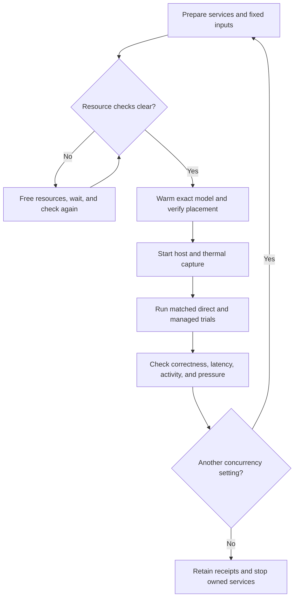

# Test throughput, CPU/GPU activity, and thermal behavior on macOS

Use this procedure to measure the resource-management cost and benefit of offloading tasks
through FreeLlama on your Mac. It compares direct and managed Ollama execution for useful output,
request latency, device activity, and thermal behavior under a declared workload.
Run every command from the repository root.



Each result applies to the measured model, workload, configuration, and machine.

## 1. Prepare the machine and inputs

Connect mains power and keep the cooling environment consistent.
Close unused applications and heavy builds.
Record the macOS version, hardware, Ollama version, model digest, context, output limit, and concurrency.
Use independently checked expected answers and representative input lengths.
Choose latency and overhead limits before running the test.

Do not disable resource admission to obtain a passing result.
An active swapping or memory-pressure hold means the machine needs preparation before inference.
Existing swap occupancy alone does not prove current swapping; inspect counter changes.

Create a directory for this experiment:

```bash
mkdir -p .octocode/hardware/local-test
```

The earlier local audit prepared eight OCR cases under `.octocode/tmp/throughput-qualification/heldout-eight/`.
If that directory exists, copy its inputs:

```bash
cp .octocode/tmp/throughput-qualification/heldout-eight/workload.json \
   .octocode/tmp/throughput-qualification/heldout-eight/comparison.json \
   .octocode/tmp/throughput-qualification/heldout-eight/*.png \
   .octocode/hardware/local-test/
```

Those ignored fixtures are absent from a clean checkout and published packages.
If they are absent, create a workload using the [hardware manifest example](../../benchmark/hardware/README.md#measure-a-useful-gpu-workload).
Supply at least two distinct cases with independently checked expected answers.
Image paths resolve relative to the workload file.
For text generation, omit images and select a supported text task.
Do not change expected answers to make a model pass.

Inspect `workload.json` before using the example commands below.
They assume the prepared OCR model `glm-ocr:latest`, concurrency `2`, and context `4096`.
Confirm the exact tag is installed; its name does not prove installation or memory fit.
This procedure never authorizes a model download.

Create `comparison.json` beside the workload if it is missing:

```json
{
  "schema_version": 1,
  "workload": "workload.json",
  "repeats_per_phase": 20,
  "minimum_measured_seconds": 120,
  "maximum_overhead_ratio": 1.15,
  "latency_slo_ms": 500
}
```

These are example limits, not universal performance targets.
Select limits appropriate to your workload before inference.
The runner performs at least three alternating direct/managed pairs.
Its repeated cases increase timing samples, not the number of independent quality cases.

## 2. Start isolated services

Use unused loopback ports and dedicated terminals.
Do not reuse a running production service for this experiment.
If necessary, build the local CLI with `yarn build:rust`.

In terminal A, start Ollama:

```bash
OLLAMA_HOST=127.0.0.1:11439 \
OLLAMA_NO_CLOUD=1 \
OLLAMA_NUM_PARALLEL=2 \
OLLAMA_MAX_LOADED_MODELS=1 \
OLLAMA_CONTEXT_LENGTH=4096 \
ollama serve
```

Set `OLLAMA_NUM_PARALLEL` to the workload's concurrency before starting Ollama.
The comparison requires an observed process setting, not an inferred default.

Create `.octocode/hardware/local-test/runtime.toml`:

```toml
context_mode = "explicit"
adaptive_concurrency = "off"
```

In terminal B, start the gateway:

```bash
./target/release/freellama serve \
  --listen 127.0.0.1:11438 \
  --upstream http://127.0.0.1:11439 \
  --max-concurrent-tasks 8 \
  --runtime-config .octocode/hardware/local-test/runtime.toml \
  --ephemeral-feedback \
  --ephemeral-usage
```

This sample freezes adaptive concurrency for a controlled comparison.
The eight-unit budget permits two default four-unit vision tasks, subject to resource checks.
It is an experiment setting, not a recommended production default.
Record it, and test deployment defaults separately.
For another task or concurrency, choose a matching weighted budget using the [routing guide](../CPU_GPU_ROUTING.md).

If you enable gateway authentication, supply `--auth-token-file` to the gateway and each benchmark runner.
Keep tokens out of manifests and telemetry logs.

## 3. Check admission and warm the model

Inspect current gateway health and status:

```bash
curl --fail --silent --show-error http://127.0.0.1:11438/_freellama/v1/health
curl --fail --silent --show-error http://127.0.0.1:11438/_freellama/v1/status
OLLAMA_HOST=127.0.0.1:11439 ollama list
```

Require an idle backend, fresh host observations, and normal memory pressure.
Wait until resource holds clear before warming.
The comparison runner independently validates its supported resource conditions.
Treat a refusal as a diagnostic result, not throughput evidence.

Warm the exact installed profile:

```bash
./target/release/freellama warm \
  --endpoint http://127.0.0.1:11438 \
  --model glm-ocr:latest \
  --task vision \
  --context-tokens 4096 \
  --execution-preference prefer-gpu \
  --min-placement-evidence configured \
  --keep-alive 300s \
  --timeout-seconds 60
OLLAMA_HOST=127.0.0.1:11439 ollama ps
```

Review the warm receipt's placement observation.
The initial configured requirement permits a cold load; the comparison requires verified GPU residency afterward.
Require the installed/resident digest and context to match the workload.
Start the benchmark before the warm keepalive expires.

The `100% GPU` label in `ollama ps` describes model placement.
It does not mean the GPU is busy for every instant. See the [Ollama FAQ](https://docs.ollama.com/faq).

## 4. Capture telemetry while running inference

In terminal C, start a ten-minute macOS capture:

```bash
sudo /usr/bin/powermetrics \
  --samplers tasks,cpu_power,gpu_power,thermal \
  --show-process-gpu \
  -i 1000 -n 600 \
  --output-file .octocode/hardware/local-test/power-thermal.txt
```

Run this command yourself with administrator access.
On the inspected Mac, the unprivileged tool reports that it requires the superuser.
It captures available process activity, CPU/GPU clocks, estimated subsystem power, and thermal pressure.
The selected samplers may omit temperature readings in degrees Celsius.
If a sampler is unavailable, retain the error and report that measurement as unknown.

Run the [host sampler](../../benchmark/hardware/sample_host.py) in another terminal for memory and process observations.
Find the exact PIDs and executable paths for the owned gateway, Ollama server, and inference runners.
Repeat `--process PID=/absolute/executable` for those processes.
For example, replace both placeholders before execution:

```bash
python3 benchmark/hardware/sample_host.py \
  --process PID=/absolute/executable \
  --duration-seconds 180 \
  --interval-seconds 1 \
  --output .octocode/hardware/local-test/host-observations.json
```

The host sampler supports at most 180 seconds per invocation.
Use successive captures for a longer experiment, with separate output files.
Process CPU and RSS exclude children; include the actual runner processes.
In its interval CPU scale, 100% means one logical CPU.
RSS does not equal physical memory footprint.
GPU driver activity covers all processes; close unrelated GPU workloads and retain the idle baseline.
Subsystem power estimates do not establish per-task energy.

In terminal D, run the comparison:

```bash
python3 benchmark/hardware/run_comparison.py \
  --endpoint http://127.0.0.1:11438 \
  --ollama-endpoint http://127.0.0.1:11439 \
  --comparison .octocode/hardware/local-test/comparison.json \
  --output .octocode/hardware/local-test/comparison-receipt.json
```

Both paths use the same engine, logical payloads, context, and output controls.
The runner warms each path and shares the resident runner and prefix cache.
It does not establish independent cache states or measure time to first token.
Keep model, runtime settings, and goldens unchanged within a run.

## 5. Read the results and check sustained behavior

Inspect `verdict`, `failures`, `completion`, and `performance` in the JSON receipt.
Accept a run only when every planned request completes correctly and the declared gates pass.
Keep rejected and incomplete receipts.

| Measurement | What to examine |
|---|---|
| Useful throughput | Correctness-qualified requests/minute and qualified output tokens/second |
| Responsiveness | Request wall latency p50/p95, sample counts, and latency-objective pass rate |
| Gateway overhead | Median paired managed/direct wall ratio; above one means extra duration |
| Waiting | Managed queue and total admission wait; direct queue breakdown remains unknown |
| Model execution | Load, prefill, and decode durations, with reported token counts |
| CPU/GPU activity | Process CPU, available GPU activity, and clocks during matched workload windows |
| Memory | Pressure, compressor occupancy, reservation levels, and swap-counter changes |
| Thermal behavior | Thermal pressure and clocks alongside early/late performance |

Small-sample p95 values are descriptive; retain their sample counts.
High CPU/GPU activity alone does not establish efficient execution.
Prefer higher correct throughput at the required latency, with acceptable resource and thermal behavior.

The copied example has a five-minute whole-run budget.
A ten-minute telemetry capture does not extend that workload.
For a sustained thermal experiment, freeze a separate plan before execution.
Choose enough cases/repeats for continuous measured work and an adequate `run_budget_seconds` in `workload.json`.
Set `minimum_measured_seconds` to the required measured duration, such as `600`.
The comparison rejects an unmet duration target; it does not automatically loop until that target.
Keep the plan within the runner's 10,000-request and 3,600-second whole-run limits.
Ensure telemetry overlaps the entire measured interval.

Compare early and late request windows at the same concurrency.
Interpret clock changes alongside thermal pressure and workload phase; clock variation alone does not prove thermal throttling.
If the host reports no thermal state, leave thermal status unknown.

Measure cold loading in a separate experiment before warming.
Retain load duration and total wall time without mixing them into the warm baseline.
To test another concurrency, create a separate plan and restart the owned Ollama with the matching parallelism.
Keep other settings comparable and record every change.
Higher parallelism can require more context-cache memory. See [Ollama concurrency settings](https://docs.ollama.com/faq).

## 6. Test simultaneous CPU and GPU work separately

Configure a dedicated CPU upstream and exact CPU model assignment using the [CPU/GPU setup guide](../CPU_GPU_ROUTING.md).
Ensure both installed models can coexist under the resource policy.
Replace `EXACT_INSTALLED_GPU_TAG` with your qualified generation tag:

```bash
python3 benchmark/hardware/run_validation.py \
  --endpoint http://127.0.0.1:11438 \
  --gpu-model EXACT_INSTALLED_GPU_TAG \
  --cpu-model nomic-embed-text:v1.5 \
  --trials 3 \
  --minimum-speedup 1.05 \
  --output .octocode/hardware/local-test/cpu-gpu-receipt.json
```

Confirm `nomic-embed-text:v1.5` is installed and assigned to the CPU upstream first.
This runner warms both tasks and compares matched sequential/parallel pairs.
It requires observed CPU/GPU placement and correct responses.
The default 1.05 speedup gate is configurable; declare the chosen target before execution.
This short overlap check does not qualify sustained saturation or general model quality.

Use [fixed-arrival load tests](../../benchmark/hardware/README.md#check-fixed-arrival-load-and-queue-ownership) for burst and queue behavior.
Use real resident mode for physical measurements.
Synthetic controlled mode supplies no inference throughput or physical placement proof.

## 7. Retain evidence and clean up

Keep input hashes, model/runtime identities, manifests, JSON receipts, telemetry, and failure logs together.
Record the workload interval so reviewers can align it with telemetry timestamps.
After pending jobs finish or cancel, stop only the services started for this experiment.
Use Ctrl-C in their dedicated terminals.
Verify no owned tasks or waiters remain before stopping the gateway.
An inference keepalive expiry or service stop does not delete installed models.

See the [hardware harness reference](../../benchmark/hardware/README.md) for schemas, bounds, and qualification details.
See [production checks](../PRODUCTION.md) for promotion requirements beyond this local experiment.
