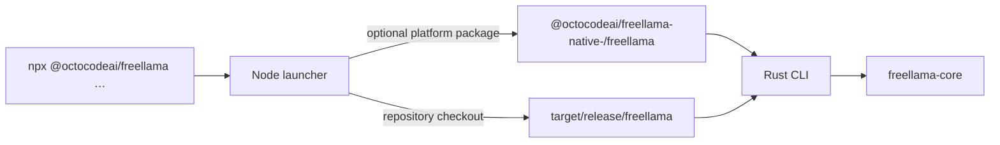

# `freellama` CLI package

This package is prepared to publish the `freellama` command through npm. Version 0.1.0 is not
published to a registry. In a checkout after `yarn install`, `npx` resolves the workspace package;
otherwise, use the release binary built at `target/release/freellama`. The JavaScript launcher
locates the compiled Rust binary and hands the current process to it. Routing and execution logic
remain in [`freellama-core`](../rust-core/README.md).



## Run it

```bash
npx @octocodeai/freellama doctor
npx @octocodeai/freellama auth-token --out ~/.local/share/freellama/auth.token
npx @octocodeai/freellama serve \
  --recommendation-catalog recommendations.example.toml \
  --auth-token-file ~/.local/share/freellama/auth.token \
  --feedback-file ~/.local/share/freellama/feedback.json
```

`doctor` works without the control plane. It reports Ollama reachability, CLI/server version drift,
portable host hardware and disk discovery, effective settings, a non-mutating
`local_conservative_config_posture`, and source/permission-aware runtime signals. `memory_bytes`
is total host RAM; `unified_memory_bytes` is present only when the memory is known to be shared with
the accelerator. In another terminal, inspect or execute:

```bash
npx @octocodeai/freellama models
npx @octocodeai/freellama route --task coding --objective fastest
npx @octocodeai/freellama task --task completion --objective fastest "Reply with exactly OK."
```

Read the repository [CLI reference](../../docs/CLI.md) for the complete command map, task kinds, routing
confidence, policy generation, and admission controls.

## Run separate CPU and GPU backends

`serve` can assign exact models to a second loopback Ollama process:

```bash
npx @octocodeai/freellama serve \
  --upstream http://127.0.0.1:11434 \
  --cpu-upstream http://127.0.0.1:11436 \
  --cpu-model nomic-embed-text:latest
```

Managed tasks for assigned models use the CPU backend; other managed models and raw Ollama
passthrough use the primary backend. See [CPU and GPU model routing](../../docs/CPU_GPU_ROUTING.md)
for the process setup, verification steps, and measured concurrency result.

The primary admission pool defaults to two weighted units and the independent CPU pool to one.
These are conservative work-cost limits, not values derived from the development machine. Override
them with `--max-concurrent-tasks` and `--cpu-max-concurrent-tasks`. `route`, `recommend`, and
`task` also accept `--execution-preference auto|prefer-cpu|prefer-gpu`; this only chooses among
models already eligible on the requested backend and reports any fallback in the execution receipt.
`--min-placement-evidence observed` fails closed unless resident `/api/ps` evidence matches; use
the default `configured` for the first bounded warm-up.

The health endpoint advertises the backend, guarded-preference, and three-sample runtime-feedback
contracts plus per-backend admission capacity. Treat a missing contract as a stale running binary,
then rebuild and restart before testing placement.

Authentication covers both control routes and raw Ollama passthrough. A nonloopback listener also
requires `--allow-remote`; terminate TLS and add tenant authorization outside FreeLlama. The CLI
persists bounded aggregate feedback by default. Use `--ephemeral-feedback` only for disposable
runs. See the [production runbook](../../docs/PRODUCTION.md).

## Build the launcher and binary

Run `npx @octocodeai/freellama init` for a side-effect-free first-run receipt: it checks Ollama, inventories
installed tags, inspects serve health, and prints the next steps without downloading anything.

From the repository root:

```bash
yarn install
yarn build
```

`yarn build` compiles the host Rust release binary. In a checkout, the launcher uses
`target/release/freellama`. Published installs resolve a matching optional platform package, such
as `@octocodeai/freellama-native-linux-x64-gnu`; no Rust toolchain is needed by the consumer.

Supported prebuilt targets are macOS arm64/x64, Linux arm64/x64 on glibc or musl, and Windows
arm64/x64. On an unsupported platform or an install made with `--omit=optional`, the launcher
reports the attempted packages and tells the operator to run `cargo build --release`. Node.js 20
or newer is required.

## Test packaging behavior

```bash
yarn workspace @octocodeai/freellama test
```

The launcher tests cover binary selection, argument and signal forwarding, unsupported-platform
errors, and the files included in the package. Core CLI contracts live in
`packages/rust-core/tests/cli_contract.rs`.

## Understand CLI and MCP differences

```bash
npx @octocodeai/freellama tools
```

The output is contract-tested against the MCP server source. `delegate_research` and the online
model-library view are MCP-only. Control-plane startup, proxy startup, sessions, recommendation,
benchmarks, policy generation, and frozen-suite comparison are CLI-only.

Use the surfaces together: the CLI starts and verifies the local services; MCP lets an agent inspect
that state and submit bounded work. An installed MCP client can read `freellama://docs/index` and
fetch one packaged guide on demand. The CLI package links the checkout documentation; the MCP
package bundles the root `docs/` set for installed agent clients.
