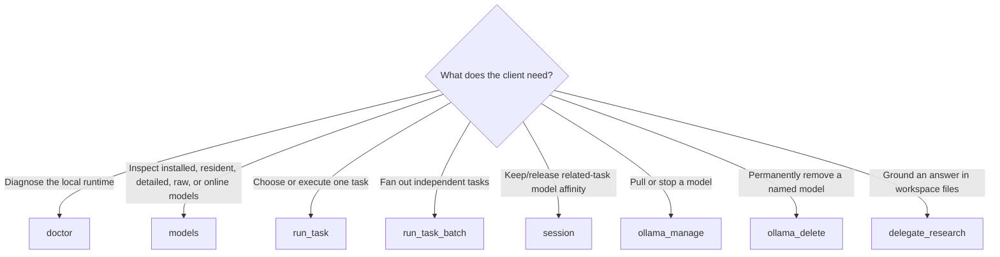
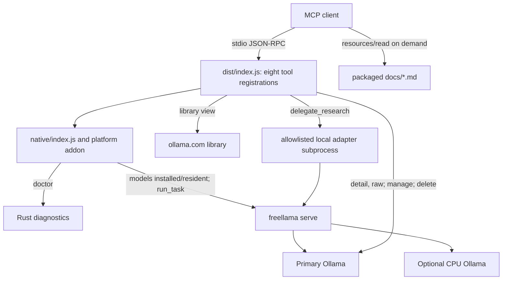

# FreeLlama MCP server

Exposes FreeLlama's local-LLM control plane, and Ollama's lifecycle, as
[MCP](https://modelcontextprotocol.io) tools, built on the official
[TypeScript SDK](https://github.com/modelcontextprotocol/typescript-sdk).

## Understand the eight tools

- `doctor`, `models`, `run_task`, `run_task_batch` — thin wrappers over the native NAPI bindings into the
  Rust core (`../rust-core/src/napi.rs`); no CLI subprocess, no reimplemented routing logic.
  `run_task { preview: true }` is the free decision-only form (the former `route` tool).
  Preview and execution are separate calls: preview accepts routing fields only and rejects task
  payloads or runtime controls instead of silently ignoring them.
  `models { view: "library" }` queries the public `ollama.com` library (the former `search_models` tool).
- `session` — creates and releases a bounded, idle-expiring model-affinity handle for related
  route/task calls. It does not store messages, prompt history, or Ollama's runner KV cache.
- `ollama_manage`, `ollama_delete` — Ollama's HTTP API for lifecycle operations the routing layer
  doesn't cover.
- `delegate_research` — offloads a grounded code-research question to a local model and returns a
  verdict computed from what the run did.

Use the smallest tool that owns the operation:



| Tool | Why it exists |
|---|---|
| `doctor` | Makes runtime, version, memory, and configuration drift visible before work starts. |
| `models` | Separates installed, resident, detailed, raw, and public-library questions instead of guessing from model names. |
| `run_task` | Applies the same deterministic routing, confidence, admission, and execution contract as the Rust control plane. |
| `run_task_batch` | Executes only caller-declared independent tasks. Stable IDs, a bounded dispatcher, 3:2:1 fair priority classes, and per-item errors make fan-out inspectable rather than implicit. |
| `session` | Lets an agent explicitly own the lifetime of a bounded affinity handle without misrepresenting it as conversation or KV storage. |
| `ollama_manage` | Exposes additive lifecycle operations that FreeLlama routing intentionally does not perform. |
| `ollama_delete` | Keeps irreversible deletion separate and explicit so a client can guard it. |
| `delegate_research` | Gives a local model bounded read-only tools and returns citations plus an independently computed verification verdict. |

## Follow the agent workflow

The server sends this workflow to every MCP client in its initialization instructions:

1. Start with `models {view:"installed"}`, then `models {view:"resident"}`. This gives a routing
   agent the smallest current inventory first.
2. Call `doctor` only for runtime or configuration diagnosis. It returns `summary` by default;
   use `view:"scheduler"` for configured/snapshot scheduling evidence or `view:"full"` for the
   complete diagnostic. If Ollama is missing or unreachable, ask the operator to install or start it.
3. Classify the task. Offload embeddings, OCR/vision, bulk transforms, and sufficiently large
   grounded lookups; retain small lookups and high-stakes judgment in the calling agent.
4. Prefer a qualified installed model and preview consequential work.
5. If none fits, collect the operator's modality, quality, context, latency, privacy, disk/download,
   and memory constraints. Search the Ollama library, inspect exact tags and host-memory fit, and
   present at most two candidates.
6. Ask the operator to approve one exact tag and its reported size before calling
   `ollama_manage {action:"pull"}`. Searching or recommending never authorizes a download.
7. Execute, inspect the route/execution/admission receipt, and verify the result at the returned
   confidence level.

### Use context and delegation deliberately

FreeLlama reduces the **calling agent's context burden**. It does not make an Ollama response more
accurate or eliminate the local model tokens needed to produce it. Its compact text cue avoids a
second serialized copy of the canonical `structuredContent`; its delegated adapter keeps full tool
observations on disk and presents them in pages when requested.

Use this economical sequence:

1. Request `models {view:"installed"}` before `doctor`; inventory is normally the smaller and
   more relevant first decision.
2. Preview consequential generation with `run_task {preview:true}`. Preview is decision-only: it
   neither generates nor reserves capacity.
3. Execute in a separate `run_task` call. Set `contextTokens` for the complete Ollama window and
   `options.num_predict` for its output cap. A lower cap or window can lower cost **and** damage a
   difficult answer, so choose it from the task rather than a global default.
4. Use `delegate_research` only for a self-contained question requiring files under
   `workspacePath`. Bound `agent.maxTurns`, `agent.contextTokens`, and `agent.outputTokens`.
5. Keep the compact text cue in the active conversation; inspect `structuredContent`, a paged tool
   result, or a bundled documentation resource only when its detail changes the next action.

For a delegated agent, estimated usable input is `contextTokens - outputTokens - safetyMarginTokens`
(the default margin is 256). The adapter pins the system instruction and question, preserves the
newest observations, compacts older observations into breadcrumbs, and refuses a pinned overflow
by default. `pinnedOverflow:"clip"` is a deliberate quality-risk override. Initial token counting
is conservative; successful Ollama calls calibrate later estimates.

Do not confuse operational evidence with answer quality. A receipt can prove admission, token
counts, placement, or unloading. It cannot prove research correctness, coding judgment, sustained
throughput, or fairness from one run. Check the returned confidence, policy evidence, and benchmark
evidence before accepting a consequential answer.

### Measure avoided external cost

Every successful `run_task`, batch item, and `delegate_research` result includes `telemetry.local`
when Ollama reports input/output token counts. To add `telemetry.externalEquivalent`, configure one
operator-owned rate card when starting the MCP server:

```text
FREELLAMA_EXTERNAL_COST_MODEL=EXTERNAL_MODEL_LABEL
FREELLAMA_EXTERNAL_COST_INPUT_USD_PER_M=INPUT_USD_PER_MILLION
FREELLAMA_EXTERNAL_COST_OUTPUT_USD_PER_M=OUTPUT_USD_PER_MILLION
```

The receipt multiplies observed local input/output counts by those configured rates. It is an
equivalent avoided-API-cost estimate only when the local result replaces an external call. It
excludes provider caching and reasoning-token differences, retries, local electricity, and hardware
amortization; it is not a provider bill or net-profit calculation. Partial or invalid rate-card
configuration stops the MCP server at startup instead of emitting a misleading estimate.

### Route images and OCR

Use `run_task` for supplied image bytes, not `delegate_research`. Preview
`{task:"vision", requiredCapabilities:["vision"], preview:true}` before a consequential image
task. Execute separately with a prompt and base64 `images` values without data-URI prefixes. The
`images` field requires an explicitly trialed vision model; inspect the execution receipt for
admission and observed placement.

FreeLlama can prove that it routed and ran a request. It cannot infer OCR or visual-reasoning
quality from a capability tag, a model name, or GPU placement. Quality depends on the exact
installed model build, prompt and decoding settings, context/output budget, and available host
memory and accelerator performance. Validate representative held-out images on the target machine
and supply policy/benchmark evidence before automatically accepting a quality-sensitive result.

The caller owns task decomposition and concurrent submission. The operator owns endpoints, exact
CPU assignments, runtime settings, and lifecycle approval. FreeLlama owns qualification, managed
placement and admission. Ollama and the OS/driver own runner loading and physical CPU/GPU execution.

## Follow the architecture



`doctor`, the installed/resident model views, and `run_task` use the NAPI binding instead of a CLI
subprocess. Direct lifecycle and no-serve model views use Ollama HTTP. `delegate_research` starts a
bounded adapter against an allowlisted workspace; each adapter model turn re-enters managed
`run_task` as `coding`, so it shares routing, admission, and placement evidence. Routing logic is
not duplicated in TypeScript.

## Read packaged documentation through MCP

The published MCP package includes every Markdown file from the repository `docs/` directory. The
repository directory remains the source of truth; the package build copies it into `docs/` and
creates `docs/INDEX.md`.

MCP clients can list resources and read `freellama://docs/index`, then fetch exactly one relevant
guide such as `freellama://docs/PRODUCTION`, `freellama://docs/CLI`, or
`freellama://docs/OLLAMA_SYSTEM_OPTIMIZATION`. Resources are deliberately lazy: do not load every
guide into an agent context. The server fails on startup if the generated index is absent, and the
release verifier checks that the packed documents match the root `docs/` set.

## Build

Build the native addon from the repository root and this package in place.

```bash
# From the repository root (yarn workspaces — one install for every package)
yarn install
yarn build
```

`yarn build` writes **one** MCP file, `packages/mcp/dist/index.js` (shebang, executable). During
checkout development it loads `native/freellama.<triple>.node`. Published installs resolve the
matching `@octocodeai/freellama-native-<target>` optional package instead, so the base MCP package remains
portable. Research adapters are copied into `adapters/` for packed installs.

Piecewise, if you are iterating on one layer:

```bash
# 1. Native addon → packages/mcp/native/freellama.<triple>.node
yarn build:native

# 2. This server → dist/index.js via esbuild (then copies the research adapters into adapters/)
yarn workspace @octocodeai/freellama-mcp-server build
```

`yarn start` needs `dist/index.js` and the compiled `.node` addon — `yarn build` from the repository
root produces both in a checkout. `dist/index.js` loads `native/index.js`, which loads a local addon
first and then a matching optional platform package. The `.node` binary is gitignored (a build
artifact); `native/index.js` and `native/index.d.ts` are hand-written and checked in.

## Run

```bash
node dist/index.js
```

The server speaks MCP over stdio — launch it from an MCP client (for example, Claude Desktop's
`claude_desktop_config.json`), not interactively.

## Test

Vitest, in three tiers (all TypeScript, under `test/`):

| Tier | Command (from this package) | Checks | Needs |
|---|---|---|---|
| `test/unit/` | `yarn test` (watch: `yarn test:watch`) | pure functions straight from `src/*.ts` — no build step, this is the TDD loop | nothing, ~0.5s |
| `test/integration/` | `yarn test:integration` | the built server over the real MCP protocol: tool contract, structured content, guardrails; rebuilds `dist/` itself | live Ollama on :11434, ~5s |
| `test/e2e/` | `yarn test:e2e` | every tool against the live system: real routing/execution, pull → delete round trip (net-zero), a real delegated research run | serve + Ollama + models, ~40s |

The same commands work from the repository root (`yarn test` there also runs the CLI package's tests).
The integration/e2e tiers fail fast with a readable message when Ollama is down, and the lifecycle
test refuses to delete a model already installed on the test system.

## Tools

| Tool | Needs `freellama serve`? | What it does |
|---|---|---|
| `doctor` | No | Runtime/configuration diagnostic. `summary` (default) returns endpoint, version, resident count, host/profile signals, and next step; `scheduler` adds configured/snapshot admission data; `config` returns categorized settings; `full` adds all non-duplicated diagnostics. The report distinguishes an observed same-user macOS process from configuration hints and never claims remote process visibility. |
| `models` | `installed` (default) and `resident` do; `detail`/`raw`/`library` don't | Views: `installed` (capabilities, derived `model_type`, VRAM, context, policy_rank), `resident` (loaded now + managed GPU/CPU split), `detail` (one model, real max context), paged `raw` (`GET /api/tags`), `library` (two-step ollama.com search: omit `model` for families, pass `model:"<family>"` for tags/`fitsInMemory`) |
| `run_task` | Yes | **Routes or executes** a chat/generate/embed call. `preview: true` accepts routing fields only and returns a decision without generation. Execution omits preview and supplies the payload. Embedding results withhold raw vectors by default (`returnEmbeddings: true` to get them) |
| `run_task_batch` | Yes | Executes only typed `{id, independent:true, task}` items. The nested `task` exposes the same task, routing, payload, and runtime controls as `run_task`; `maxParallelism` bounds fan-out. It is not a dependency graph scheduler. |
| `ollama_manage` | No (direct to Ollama) | `action: "pull"` downloads a model; `action: "stop"` force-unloads it. Both additive and idempotent |
| `ollama_delete` | No (direct to Ollama) | **Destructive**: permanently removes a model. Call only on an explicit human instruction naming the exact model |
| `delegate_research` | Yes (and spawns the adapter) | Answers a grounded question from files under `workspacePath`; managed coding turns return placement receipts, citations, and an independent verification verdict |

### Preserve Ollama request controls

All eight tools declare an MCP object `outputSchema`. Schemas type the stable fields FreeLlama owns
(such as route decision, page, answer, and session identifiers) while leaving Ollama-owned nested
payloads forward-compatible. `structuredContent` is canonical; normal text is a concise cue. For
the narrow `delegate_research` legacy case, set `legacyText:true` to receive serialized JSON text.

Use `models {view:"raw", limit:20}` and continue with its opaque `page.next_cursor`; a cursor
refuses continuation if the live model list changed. Library tag responses use the same paging
shape. Do not request `doctor {view:"full"}` in an agent loop: use `summary`, `scheduler`, or
`config` for the smallest diagnostic that answers the question.

`run_task` has two deliberately exclusive request shapes:

- Preview: set `preview: true`; pass routing fields such as `task`, `objective`, `model`,
  `contextTokens`, `requiredCapabilities`, and placement/confidence gates. To preview tool use,
  pass `requiredCapabilities: ["tools"]` rather than function definitions.
- Execution: omit `preview` (or set it to `false`) and pass `prompt`/`messages` for generative
  tasks or `input` for embeddings, plus any applicable Ollama runtime controls.

Preview rejects `prompt`, `messages`, `input`, `images`, `tools`, `keepAlive`, `format`, `think`,
`options`, `logprobs`, `topLogprobs`, and `returnEmbeddings`. This prevents a client from attaching
work to a decision-only call and mistakenly assuming it ran.

`run_task.messages` preserves Ollama message fields beyond `role` and `content`, including images,
thinking, tool calls, and tool names. Managed requests also accept `format`, `think`, `options`,
`logprobs`, and `topLogprobs`. Use `contextTokens` for `num_ctx`; placement owns `num_gpu`, so both
keys are rejected inside `options`. The raw proxy remains available when a caller needs an Ollama
endpoint or feature that the managed MCP tool does not expose, including streaming.

`model_type` is a display-oriented value derived from Ollama's additive capabilities:
`generative`, `multimodal`, `embedding_only`, or `unknown`. Routing continues to use the original
capability set, not this summary label. Unknown future Ollama capabilities are omitted from the
typed routing set instead of being treated as a known capability.

### Use CPU assignments through MCP

`run_task` delegates to `freellama serve`, so it honors the server's `--cpu-upstream` and
`--cpu-model` configuration. Exact assigned models can execute on the CPU process while other
managed tasks execute on the primary GPU-capable process.

Set `executionPreference` on `run_task` to `auto` (default), `prefer_cpu`, or `prefer_gpu`. This is a
guarded hint: only exact operator-assigned CPU models are eligible, explicit model/session pins win,
and `preview: true` returns `execution.preference_satisfied`, placement, upstream, admission, and a
reason without generating. Automatic feedback normalizes work by tokens, waits for three successful
warm, physically verified samples per task on both backends, requires a 10% advantage, and never
steers the `quality` objective. `minPlacementEvidence:"observed"` fails closed unless resident
`/api/ps` evidence matches the configured processor; warm cold models once with `"configured"`.
`keepAlive:"0"` uses an observe-then-unload transaction: FreeLlama retains the runner long enough
to inspect `/api/ps`, accepts feedback only for verified placement, requests an explicit unload,
then reports the unload verification in `execution.lifecycle`.

`models {view: "resident"}` uses the managed catalog, so it includes resident models from both
Ollama processes and labels explicitly assigned CPU models instead of querying only the primary
server.

Before relying on that placement, query `/_freellama/v1/health` and require
`contracts.placement_observation:"ollama_api_ps_after_execution"` and
`contracts.placement_evidence_gate:"configured_or_observed"`. A missing contract means the running server
predates the dual-backend build even if the MCP package itself is current.

The direct Ollama tools do not infer that assignment. `ollama_manage`, `ollama_delete`, and the
no-serve model views target their explicit `ollamaEndpoint` or `FREELLAMA_OLLAMA_ENDPOINT`, which
defaults to the primary Ollama server. Point them at the CPU endpoint only when you intend to
inspect or modify that separate server. Read
[CPU and GPU model routing](docs/CPU_GPU_ROUTING.md) for the complete contract.

## Configuration

Every default is overridable through an environment variable — set them in the MCP client's
server-launch config (for example `.mcp.json`'s `env` block) or the launching shell.

| Variable | Default | Affects |
|---|---|---|
| `FREELLAMA_OLLAMA_ENDPOINT` | `http://127.0.0.1:11434` | `doctor` and all `ollama_*` tools' default Ollama endpoint |
| `FREELLAMA_SERVE_ENDPOINT` | `http://127.0.0.1:11435` | Default `endpoint` for serve-backed tools and `delegate_research` |
| `FREELLAMA_MCP_DEFAULT_MODEL` | `qwen3.8:27b-mlx` | `delegate_research`'s default `model` |
| `FREELLAMA_MCP_DEFAULT_ADAPTER` | `bash` | `delegate_research`'s adapter (`octocode` to switch) |
| `FREELLAMA_MCP_MAX_TURNS` | `8` | Max agent turns for `delegate_research` |
| `FREELLAMA_MCP_DELEGATE_TIMEOUT_SECONDS` | `180` | Whole-subprocess timeout for `delegate_research` |
| `FREELLAMA_MCP_PULL_TIMEOUT_SECONDS` | `1200` | Default `ollama_manage` `"pull"` timeout |
| `FREELLAMA_MCP_FETCH_TIMEOUT_SECONDS` | `30` | Timeout for other direct Ollama HTTP calls |
| `FREELLAMA_MCP_ALLOWED_ROOTS` | checkout: this repository; published: must be set | Platform-separated allowlist of directories `delegate_research` may read (`:` on macOS/Linux, `;` on Windows) |
| `FREELLAMA_MCP_MODEL_EVIDENCE` | checkout: `benchmark/evidence/model-evidence.json`; published: unset | Path to per-model research grades (see "Runtime evidence") |
| `FREELLAMA_EXTERNAL_COST_MODEL` | unset | External-model label in estimated avoided-cost telemetry; set all three cost variables or none |
| `FREELLAMA_EXTERNAL_COST_INPUT_USD_PER_M` | unset | External input USD per million tokens |
| `FREELLAMA_EXTERNAL_COST_OUTPUT_USD_PER_M` | unset | External output USD per million tokens |
| `FREELLAMA_CONTROL_TIMEOUT_SECONDS` | `30` | Decision-only serve calls; read by `../rust-core/src/napi.rs` |
| `FREELLAMA_TASK_TIMEOUT_SECONDS` | `900` | Generation calls; read by `../rust-core/src/napi.rs` |
| `FREELLAMA_AUTH_TOKEN_FILE` | unset | Bearer-token file used by the native client and research adapters for all serve routes |
| `FREELLAMA_AGENT_TOKEN_CALIBRATION_DIR` | platform data directory | Prompt-free, model-specific token-estimator calibration shared across adapter processes |

Research-adapter settings are deployment defaults. The optional `delegate_research.agent` object
exposes the same values per call using camelCase; explicit per-call fields win.

| Variable | Default | Affects |
|---|---:|---|
| `FREELLAMA_AGENT_NUM_CTX` | `8192` | Ollama context window |
| `FREELLAMA_AGENT_EXECUTION_PREFERENCE` | `auto` | Managed coding-agent backend hint |
| `FREELLAMA_AGENT_MIN_PLACEMENT_EVIDENCE` | `configured` | Set `observed` to fail closed on cold/mismatched placement |
| `FREELLAMA_AGENT_NUM_PREDICT` | `512` | Reserved output budget |
| `FREELLAMA_AGENT_TEMPERATURE` / `FREELLAMA_AGENT_SEED` | `0` / `42` | Repeatable decoding |
| `FREELLAMA_AGENT_THINK` / `FREELLAMA_AGENT_KEEP_ALIVE` | `false` / `5m` | Ollama reasoning and residency |
| `FREELLAMA_AGENT_REQUEST_TIMEOUT_SECONDS` | `600` | Each Ollama chat attempt |
| `FREELLAMA_AGENT_TOOL_TIMEOUT_SECONDS` | Bash `30`, Octocode `45` | Each local tool call |
| `FREELLAMA_AGENT_RETRY_ATTEMPTS` / `FREELLAMA_AGENT_RETRY_BACKOFF_SECONDS` | `2` / `5` | Conversation-level retry |
| `FREELLAMA_AGENT_MAX_PARSE_REPAIRS` / `FREELLAMA_AGENT_PARSE_REPAIR_ECHO_CHARS` | `2` / `500` | Invalid JSON correction limit and retained reply text |
| `FREELLAMA_AGENT_CHARS_PER_TOKEN` | `4` | First-call token estimate; later calibrated from Ollama |
| `FREELLAMA_AGENT_SAFETY_MARGIN_TOKENS` | `256` | Input headroom beyond `num_predict` |
| `FREELLAMA_AGENT_IMAGE_TOKEN_ESTIMATE` | `1024` | Bounded charge per image |
| `FREELLAMA_AGENT_KEEP_RECENT` | `2` | Recent observations preserved verbatim |
| `FREELLAMA_AGENT_COMPACT_PREVIEW_CHARS` | `180` | Old-observation breadcrumb size |
| `FREELLAMA_AGENT_COMPACT_RETAIN_RATIO` | `0.8` | Current payload retained per emergency pass |
| `FREELLAMA_AGENT_CLIP_HEAD_RATIO` | `0.667` | Head share when an emergency clip preserves both ends |
| `FREELLAMA_AGENT_OBSERVATION_PAGE_CHARS` | `3000` | Lossless observation page target |
| `FREELLAMA_AGENT_PINNED_OVERFLOW` | `error` | Preserve system/task bytes; `clip` is explicit opt-in |

Invalid values fail before an Ollama request. Each successful result returns
`contextManagement` with the resolved policy, calibration source/scale, estimated input budget,
and compaction count. Ollama has no stable preflight tokenizer endpoint, so “exact before the first
call” is not claimed. Model-specific calibration persists after successful calls, so later
processes start conservatively from prior `prompt_eval_count` evidence without sharing estimates
between model templates.

**Security:** `delegate_research` grants a local model read access to `workspacePath`. The path is
confined to `FREELLAMA_MCP_ALLOWED_ROOTS` (default: this repository in a checkout; unset in a published
install until you set it), resolved through symlinks so a link inside an allowed root can't escape
it. The default `bash` adapter also rejects home-directory paths, `..`, and absolute paths outside
that workspace. Production deployments should generate a permission-restricted token with
`freellama auth-token`, start `serve` with `--auth-token-file`, and set
`FREELLAMA_AUTH_TOKEN_FILE` for MCP. Authentication covers managed and raw passthrough routes; use
an external TLS and authorization layer for untrusted or multi-tenant networks.

### Runtime evidence

**No measurements are compiled in.** In a repository checkout, per-model research grades load from
`benchmark/evidence/model-evidence.json`. A published package does not include that repository
file, so its evidence table is empty unless you set `FREELLAMA_MCP_MODEL_EVIDENCE`. An unmeasured
model yields a `verify` verdict. Tool descriptions state the rules; measurement details live in
`skills/freellama/references/` and `.octocode/evals/`.

## Platform support

The native addon is named by target triple (`freellama.<platform>-<arch>[-<abi>].node`). The base
package has eight npm optional dependencies, one each for macOS arm64/x64, Linux arm64/x64 with
glibc or musl, and Windows arm64/x64 with MSVC. `native/index.js` tries the checkout artifact first,
then the host's optional package. A release is supported only when all eight artifact packages pass
the publish verifier; an installation made with `--omit=optional` cannot load the addon. `engines`
requires Node >= 20.

Machine discovery distinguishes total host memory (`memory_bytes`) from known unified memory
(`unified_memory_bytes`). Library-tag `fitsInMemory` is a conservative host-memory preflight and
includes `fitScope: "host_memory_budget_only"`; inspect `/api/ps` for actual accelerator placement.

Start the serve-backed tools' dependency from the repository root:

```bash
cargo run --release -- serve --recommendation-catalog recommendations.example.toml
```

See `skills/freellama/references/proxy-vs-serve.md` for the `proxy` vs `serve` distinction (only
`serve` has the `/_freellama/v1/*` routes these tools call).

## Publish

`packages/mcp/` is the portable JavaScript package. Its `package.json` lists the platform packages
as exact-version optional dependencies; it intentionally does not embed a `.node` binary. Publish
the eight `packages/native/*` packages first, then publish `@octocodeai/freellama` and `@octocodeai/freellama-mcp-server`
at the same version. `yarn release:verify:publish` refuses a release if any platform package has a
missing, empty, or unpacked executable/addon pair.

```bash
cd packages/mcp
npm pack --dry-run   # confirm exactly what a publish would ship
```

Version 0.1.0 is not published to a registry. Treat `npm publish` as a real, irreversible public
action, and confirm with the repository owner first.

## Why native bindings

- **No reimplementation.** `run_task`, `route`/`preview`, and the installed-model list are HTTP
  calls into a running `freellama serve`, matching `../cli/src/main.rs`. `doctor` talks to Ollama
  and the host's portable machine-discovery layer directly. `ollama_manage` / `ollama_delete` hit Ollama's HTTP API. `delegate_research`
  is a subprocess. Routing logic still lives in exactly one place — the Rust core.
- **One connection pool.** `../rust-core/src/napi.rs` holds a single `reqwest::Client` in a
  `OnceLock` and clones the handle per request, matching the server side.
- **`unsafe_code` stays isolated.** The crate is `deny(unsafe_code)` except `napi.rs`, which
  carries an explicit `#[allow(unsafe_code)]` for napi-derive's FFI glue.
- **The napi build is off by default** (`cargo build` never touches it); the addon is built with
  `napi build --features napi` from the repo root.
