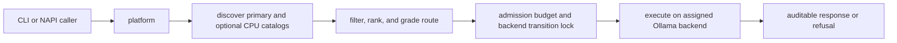

# `freellama-core`

`freellama-core` is the embeddable Rust implementation behind the CLI and MCP server. It owns model
discovery, deterministic routing, session affinity, admission control, managed execution,
benchmarking, recommendation planning, and policy generation.

The crate is named `freellama-core`; its library is named `freellama`, so consumers import
`freellama::…`.

## Follow the core flow



| Module | Responsibility |
|---|---|
| `platform` | Control API, discovery, routing, sessions, managed task execution, and admission |
| `proxy` | Ollama-compatible passthrough, retries, timeout, jitter, and optional restart |
| `model_bench` | Capability-grouped throughput measurements across installed models |
| `recommend` | Side-effect-free installation plans from a reviewed catalog |
| `policy` | Routing-policy generation from quality-evaluation aggregates |
| `napi` | Feature-gated Node.js binding and the only FFI boundary |
| `lib` | Diagnostics, frozen-suite execution, and build comparison |

## Understand admission

The platform combines an independent weighted semaphore and transition lock for each configured
backend. Embedding costs 1, chat costs 2, and vision costs 4 (capped to the pool size).

- A resident model takes a shared lock on its assigned backend.
- A cold model takes an exclusive lock on its assigned backend.
- Independent CPU and GPU backends can therefore progress concurrently.
- A task that cannot acquire its weighted permit before the queue deadline receives HTTP 503.

The primary/GPU pool defaults to two weighted units; the optional CPU pool defaults to one. An
embedding costs 1, ordinary chat costs 2, and vision costs 4 capped to the pool size. Runtime
feedback records successful resident-task work-unit latency by task and backend: decode
nanoseconds/output token for generation and total nanoseconds/input token for embeddings. Only
after three samples exist on each backend and one is more than 10% faster may `auto` steer; it never
does so for quality routing, explicit models, or session-pinned routes.

Every upstream HTTP client has a timeout. Without it, a stalled request could retain an exclusive
transition lock and block later managed tasks.

## Understand confidence

Confidence is derived from evidence, not from model metadata alone:

| Policy for task | Local benchmark | Confidence | Evidence label |
|---|---|---|---|
| Yes | Yes | Medium | `configured_task_policy` |
| Yes | No | Low | `configured_task_policy` |
| No | Yes | Low | `functional_throughput_screen` |
| No | No | Low | `capability_metadata_only` |

`policy::qualify_from_aggregate` reads correctness pass rates from a harness aggregate. It never
uses `bench-all` throughput as a quality signal. It also refuses expired evidence, fewer than three
trials unless explicitly marked as smoke data, and models that are not installed.

## Embed the platform

```rust
use freellama::platform::{serve, PlatformConfig};

let config = PlatformConfig::new(
    "127.0.0.1:11435",
    "http://127.0.0.1:11434",
    None,
    None,
    "…",
)
.with_recommendation_catalog("recommendations.example.toml")
.with_cpu_backend(
    "http://127.0.0.1:11436",
    vec!["nomic-embed-text:latest".to_owned()],
)
.with_feedback_file("/var/lib/freellama/feedback.json")
.with_auth_token("replace-with-a-secret-of-at-least-32-bytes");

serve(config).await?;
```

The CPU backend is optional. When configured, exact assigned model names use it and receive
`options.num_gpu=0` on managed requests. Raw `/api/*` and `/v1/*` passthrough always uses the primary
upstream. See [CPU and GPU model routing](../../docs/CPU_GPU_ROUTING.md) for the operational
contract.

`/_freellama/v1/health` exposes the `explicit_cpu_assignment` contract and configured backends.
Tests pin that receipt, CPU option injection for tasks and intent interpretation, and byte-exact raw
passthrough to the primary backend.

Bearer authentication, when configured, covers control and passthrough routes. Binding a
nonloopback address requires both an authentication token and explicit remote opt-in. Aggregate
placement feedback can use a bounded, versioned, atomically replaced snapshot; corrupt or
unsupported snapshots fail startup instead of silently resetting routing evidence.

Managed `/_freellama/v1/tasks` requests accept Ollama's structured message objects without reducing
them to role/content pairs. Their nested `request_options` supports `format`, `think`, `options`,
`logprobs`, and `top_logprobs`. The route's `context_tokens` owns `num_ctx`, and backend placement
owns `num_gpu`; callers cannot override those two keys through `options`. Raw passthrough remains the
full-control escape hatch, including streaming.

Installed-model metadata includes a derived `model_type`: `generative`, `multimodal`,
`embedding_only`, or `unknown`. It is a display summary only. Capability filtering and routing use
Ollama's additive capability set, and unrecognized future values are not converted into a known
routable capability.

`proxy::serve` runs passthrough alone. `platform::serve` composes the proxy as its fallback, making
the platform a strict superset of the proxy.

## Build and verify

```bash
cargo build --release
cargo test
cargo fmt --all -- --check
cargo clippy --all-targets -- -D warnings
```

The Node addon is a separate feature-gated build because its FFI symbols resolve only inside Node:

```bash
yarn --cwd ../.. build:native
```

This writes `packages/mcp/native/freellama.<triple>.node`. The crate denies unsafe code except in
`napi.rs`, where generated NAPI glue requires an explicit exception.

Machine discovery is OS-specific behind one serialized contract: `memory_bytes` is total host RAM,
while `unified_memory_bytes` is populated only on a known unified-memory host. Recommendations use
the former as a conservative preflight. They never equate host RAM with discrete-GPU VRAM; Ollama's
resident-runner data remains the execution proof.
