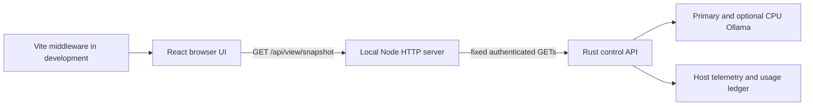

# FreeLlama runtime view

`@octocodeai/freellama-view` is a private workspace package: a Vite + React dashboard and a small
Node.js backend on localhost. It shows how FreeLlama manages delegated tasks: model residency,
queues, admission, resource pressure, and usage. The dashboard reads the control API; it does not
run inference, pull models, or change configuration.

## Run

Use Node.js 20.19+ or 22.12+. From the repository root:

```sh
yarn install
# In one terminal, start the existing control plane (and your operator-managed Ollama backend):
cargo run -p freellama-cli -- serve
# In another terminal:
yarn dev:view
```

Open **http://127.0.0.1:5173**. Both the browser app and its backend use that origin, with Vite hot
reload during development. The view also starts without FreeLlama; sources report unavailable and
retry automatically.

Production uses the same localhost backend to serve the built app:

```sh
yarn build:view
yarn start:view
```

| Server-only environment setting | Default                  | Purpose                                                  |
| ------------------------------- | ------------------------ | -------------------------------------------------------- |
| `FREELLAMA_VIEW_PORT`           | `5173`                   | Dashboard port; the listener always binds to `127.0.0.1` |
| `FREELLAMA_SERVE_ENDPOINT`      | `http://127.0.0.1:11435` | Existing FreeLlama control API loopback origin           |
| `FREELLAMA_AUTH_TOKEN_FILE`     | unset                    | File containing the control API's bearer token           |

The upstream must be a loopback HTTP or HTTPS origin, without a path, query, or embedded credentials.
The bearer token is read at view-server startup and never sent to the browser. Restart the view
after changing the token file. Use the same token file as `freellama serve` when auth is enabled.
Do not put credentials in `VITE_*` variables or client code.

## Views

- **Overview:** backend admission, slot/resource queues, circuit breakers, adaptive limits, raw
  streams, host RAM, discrete VRAM where available, runner residency, deferred jobs when available,
  and latest eviction.
- **Models:** searchable installed inventory, capability labels, configured assignment, and
  separately observed loaded-runner memory. Inventory refreshes every 30 seconds.
- **Usage:** seven-day UTC task volume, token totals, errors, busy/queue time, and ledger state.
- **System:** machine profile, service version, affinity sessions, security, effective runtime
  settings and their sources, reload errors, and Ollama settings.
- **Diagnostics:** source freshness/errors and expandable complete JSON observations, including
  fields that do not have a dedicated card.

Pause freezes observations; resume reconnects. Refresh resumes and requests a snapshot, respecting
the backend's source cache. The activity chart keeps up to two minutes of actual readings in the
browser; it is not durable history. Daily usage comes from FreeLlama's ledger. Task demand on a
runner includes queued tasks. GPU memory share is Ollama's observed residency, not GPU utilization.
Unknown telemetry is shown as unknown. Configured placement does not establish physical placement.

## Architecture and types



| Directory                        | Owner                                                                                                           |
| -------------------------------- | --------------------------------------------------------------------------------------------------------------- |
| `src/shared/contracts.ts`        | Zod wire schemas and inferred TypeScript types for consumed Rust fields and the view snapshot                   |
| `src/server/config.ts`           | Validated localhost endpoint/port and server-only credentials                                                   |
| `src/server/collector.ts`        | Bounded API reads, independent caches, concurrent-request deduplication, validation, and last-good observations |
| `src/server/app.ts`              | Fixed read-only API, local request checks, and production static files                                          |
| `src/server/dev.ts` / `index.ts` | Development Vite middleware / production HTTP entry points                                                      |
| `src/client/useRuntime.ts`       | Completion-scheduled polling, timeout, cancellation, and transport recovery                                     |
| `src/client/*`                   | View components, formatting, and browser-only activity history                                                  |

Rust remains the source of truth for monitoring and scheduling. The view adapts existing JSON
contracts rather than importing Rust or the MCP server, creating a second scheduler, or taking
ownership of telemetry. Schemas validate the fields rendered in the UI and preserve additive
fields for diagnostics. Both upstream data and browser snapshots are validated at runtime; types
are inferred from those same schemas.

Every source is a typed `Source<T>` with `state`, `data`, `updated_at`, and `error`:

- `live`: validated observation, with its actual observation timestamp;
- `stale`: last valid observation retained after a failed read, with the previous timestamp;
- `unavailable`: no successful observation, with null data and an explicit error.

Source cache intervals: status 2 seconds; health 5 seconds; usage/config 10 seconds; inventory
30 seconds; machine 60 seconds. Reads are demand-driven and deduplicated across browser tabs.
Upstream requests time out after 8 seconds and JSON bodies are bounded at 8 MiB. Browser polling
waits 2 seconds after completion, never overlaps, times out after 12 seconds, and cancels on
pause/unmount. A transport failure retains the previous snapshot with a disconnected banner.

The HTTP backend only exposes `GET /api/view/snapshot`; callers cannot choose upstream paths,
forward arbitrary headers, run tasks, reload settings, or manage models. Other API paths and
methods are rejected. Host, Origin, and Fetch Metadata checks reject cross-site browser access
and DNS rebinding hosts. Production serves only the built client directory with security headers.
There is no external font, analytics, or asset service. This is a local operator view, not a
remotely published website.

## Verify

```sh
yarn workspace @octocodeai/freellama-view typecheck
yarn workspace @octocodeai/freellama-view test
yarn build:view
```

Tests exercise source failures, shape validation, last-good retention, cache/deduplication,
credentials, request confinement, and production static serving using disposable local servers.
They need no running Ollama or models. The package participates in root `yarn typecheck`,
`yarn test`, and workspace builds.

See [monitoring contracts](../../docs/MONITORING.md) and [the Rust control API](../rust-core/README.md)
for the upstream ownership and operational details.
